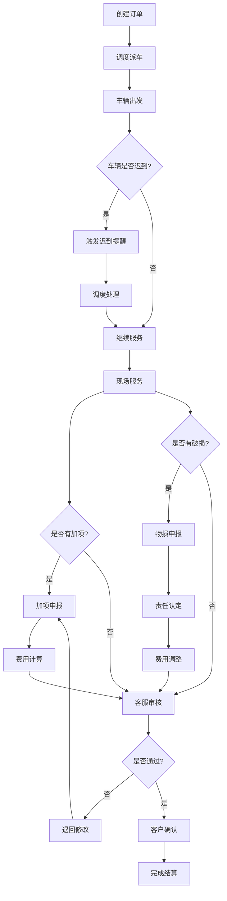

## 1. Product Overview
搬家公司现场加项与费用确认系统，解决临时加价、物品破损、车辆迟到等问题的实时追踪与确认。通过状态可视化和异常触发机制，确保调度、搬运组长、客服三方信息一致，消除责任空档。

## 2. Core Features

### 2.1 User Roles
| Role | Registration Method | Core Permissions |
|------|---------------------|------------------|
| 调度员 | 账号密码登录 | 创建订单、分配车辆、查看所有订单状态 |
| 搬运组长 | 账号密码登录 | 现场加项申报、上传物损照片、确认费用 |
| 客服 | 账号密码登录 | 处理客户投诉、查看历史记录、费用确认回看 |

### 2.2 Feature Module
1. **订单管理首页**: 实时状态看板、异常订单预警、快速搜索
2. **订单详情页**: 订单信息、现场加项记录、费用明细、操作历史
3. **现场加项处理**: 加项申报、费用计算、确认流程
4. **费用确认页**: 费用汇总、客户确认、历史回看
5. **异常处理中心**: 迟到提醒、破损申报、退回处理

### 2.3 Page Details
| Page Name | Module Name | Feature description |
|-----------|-------------|---------------------|
| 首页 | 订单看板 | 按状态分组展示订单，红色高亮异常订单，支持搜索筛选 |
| 首页 | 异常预警 | 车辆迟到、物品破损、待确认费用等异常实时提醒 |
| 订单详情 | 基本信息 | 客户信息、地址、预约时间、车辆信息 |
| 订单详情 | 现场加项 | 加项类型选择、数量输入、费用自动计算 |
| 订单详情 | 物损记录 | 照片上传、破损描述、责任认定 |
| 订单详情 | 操作历史 | 时间线展示所有操作记录 |
| 费用确认 | 费用汇总 | 基础费用+加项费用+物损费用明细 |
| 费用确认 | 确认流程 | 搬运组长提交→客服审核→客户确认 |
| 异常处理 | 迟到处理 | 车辆迟到记录、原因说明、调度调整 |
| 异常处理 | 退回处理 | 订单退回原因、重新分配 |

## 3. Core Process

## 4. User Interface Design
### 4.1 Design Style
- **主色调**: 深蓝色(#1e40af)作为主色，橙色(#f97316)作为强调色用于警告和异常提示
- **按钮风格**: 圆角矩形，hover时有阴影效果
- **字体**: 思源黑体，标题18px，正文14px，小字12px
- **布局风格**: 左侧导航+右侧内容，卡片式布局
- **图标**: 使用lucide-react图标库

### 4.2 Page Design Overview
| Page Name | Module Name | UI Elements |
|-----------|-------------|-------------|
| 首页 | 订单卡片 | 状态标签(待派车/运输中/服务中/待确认/已完成)、优先级标识 |
| 首页 | 异常预警 | 红色背景警示条、倒计时、快捷处理按钮 |
| 订单详情 | 操作面板 | 加项按钮、拍照按钮、费用确认按钮 |
| 费用确认 | 费用明细 | 表格展示、金额汇总、确认按钮组 |
| 操作历史 | 时间线 | 垂直时间轴、状态节点、操作人信息 |

### 4.3 Responsiveness
- Desktop-first设计
- 支持平板端自适应
- 移动端简化布局，聚焦核心操作

### 4.4 异常触发设计
| 异常类型 | 触发条件 | 提醒方式 | 处理动作 |
|----------|----------|----------|----------|
| 车辆迟到 | 超过预计到达时间15分钟 | 红色警示、声音提示 | 联系司机、通知客户 |
| 待确认费用 | 加项提交后超过30分钟未审核 | 黄色警示 | 催办客服 |
| 物损待处理 | 申报后超过2小时未认定 | 橙色警示 | 通知负责人 |

---

## 业务规则说明

### 1. 状态流转规则
| 当前状态 | 可执行操作 | 下一状态 |
|----------|------------|----------|
| 已预约 | 派车 | 运输中 |
| 运输中 | 到达现场 | 服务中 |
| 服务中 | 提交加项 | 待确认 |
| 服务中 | 完成服务 | 待结算 |
| 待确认 | 审核通过 | 待结算 |
| 待确认 | 审核退回 | 服务中 |
| 待结算 | 客户确认 | 已完成 |
| 待结算 | 客户拒付 | 纠纷处理 |

### 2. 费用计算规则
- 基础费用 = 距离费用 + 楼层费用 + 基础搬运费
- 加项费用 = 加项类型单价 × 数量
- 物损费用 = 物品价值 × 责任比例
- 总费用 = 基础费用 + 加项费用 - 物损费用(如有)

### 3. 异常处理规则
- 车辆迟到: 每5分钟发送一次提醒，超过30分钟自动升级为紧急
- 费用待确认: 超过30分钟未处理自动通知主管
- 物损申报: 必须在2小时内完成责任认定，否则自动升级

### 4. 数据持久化规则
- 所有操作记录本地缓存，断网时存储IndexedDB
- 恢复网络后自动同步到服务器
- 操作历史永久保存，支持随时回看
