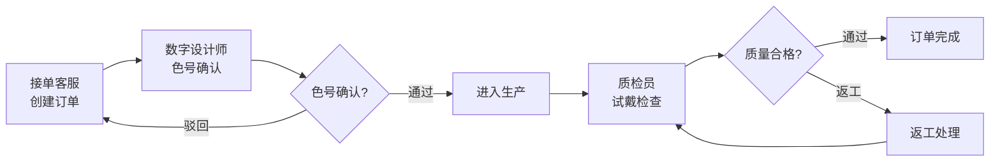

# 义齿加工厂色号确认与试戴返工管理系统 PRD

## 1. 产品概述

义齿加工厂内部流程管理系统，解决色号确认、试戴返工的责任追溯和流程透明化问题。通过角色分离的工作流，实现接单客服、数字设计师、质检员的高效协作，避免责任争议。

- 核心目标：流程透明化、责任可追溯、效率提升
- 目标用户：接单客服、数字设计师、质检员、管理人员

## 2. 核心功能

### 2.1 用户角色

| 角色 | 登录方式 | 核心权限 |
|------|----------|----------|
| 接单客服 | 演示账号 | 创建订单、录入基本信息、查看订单状态 |
| 数字设计师 | 演示账号 | 色号确认处理、模型接收、上传设计文件 |
| 质检员 | 演示账号 | 试戴返工审核、质量检查、结果确认 |

### 2.2 功能模块

1. **订单列表页**：筛选列表、状态标签、快速操作、风险预警
2. **色号确认模块**：色号选择、确认处理、历史记录回看
3. **试戴返工模块**：返工申请、原因记录、审核流程、处理跟踪
4. **详情页**：完整流程历史、状态变更时间线、责任人追踪
5. **账号切换**：演示角色快速切换，模拟不同角色视角

### 2.3 页面详情

| 页面名称 | 模块名称 | 功能描述 |
|----------|----------|----------|
| 订单列表 | 筛选栏 | 按状态、角色、日期、关键词筛选 |
| 订单列表 | 订单卡片 | 显示订单号、患者、状态、责任人、预警标记 |
| 订单列表 | 快速操作 | 一键确认、返工处理快捷按钮 |
| 色号确认 | 色号选择 | 标准色号面板、自定义色号输入 |
| 色号确认 | 确认流程 | 确认/驳回操作、备注记录、责任签名 |
| 试戴返工 | 返工申请 | 原因选择、问题描述、图片上传 |
| 试戴返工 | 审核处理 | 审核意见、责任人分配、截止日期 |
| 订单详情 | 时间线 | 完整状态变更历史、时间点、责任人 |
| 订单详情 | 操作历史 | 所有操作记录、备注回看 |
| 账号切换 | 角色面板 | 一键切换不同演示角色 |

## 3. 核心流程

### 3.1 色号确认流程
接单客服创建订单 → 数字设计师接收订单 → 选择/确认色号 → 系统记录确认人和时间 → 进入下一环节

### 3.2 试戴返工流程
质检员发现问题 → 提交返工申请（原因+备注）→ 指定责任人 → 责任人处理返工 → 质检员复核 → 通过/再次返工

### 3.3 流程图

## 4. 用户界面设计

### 4.1 设计风格
- **主色调**：专业深蓝 (#1e3a5f) 代表医疗行业专业性
- **辅助色**：警示橙 (#f59e0b) 标记返工风险，成功绿 (#10b981) 标记已确认
- **按钮风格**：圆角矩形、微阴影、hover动效
- **字体**：系统无衬线字体，清晰易读
- **布局风格**：卡片式布局，左侧导航+右侧内容区
- **图标**：线性图标，统一风格

### 4.2 页面设计概述

| 页面名称 | 模块名称 | UI元素 |
|----------|----------|--------|
| 订单列表 | 顶部导航 | Logo、角色切换、用户信息 |
| 订单列表 | 侧边栏 | 功能菜单、状态统计 |
| 订单列表 | 数据表格 | 斑马纹、悬停高亮、状态标签 |
| 订单详情 | 时间线 | 垂直时间线、状态节点、动画效果 |
| 详情页 | 操作面板 | 固定底部操作栏、主按钮突出 |

### 4.3 响应式
- 桌面端优先（1280px+）
- 平板端自适应（768px-1279px）
- 移动端单列布局（<768px）

### 4.4 风险预警设计
- 色号返工：橙色标记，显示返工次数
- 模型漏收：红色警告标记
- 交付日期临近：倒计时显示，超期红色高亮
