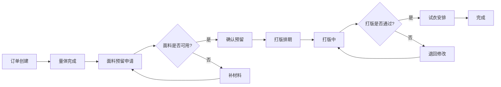

## 服装定制店-面料预留与打版排期系统 PRD

### 1. Product Overview
服装定制店面料预留与打版排期业务工作台，整合分散在量体单、面料卡和试衣记录中的信息，为量体师、版师、客服提供角色专属视图，支持催单、退回、补材料状态追踪，实现完整的历史回看功能。

### 2. Core Features

#### 2.1 User Roles
| Role | Core Permissions |
|------|------------------|
| 量体师 | 查看量体单、提交测量数据、跟进进度 |
| 版师 | 查看打版任务、更新排期、提交打版结果 |
| 客服 | 查看全流程、处理客户反馈、协调各角色 |

#### 2.2 Feature Module
1. **工作台首页**：状态概览卡片、快捷操作入口、待办提醒
2. **面料预留管理**：面料列表、状态筛选、批量处理、详情查看
3. **打版排期管理**：排期日历、任务列表、批量分配、进度追踪
4. **订单详情页**：完整历史记录、状态变更轨迹、备注管理

#### 2.3 Page Details
| Page Name | Module Name | Feature description |
|-----------|-------------|---------------------|
| 工作台首页 | 状态概览 | 各状态订单统计、快捷操作入口 |
| 工作台首页 | 待办提醒 | 催单、退回、补材料任务列表 |
| 面料预留管理 | 面料列表 | 面料信息、预留状态、操作按钮 |
| 面料预留管理 | 筛选搜索 | 按状态、时间、责任人筛选 |
| 面料预留管理 | 批量动作 | 批量确认、批量退回 |
| 打版排期管理 | 排期列表 | 任务列表、优先级排序、状态标识 |
| 打版排期管理 | 批量操作 | 批量分配、批量改期 |
| 订单详情页 | 历史记录 | 状态变更时间线、责任人、备注 |

### 3. Core Process

### 4. User Interface Design
#### 4.1 Design Style
- 主色调：深蓝色(#1e3a5f)搭配暖橙色(#f59e0b)作为强调色
- 按钮风格：圆角矩形，hover状态有阴影变化
- 字体：Inter，标题16-20px，正文14px，小字12px
- 布局：卡片式布局，清晰的表格展示
- 图标：Lucide图标库，线性风格

#### 4.2 Page Design Overview
| Page Name | Module Name | UI Elements |
|-----------|-------------|-------------|
| 工作台首页 | 状态概览 | 统计卡片(状态色区分)、数字高亮、趋势箭头 |
| 工作台首页 | 待办提醒 | 列表布局、状态标签、快捷操作按钮 |
| 面料预留管理 | 面料列表 | 表格、状态列(颜色标识)、操作列 |
| 打版排期管理 | 排期列表 | 时间线样式、优先级标识、进度条 |
| 订单详情页 | 历史记录 | 垂直时间线、时间戳、责任人头像 |

#### 4.3 Responsiveness
- Desktop-first设计，支持1200px+屏幕
- 表格支持横向滚动
- 侧边栏可折叠