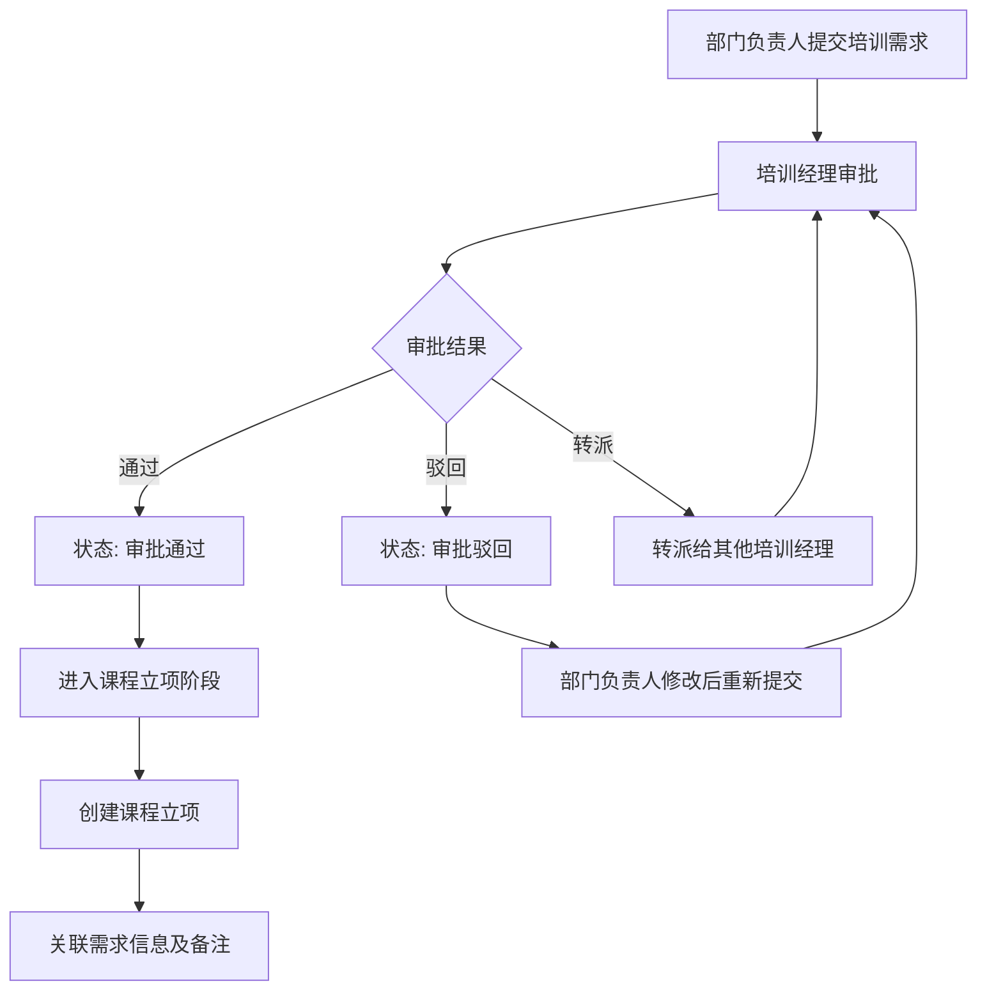
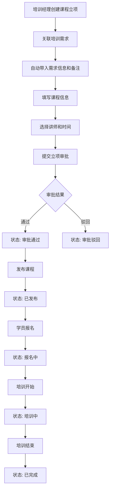
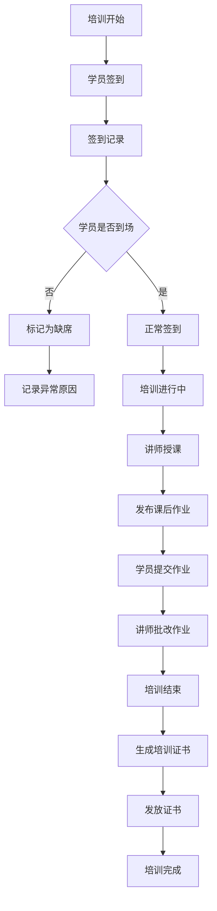
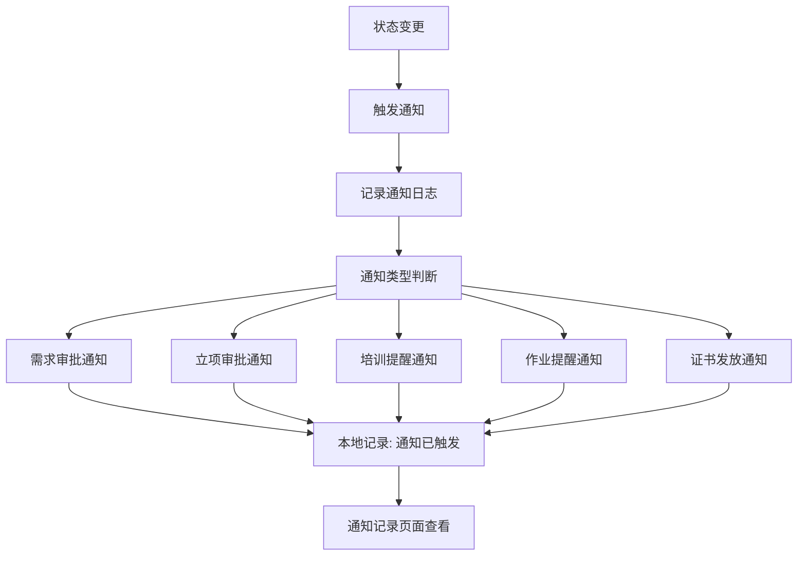

# 企业内训部 - 培训需求与课程立项管理系统

## 1. 产品概述

企业内训部培训需求与课程立项管理系统，用于解决培训需求收集、课程立项审批、讲师排期、培训执行、签到管理、作业收集、证书发放等全流程管理问题。系统强调状态流转的清晰性和角色权限的差异化，确保培训需求处理的备注信息能够贯穿到课程立项阶段，避免信息断层。

**核心价值**：
- 解决培训需求与课程立项之间的信息断层问题
- 提供清晰的状态流转和角色权限管理
- 减少人工临时补说明的情况，提高培训管理效率

## 2. 核心功能

### 2.1 用户角色

| 角色 | 注册方式 | 核心权限 |
|------|---------|---------|
| 培训经理 | 系统分配 | 培训需求审批、课程立项管理、讲师排期、培训执行监控、数据统计 |
| 部门负责人 | 系统分配 | 提交培训需求、查看本部门培训进度、审批本部门员工参训 |
| 讲师 | 系统分配 | 查看授课安排、上传课程资料、查看学员名单、批改作业 |
| 学员 | 系统分配 | 查看培训日程、报名参训、提交作业、查看证书 |

### 2.2 功能模块

#### 2.2.1 培训需求管理
1. **需求提交页面**：需求表单、部门选择、紧急程度、期望时间
2. **需求列表页面**：状态筛选、部门筛选、时间范围、搜索功能
3. **需求详情页面**：需求信息、处理记录、备注信息、审批操作

#### 2.2.2 课程立项管理
1. **立项申请页面**：关联培训需求、课程信息、讲师选择、时间安排
2. **立项列表页面**：状态筛选、时间筛选、讲师筛选
3. **立项详情页面**：课程信息、讲师排期、学员名单、签到记录

#### 2.2.3 培训执行管理
1. **讲师排期页面**：讲师日历、排期冲突检测、排期调整
2. **签到管理页面**：学员签到、补签处理、签到统计
3. **作业管理页面**：作业发布、作业提交、作业批改
4. **证书管理页面**：证书生成、证书发放、证书查询

#### 2.2.4 系统管理
1. **角色权限页面**：角色配置、权限分配
2. **通知记录页面**：通知日志、触发记录、本地记录查看

### 2.3 页面详情

| 页面名称 | 模块名称 | 功能描述 |
|---------|---------|---------|
| 需求提交页面 | 需求表单 | 填写培训需求主题、内容描述、期望时间、参训人数、预算范围 |
| 需求提交页面 | 部门选择 | 选择需求部门、紧急程度标记、附件上传 |
| 需求列表页面 | 筛选区域 | 按状态、部门、时间范围、紧急程度筛选 |
| 需求列表页面 | 列表展示 | 显示需求编号、主题、提交人、状态、提交时间 |
| 需求详情页面 | 需求信息 | 展示需求详细内容、附件、历史记录 |
| 需求详情页面 | 处理操作 | 审批通过、驳回、转派、添加备注（备注可传递到立项阶段） |
| 立项申请页面 | 需求关联 | 选择已审批通过的培训需求，自动带入需求信息和备注 |
| 立项申请页面 | 课程信息 | 填写课程名称、课程描述、课程目标、课程大纲 |
| 立项申请页面 | 讲师选择 | 从讲师库中选择讲师，查看讲师档期 |
| 立项申请页面 | 时间安排 | 设置培训时间、地点、报名截止时间 |
| 立项列表页面 | 筛选区域 | 按状态、讲师、时间范围筛选 |
| 立项列表页面 | 列表展示 | 显示立项编号、课程名称、讲师、状态、培训时间 |
| 立项详情页面 | 课程信息 | 展示课程详细信息、关联的需求信息及备注 |
| 立项详情页面 | 学员管理 | 查看报名学员、处理报名后不来情况、学员状态管理 |
| 立项详情页面 | 签到记录 | 查看签到统计、补签处理、签到异常记录 |
| 立项详情页面 | 作业管理 | 发布作业、查看提交情况、批改作业 |
| 立项详情页面 | 证书管理 | 生成证书、发放证书、查看证书状态 |
| 讲师排期页面 | 日历视图 | 查看讲师排期日历、冲突检测提示 |
| 讲师排期页面 | 排期调整 | 调整排期时间、通知相关人员 |
| 签到管理页面 | 签到操作 | 学员签到、批量签到、补签处理 |
| 签到管理页面 | 统计分析 | 签到率统计、异常签到记录 |
| 作业管理页面 | 作业发布 | 发布作业要求、截止时间 |
| 作业管理页面 | 提交管理 | 查看提交情况、催交作业、批改作业 |
| 证书管理页面 | 证书生成 | 批量生成证书、证书模板管理 |
| 证书管理页面 | 证书发放 | 发放证书、查看发放记录 |
| 角色权限页面 | 角色配置 | 配置角色信息、权限分配 |
| 角色权限页面 | 权限管理 | 细粒度权限控制、权限继承 |
| 通知记录页面 | 通知日志 | 查看所有通知记录、触发时间、接收人 |
| 通知记录页面 | 本地记录 | 查看本地记录的通知触发结果（模拟通知） |

## 3. 核心流程

### 3.1 培训需求处理流程

培训需求由部门负责人提交，培训经理进行审批处理。需求状态包括：待审批、审批通过、审批驳回、已转派。审批过程中添加的备注信息会被保存，并在课程立项阶段自动带入，确保信息不丢失。

### 3.2 课程立项流程

课程立项关联已审批通过的培训需求，自动带入需求信息和处理备注。立项状态包括：待审批、审批通过、审批驳回、已发布、报名中、培训中、已完成、已取消。

### 3.3 培训执行流程

培训执行阶段包括签到管理、作业管理、证书发放。系统会记录学员的实际参训情况，处理报名后不来的异常情况，收集课后作业，发放培训证书。

### 3.4 状态变更与通知流程

系统在关键状态变更时触发通知，目前使用本地记录模拟通知触发结果。通知记录包含：通知类型、触发时间、接收人、通知内容、触发结果。

## 4. 用户界面设计

### 4.1 设计风格

**主色调**：
- 主色：深蓝色 (#1E3A8A) - 专业、稳重
- 辅助色：浅蓝色 (#60A5FA) - 清新、活力
- 强调色：橙色 (#F97316) - 提示、警告
- 成功色：绿色 (#10B981) - 完成状态
- 错误色：红色 (#EF4444) - 错误、驳回

**按钮风格**：
- 主要按钮：圆角矩形，填充主色，白色文字
- 次要按钮：圆角矩形，白色背景，主色边框和文字
- 危险按钮：圆角矩形，填充错误色，白色文字

**字体**：
- 标题字体：思源黑体 (Source Han Sans) - 粗体
- 正文字体：思源黑体 (Source Han Sans) - 常规
- 代码字体：Fira Code - 等宽字体

**布局风格**：
- 顶部导航栏 + 左侧菜单栏 + 右侧内容区
- 卡片式布局，圆角卡片，阴影效果
- 响应式设计，支持桌面端和移动端

**图标风格**：
- 使用 Heroicons 图标库
- 线性图标，统一风格
- 支持不同尺寸和颜色

### 4.2 页面设计概览

| 页面名称 | 模块名称 | UI元素 |
|---------|---------|--------|
| 需求提交页面 | 需求表单 | 表单布局，输入框、下拉选择、日期选择器、文件上传 |
| 需求提交页面 | 操作按钮 | 提交按钮、保存草稿按钮、取消按钮 |
| 需求列表页面 | 筛选区域 | 状态筛选下拉框、部门筛选下拉框、时间范围选择器、搜索框 |
| 需求列表页面 | 列表展示 | 表格布局，状态标签（不同颜色）、操作按钮（查看、编辑、删除） |
| 需求详情页面 | 需求信息 | 卡片布局，信息分组展示，附件列表 |
| 需求详情页面 | 处理记录 | 时间轴布局，显示处理人、处理时间、处理结果、备注内容 |
| 需求详情页面 | 处理操作 | 审批通过按钮、驳回按钮、转派按钮、备注输入框 |
| 立项申请页面 | 需求关联 | 弹窗选择已审批需求，自动填充需求信息 |
| 立项申请页面 | 课程信息 | 表单布局，富文本编辑器（课程描述、课程大纲） |
| 立项申请页面 | 讲师选择 | 弹窗选择讲师，显示讲师档期日历 |
| 立项详情页面 | 课程信息 | Tab切换（基本信息、学员管理、签到记录、作业管理、证书管理） |
| 立项详情页面 | 学员管理 | 表格布局，学员状态标签、操作按钮（移除、标记缺席） |
| 立项详情页面 | 签到记录 | 签到统计卡片、签到明细表格、补签操作 |
| 立项详情页面 | 作业管理 | 作业发布表单、作业提交列表、批改操作 |
| 立项详情页面 | 证书管理 | 证书生成按钮、证书列表、发放操作 |
| 讲师排期页面 | 日历视图 | 月视图、周视图切换，排期事件显示 |
| 通知记录页面 | 通知日志 | 表格布局，通知类型标签、触发时间、接收人、触发结果 |

### 4.3 响应式设计

- **桌面优先**：主要针对桌面端设计，保证大屏幕下的最佳体验
- **移动端适配**：支持平板和手机访问，采用响应式布局
- **触控优化**：移动端按钮和操作区域增大，方便触控操作

### 4.4 状态可视化

**状态标签颜色**：
- 待审批：黄色 (#FBBF24)
- 审批通过：绿色 (#10B981)
- 审批驳回：红色 (#EF4444)
- 已发布：蓝色 (#3B82F6)
- 报名中：紫色 (#8B5CF6)
- 培训中：橙色 (#F97316)
- 已完成：深绿色 (#059669)
- 已取消：灰色 (#6B7280)

**状态流转可视化**：
- 使用流程图展示状态流转路径
- 当前状态高亮显示
- 可点击状态节点查看该状态下的详细信息

### 4.5 角色差异化入口

**培训经理入口**：
- 首页展示待审批需求数量、待审批立项数量、进行中培训数量
- 快速入口：待审批需求、待审批立项、讲师排期、培训执行

**部门负责人入口**：
- 首页展示本部门培训需求提交情况、本部门员工参训情况
- 快速入口：提交需求、查看需求、查看培训进度

**讲师入口**：
- 首页展示即将授课的课程、待批改作业数量
- 快速入口：授课安排、作业批改、学员名单

**学员入口**：
- 首页展示已报名培训、待提交作业、已获得证书
- 快速入口：查看培训、提交作业、查看证书