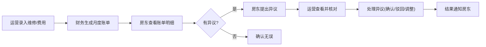

## 1. 产品概述

民宿托管公司的房东对账管理系统，解决多表数据分散导致的对账效率低问题。

- 主要目的：整合房源、订单、费用、维修、垫付、账单等数据，实现一站式对账管理
- 目标用户：运营人员、财务人员、房东
- 市场价值：提升对账效率80%，减少房东纠纷，提升托管服务满意度

## 2. 核心功能

### 2.1 用户角色

| 角色 | 登录方式 | 核心权限 |
|------|----------|----------|
| 运营人员 | 账号登录 | 录入维修工单、费用项、垫付记录，处理房东异议 |
| 财务人员 | 账号登录 | 生成月度账单，查看财务汇总 |
| 房东 | 账号登录 | 查看名下房源汇总、订单明细、月度账单，提出异议 |

### 2.2 功能模块

1. **仪表盘**：数据概览、关键指标、待办事项
2. **房源管理**：房源列表、房源详情、房源收入汇总
3. **订单管理**：订单列表、订单详情、订单收入明细
4. **费用管理**：费用项列表、新增费用、费用分类
5. **维修管理**：维修工单列表、工单详情、新增维修
6. **账单管理**：月度账单列表、账单详情、生成账单
7. **异议处理**：异议列表、异议详情、处理异议

### 2.3 页面详情

| 页面名称 | 模块名称 | 功能描述 |
|----------|----------|----------|
| 仪表盘 | 数据概览 | 展示本月收入、订单数、维修数、待处理异议等关键指标 |
| 房源列表 | 房源卡片 | 展示所有房源，支持按房东筛选，显示房源基本信息和月度收入 |
| 房源详情 | 信息概览 | 展示房源详情、月度收入趋势、订单列表、费用明细 |
| 订单列表 | 订单表格 | 展示所有订单，支持按房源、时间、状态筛选 |
| 订单详情 | 收入明细 | 展示订单收入、平台扣点、退款等详细信息 |
| 费用管理 | 费用列表 | 展示保洁费、维修费等各项费用，支持新增和编辑 |
| 维修管理 | 工单列表 | 展示维修工单，支持录入新工单，显示费用和状态 |
| 账单列表 | 账单卡片 | 展示月度账单，支持生成新账单，显示结算状态 |
| 账单详情 | 对清明细 | 展示账单汇总、订单明细、费用明细、垫付明细 |
| 异议管理 | 异议列表 | 展示房东提出的异议，支持查看详情和处理 |

## 3. 核心流程

运营录入维修工单和费用项 → 财务月底生成月度账单 → 房东查看账单明细 → 房东对有疑问的项目提出异议 → 运营查看异议并核对 → 运营处理异议（确认/驳回/调整）→ 异议结果通知房东

## 4. 用户界面设计

### 4.1 设计风格

- **主色调**：深青绿色 #0D9488（专业、稳重）
- **辅助色**：琥珀色 #F59E0B（强调、警示）
- **按钮样式**：圆角 8px，悬停有阴影效果
- **字体**：Inter 字体族，标题字重 600，正文字重 400
- **布局风格**：左侧导航 + 右侧内容，卡片式布局
- **图标风格**：Lucide 线性图标，统一尺寸 18px

### 4.2 页面设计概览

| 页面名称 | 模块名称 | UI 元素 |
|----------|----------|----------|
| 仪表盘 | 数据概览 | 4 个统计卡片（收入、订单、维修、异议），柱状图月度趋势，待办列表 |
| 房源列表 | 房源卡片 | 网格布局，卡片显示房源图片、名称、地址、本月收入、房东姓名 |
| 账单详情 | 对清明细 | 三栏式：汇总金额、订单明细、费用明细，可折叠展开 |
| 异议详情 | 处理面板 | 左侧异议信息，右侧处理表单，时间线记录处理过程 |

### 4.3 响应式

- 桌面端优先（1200px 以上）
- 平板端：左侧导航收起为图标
- 移动端：底部导航，内容单列布局

### 4.4 交互动效

- 页面加载：元素渐入 + 轻微上移动画
- 卡片悬停：向上浮动 2px，阴影加深
- 按钮点击：缩放 0.98 反馈
- 数据更新：数字滚动动画
