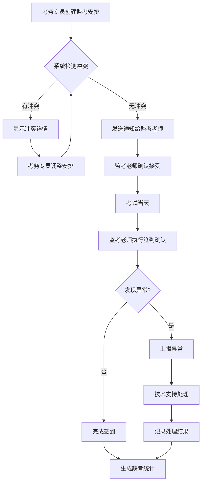

# 考务中心-监考安排与签到确认 产品需求文档

## 1. 产品概述

考务中心是一个面向高校考试管理场景的内部业务系统，旨在解决准考证信息错误、考场座位冲突、缺考统计慢等实际痛点。系统通过监考安排与签到确认的闭环流程，实现考务专员、监考老师、技术支持三方角色的有序协作，确保考试过程的规范性和数据留痕。

**核心价值**：
- 将监考安排与签到确认形成完整工作流，而非孤立功能
- 实时发现并预警准考证信息错误、考场座位冲突等风险
- 快速统计缺考情况，提升考务管理效率

## 2. 核心功能

### 2.1 用户角色

| 角色 | 职责描述 | 核心权限 |
|------|----------|----------|
| 考务专员 | 负责监考安排、处理异常情况 | 创建/修改监考安排、查看签到状态、处理风险项、批量操作 |
| 监考老师 | 执行监考任务、确认签到 | 查看个人监考安排、确认学生签到、上报异常 |
| 技术支持 | 处理系统异常、数据维护 | 查看系统日志、处理数据异常、维护考场信息 |

### 2.2 功能模块

1. **首页仪表盘**：待办事项、风险预警、最近变更、快速入口
2. **监考安排管理**：监考任务分配、批量安排、冲突检测
3. **签到确认**：学生签到确认、异常上报、缺考统计
4. **考场管理**：考场信息维护、座位编排、冲突检测
5. **数据统计**：缺考统计、监考工作量、异常分析

### 2.3 页面详情

| 页面名称 | 模块名称 | 功能描述 |
|---------|---------|---------|
| 首页仪表盘 | 待办事项 | 显示当前用户需要处理的任务列表，如待确认的监考安排、待处理的异常等 |
| 首页仪表盘 | 风险预警 | 显示准考证信息错误、考场座位冲突、监考人员不足等风险项 |
| 首页仪表盘 | 最近变更 | 显示最近24小时内的监考安排变更、签到确认记录等 |
| 首页仪表盘 | 快速入口 | 提供监考安排、签到确认、数据统计等功能的快速访问入口 |
| 监考安排管理 | 监考任务列表 | 显示所有监考任务，支持按考试、考场、时间筛选 |
| 监考安排管理 | 新建/编辑安排 | 创建或修改监考安排，支持批量操作 |
| 监考安排管理 | 冲突检测 | 自动检测监考人员时间冲突、考场座位冲突 |
| 监考安排管理 | 安排确认流程 | 监考老师确认接受任务，系统记录确认时间和人员 |
| 签到确认 | 签到列表 | 显示当前监考老师负责的学生签到情况 |
| 签到确认 | 签到操作 | 支持单个签到、批量签到、缺考标记 |
| 签到确认 | 异常上报 | 上报准考证错误、座位冲突等异常情况 |
| 签到确认 | 签到回看 | 查看历史签到记录，支持按考试、考场筛选 |
| 考场管理 | 考场列表 | 显示所有考场信息，包括座位数、设备情况等 |
| 考场管理 | 座位编排 | 查看和调整考场座位安排 |
| 数据统计 | 缺考统计 | 按考试、院系、专业统计缺考情况 |
| 数据统计 | 监考工作量 | 统计监考老师的监考次数、时长 |
| 数据统计 | 异常分析 | 分析异常类型、频率，提供改进建议 |

## 3. 核心流程

### 3.1 监考安排流程

考务专员创建监考安排 → 系统自动检测冲突 → 监考老师收到通知 → 监考老师确认接受 → 系统记录确认信息 → 考务专员查看确认状态

### 3.2 签到确认流程

监考老师进入考场 → 打开签到确认页面 → 核对学生信息 → 确认签到或标记缺考 → 发现异常时上报 → 系统实时更新统计数据

### 3.3 异常处理流程

发现异常（准考证错误/座位冲突）→ 监考老师上报异常 → 技术支持收到通知 → 技术支持处理异常 → 系统记录处理过程 → 通知相关人员

### 3.4 流程图

## 4. 用户界面设计

### 4.1 设计风格

**整体风格**：专业、高效、清晰的政务系统风格

- **主色调**：深蓝色 (#1e3a5f) - 专业、稳重
- **辅助色**：橙色 (#f59e0b) - 警示、提醒
- **成功色**：绿色 (#10b981) - 完成、正常
- **危险色**：红色 (#ef4444) - 错误、风险
- **背景色**：浅灰 (#f8fafc) - 清爽、舒适

**字体方案**：
- 标题：思源黑体 / Noto Sans SC（粗体）
- 正文：系统默认字体栈（-apple-system, BlinkMacSystemFont, "Segoe UI"）
- 数字：等宽字体（用于编号、时间等）

**布局风格**：
- 左侧固定导航栏
- 顶部用户信息和角色切换
- 主内容区卡片式布局
- 表格为主的数据展示

**交互设计**：
- 表格支持排序、筛选、批量操作
- 关键操作需二次确认
- 状态变更即时反馈
- 异常情况醒目提示

### 4.2 页面设计概览

| 页面名称 | 模块名称 | UI元素 |
|---------|---------|--------|
| 首页仪表盘 | 待办事项 | 卡片列表，每项显示类型图标、标题、截止时间、操作按钮 |
| 首页仪表盘 | 风险预警 | 红色/橙色背景卡片，显示风险类型、影响范围、紧急程度 |
| 首页仪表盘 | 最近变更 | 时间轴样式，显示变更时间、操作人、变更内容 |
| 首页仪表盘 | 快速入口 | 4个图标卡片，点击跳转对应功能 |
| 监考安排管理 | 监考任务列表 | 数据表格，支持多选、排序、筛选，每行显示考试名称、时间、考场、监考老师、状态 |
| 监考安排管理 | 新建/编辑安排 | 模态框表单，包含考试选择、考场选择、监考老师选择、时间段设置 |
| 监考安排管理 | 冲突检测 | 弹窗提示，显示冲突详情和解决建议 |
| 签到确认 | 签到列表 | 数据表格，显示学生姓名、准考证号、座位号、签到状态 |
| 签到确认 | 签到操作 | 行内按钮（签到/缺考），批量操作工具栏 |
| 签到确认 | 异常上报 | 模态框表单，选择异常类型、填写描述、上传附件 |
| 考场管理 | 考场列表 | 卡片网格布局，每个卡片显示考场编号、座位数、设备状态 |
| 数据统计 | 缺考统计 | 图表+表格，支持按维度筛选，导出Excel |

### 4.3 响应式设计

- **桌面优先**：主要针对桌面端使用场景优化
- **平板适配**：导航栏可折叠，表格支持横向滚动
- **移动端**：提供简化版视图，核心功能可用

### 4.4 角色切换设计

- 顶部导航栏右侧显示当前角色
- 点击角色名称弹出角色选择下拉菜单
- 切换角色后自动刷新页面数据
- 不同角色看到不同的菜单项和操作权限