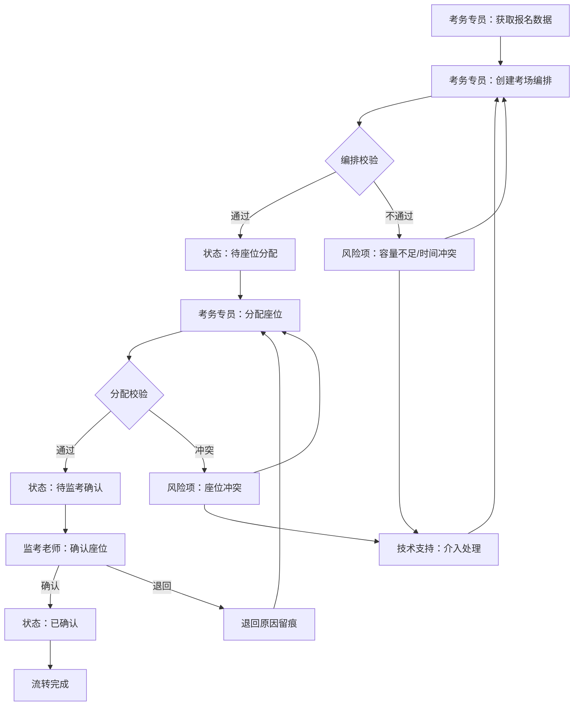

## 1. 产品概述

考务中心-考场编排与座位分配工作台，面向考务专员、监考老师、技术支持三类一线角色，将散落在报名数据、考场编排和监考名单中的信息串成可追溯的处理流水线。核心解决"谁提交了什么、谁确认了什么、当前卡在哪里"的交接留痕问题，以业务工作台形态支撑连续处理。

- 目标用户：高校/教育局考务专员（主操作人）、监考老师（确认人）、技术支持（保障人）
- 核心价值：把考场编排→座位分配→监考确认的断点流程拉成一条有状态、可回溯的工作链

## 2. 核心功能

### 2.1 用户角色

| 角色 | 进入方式 | 核心权限 |
|------|----------|----------|
| 考务专员 | 工号登录 | 创建/编辑考场编排、分配座位、提交审核、查看风险项 |
| 监考老师 | 工号登录 | 确认座位分配、查看本人监考任务、标记异常 |
| 技术支持 | 工号登录 | 处理系统异常、查看技术风险项、确认设备状态 |

### 2.2 功能模块

1. **工作台首页**：待处理队列、风险项预警、最近变更时间线、快捷操作入口
2. **考场编排页**：考场列表与编排状态、批量编排操作、编排提交与留痕
3. **座位分配页**：考场座位可视化、分配回看与历史快照、分配确认流转
4. **流转记录页**：全链路操作日志、按角色筛选交接记录、状态变更时间线

### 2.3 页面详情

| 页面名称 | 模块名称 | 功能描述 |
|----------|----------|----------|
| 工作台首页 | 待处理队列 | 按优先级展示待编排考场、待确认座位、待处理异常，支持一键跳转处理 |
| 工作台首页 | 风险项预警 | 显示考场容量不足、座位冲突、监考未覆盖等风险，标红高亮 |
| 工作台首页 | 最近变更 | 展示最近24h的操作记录流，含操作人、操作类型、时间戳 |
| 工作台首页 | 统计概览 | 考场编排完成率、座位分配率、异常率等关键指标 |
| 考场编排页 | 考场列表 | 左侧列表展示所有考场及编排状态（待编排/已编排/已提交/已退回） |
| 考场编排页 | 编排表单 | 右侧表单/面板，编辑考场容量、科目、时间段，提交时自动留痕 |
| 考场编排页 | 批量操作 | 多选考场进行批量编排、批量提交审核 |
| 座位分配页 | 座位可视化 | 以考场平面图形式展示座位布局，已分配/未分配/冲突状态用颜色区分 |
| 座位分配页 | 分配操作 | 点击座位进行手动分配或自动分配，操作即时留痕 |
| 座位分配页 | 回看快照 | 选择历史时间点查看当时的座位分配状态，支持对比两个快照 |
| 座位分配页 | 确认流转 | 监考老师确认座位分配，确认/退回操作留痕 |
| 流转记录页 | 操作日志 | 全量操作记录列表，含操作人、角色、操作类型、关联考场、时间戳 |
| 流转记录页 | 角色筛选 | 按考务专员/监考老师/技术支持筛选交接记录 |
| 流转记录页 | 状态时间线 | 选定考场后展示其编排→分配→确认的完整状态变更时间线 |

## 3. 核心流程

考务专员从报名数据中获取考生名单后，创建考场编排（选择考场、设定容量和科目），提交后进入"待座位分配"状态。考务专员或系统自动进行座位分配，分配完成后流转至监考老师确认。监考老师确认无误则状态变为"已确认"，有问题则退回并附原因。全流程每一步操作均留痕记录，技术支持可介入处理异常。

## 4. 用户界面设计

### 4.1 设计风格

- 主色调：深青色 (#0F766E) + 琥珀色 (#D97706) 作为警示/强调色，辅以石板灰 (#334155) 做文字
- 按钮风格：圆角微凸（rounded-lg + shadow-sm），主操作用实色填充，次操作用描边
- 字体：思源黑体/Noto Sans SC 作为正文，数字用 Tabular Nums 等宽对齐
- 布局风格：左侧固定导航 + 顶部状态栏 + 主内容区卡片式布局
- 图标风格：Lucide 线性图标，与文字同色系

### 4.2 页面设计概览

| 页面名称 | 模块名称 | UI 元素 |
|----------|----------|---------|
| 工作台首页 | 待处理队列 | 白底卡片，左侧彩色竖条标识优先级（红/橙/蓝），右侧操作按钮 |
| 工作台首页 | 风险项预警 | 浅红背景卡片，三角警示图标，风险等级标签 |
| 工作台首页 | 最近变更 | 时间线布局，圆点+连线，操作人头像缩写+操作描述 |
| 工作台首页 | 统计概览 | 三列数字卡片，大号数字+小号标签，环形进度图 |
| 考场编排页 | 考场列表 | 左侧窄列，行高紧凑，状态标签（待编排灰/已编排蓝/已提交绿/已退回红） |
| 考场编排页 | 编排表单 | 右侧宽面板，表单分组，底部固定操作栏（保存草稿/提交审核） |
| 考场编排页 | 批量操作 | 顶部勾选条，批量操作下拉菜单 |
| 座位分配页 | 座位可视化 | 网格布局，每个座位一个小方块，颜色区分状态，hover 显示考生信息 |
| 座位分配页 | 分配操作 | 右侧抽屉面板，考生列表拖拽或点击分配 |
| 座位分配页 | 回看快照 | 顶部时间轴滑块，拖动切换历史快照 |
| 座位分配页 | 确认流转 | 底部确认栏，确认/退回按钮，退回需填原因 |
| 流转记录页 | 操作日志 | 表格布局，斑马纹，操作类型用不同颜色标签 |
| 流转记录页 | 角色筛选 | 顶部标签切换（全部/考务专员/监考老师/技术支持） |
| 流转记录页 | 状态时间线 | 展开行内嵌时间线，圆点+状态标签+时间戳 |

### 4.3 响应式

- 桌面优先设计，最小宽度 1280px
- 左侧导航可折叠为图标模式
- 座位可视化区域支持缩放

### 4.4 3D 场景指导

不适用
