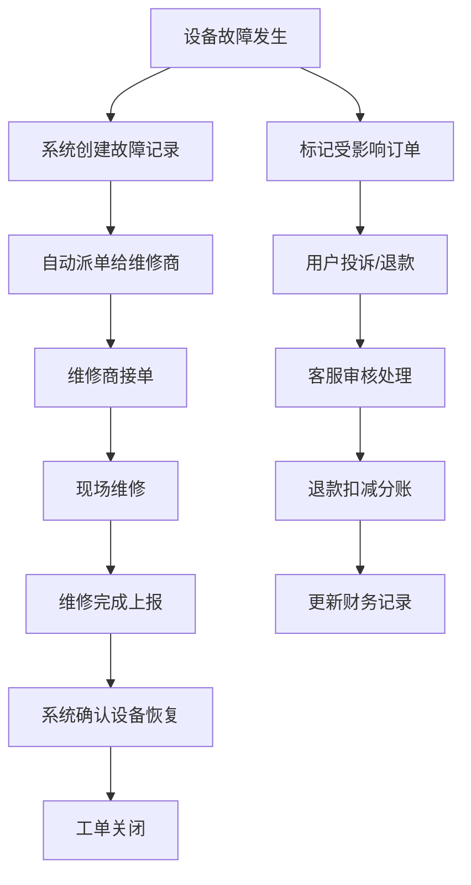

# 充电桩运营后台系统 PRD

## 1. 产品概述

充电桩运营后台管理系统，解决设备故障、抢修派单、订单影响、电费分账全链路管理问题。目标用户包括运营人员、客服、维修商和财务人员，实现站点监控-故障告警-工单流转-订单处理-分账调整的闭环管理。

## 2. 核心功能

### 2.1 用户角色

| 角色 | 登录方式 | 核心权限 |
|------|----------|----------|
| 运营管理员 | 账号密码登录 | 站点概览、故障监控、全局数据统计 |
| 客服人员 | 账号密码登录 | 处理用户投诉、退款审核、订单查询 |
| 维修商 | 账号密码登录 | 接收抢修工单、上报维修进度、查看历史工单 |
| 财务人员 | 账号密码登录 | 电费分账、对账异议处理、财务报表 |

### 2.2 功能模块

1. **首页仪表盘**：站点状态概览、故障统计、工单趋势、分账数据
2. **站点管理**：站点列表/地图、设备状态、站点详情
3. **故障管理**：故障列表、故障详情、故障时间线
4. **工单管理**：抢修工单、派单调度、工单进度追踪
5. **订单管理**：充电订单、受影响订单、退款处理
6. **投诉管理**：用户投诉列表、投诉处理、投诉记录
7. **分账管理**：电费分账、分账调整、对账异议、财务报表

### 2.3 页面详情

| 页面名称 | 模块名称 | 功能描述 |
|---------|----------|----------|
| 首页仪表盘 | 数据概览 | 站点在线率、故障数量、待处理工单、分账金额统计卡片 |
| 首页仪表盘 | 站点地图 | 可视化显示所有站点位置及状态 |
| 首页仪表盘 | 趋势图表 | 7天故障趋势、工单完成率、分账金额走势 |
| 站点列表 | 站点筛选 | 按区域、状态、设备数量筛选站点 |
| 站点列表 | 站点卡片 | 显示站点名称、地址、设备状态、在线率 |
| 站点详情 | 设备列表 | 站点内所有充电桩状态、功率、型号 |
| 站点详情 | 故障历史 | 该站点历史故障记录 |
| 故障列表 | 故障筛选 | 按故障类型、状态、时间筛选 |
| 故障详情 | 基本信息 | 故障设备、故障时间、故障类型、严重程度 |
| 故障详情 | 时间线 | 故障发生、派单、维修、完成全流程时间线 |
| 故障详情 | 受影响订单 | 该故障期间受影响的充电订单列表 |
| 工单列表 | 工单状态 | 待接单、进行中、已完成、已超时 |
| 工单详情 | 派单信息 | 派单时间、维修商、预计到达时间 |
| 工单详情 | 进度上报 | 维修商上报维修进度、上传照片 |
| 订单列表 | 订单筛选 | 按状态、站点、时间筛选 |
| 订单详情 | 退款处理 | 申请退款、审核退款、退款记录 |
| 投诉列表 | 投诉分类 | 设备故障、充电中断、费用异议、其他 |
| 投诉详情 | 投诉处理 | 记录处理过程、关联订单、关联故障 |
| 分账概览 | 分账统计 | 总收入、平台分成、场地方分成、退款扣减 |
| 分账明细 | 分账列表 | 按站点、按时间的分账明细 |
| 分账调整 | 调整记录 | 退款扣减、补偿、对账异议调整记录 |
| 对账异议 | 异议处理 | 场地方提出的对账异议处理流程 |

## 3. 核心流程

### 3.1 故障处理流程

站点设备掉线 → 系统自动检测并创建故障记录 → 自动派单给维修商 → 维修商接单并前往现场 → 维修完成上报 → 系统确认设备恢复 → 工单关闭 → 计算维修超时（如有）

### 3.2 订单影响处理流程

故障发生 → 标记受影响的充电订单 → 用户发起投诉/退款 → 客服审核 → 确认退款 → 退款金额从分账中扣减 → 更新财务记录

### 3.3 分账流程

每日充电订单结算 → 按比例计算平台/场地方分成 → 生成预分账单 → 处理退款扣减、维修补偿 → 生成最终分账单 → 场地方确认 → 如有异议进入异议处理流程 → 完成分账

## 4. 用户界面设计

### 4.1 设计风格

- **主色调**：工业蓝 (#1e40af) - 体现专业、可靠的运营系统
- **辅助色**：警示橙 (#f97316) - 故障告警；成功绿 (#10b981) - 正常状态；危险红 (#ef4444) - 紧急故障
- **按钮样式**：圆角4px，简约扁平，悬停有轻微阴影
- **字体**：系统默认无衬线字体，标题16-18px，正文14px，辅助文字12px
- **布局风格**：左侧导航栏 + 顶部状态栏 + 主内容区的经典后台布局
- **图标风格**：线性图标，统一24px尺寸

### 4.2 页面设计概览

| 页面名称 | 模块名称 | UI 元素 |
|---------|----------|----------|
| 首页仪表盘 | 数据概览 | 4个统计卡片网格布局，带图标和趋势箭头 |
| 首页仪表盘 | 站点地图 | 全屏地图，站点标记用颜色区分状态 |
| 故障列表 | 表格 | 带状态标签的高级表格，支持排序筛选 |
| 故障详情 | 时间线 | 垂直时间线，带状态节点和时间戳 |
| 工单详情 | 进度条 | 水平进度条显示工单完成度 |
| 分账概览 | 图表 | 饼图显示分成比例，折线图显示趋势 |

### 4.3 响应式

- 桌面端优先设计（1440px以上）
- 平板端（768px-1440px）：导航栏可折叠
- 移动端：简化为列表视图，保留核心操作

### 4.4 交互细节

- 状态标签使用不同颜色区分：在线-绿色，离线-红色，维修中-橙色
- 表格行悬停高亮，点击展开详情
- 时间线节点带动画效果
- 故障告警有闪烁动画提醒
- 页面切换有淡入过渡效果
