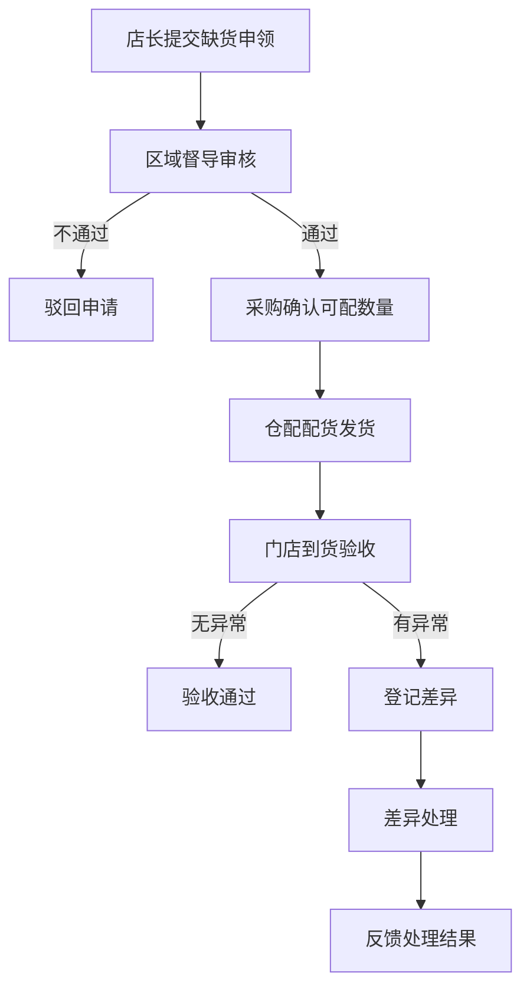

## 1. Product Overview

餐饮连锁门店缺货申领与到货验收系统，将门店申领、总部配货、到货验收和差异反馈串联起来，实现缺货管理全流程数字化。目标用户包括店长、区域督导、采购/仓配人员，解决传统缺货管理流程繁琐、信息不透明的问题。

## 2. Core Features

### 2.1 User Roles
| Role | Registration Method | Core Permissions |
|------|---------------------|------------------|
| 店长 | 系统账号 | 提交缺货申领、查看配货状态、到货验收、提交差异反馈 |
| 区域督导 | 系统账号 | 审核缺货申请、查看区域缺货情况 |
| 采购/仓配 | 系统账号 | 确认可配数量、更新配货状态、处理差异反馈 |

### 2.2 Feature Module
1. **缺货申领页**: 店长提交缺货申请，选择商品、填写缺货原因和数量
2. **配货状态页**: 查看申领单审核状态、配货进度
3. **到货验收页**: 验收商品数量、规格、温度，登记异常
4. **差异处理页**: 查看和处理验收差异，生成差异报告
5. **门店反馈页**: 查看历史申领记录和反馈结果

### 2.3 Page Details
| Page Name | Module Name | Feature description |
|-----------|-------------|---------------------|
| 缺货申领 | 申领表单 | 选择门店、商品，填写缺货原因、期望到货时间 |
| 缺货申领 | 商品列表 | 显示商品库存、规格、单位，支持搜索筛选 |
| 配货状态 | 状态列表 | 显示申领单状态（待审核/已审核/配货中/已发货） |
| 到货验收 | 验收表单 | 扫描/输入到货数量，检查规格和冷链温度 |
| 到货验收 | 异常登记 | 登记数量差异、规格错误、温度异常 |
| 差异处理 | 差异列表 | 查看验收差异，处理少配、错配、温度异常 |
| 门店反馈 | 历史记录 | 查看门店所有申领记录和处理结果 |

## 3. Core Process

## 4. User Interface Design

### 4.1 Design Style
- Primary color: #2563eb (蓝色系，代表专业、可靠)
- Secondary color: #f59e0b (橙色系，代表警示、提醒)
- Button style: 圆角矩形，hover状态有阴影变化
- Font: Inter，标题18-24px，正文14px，辅助文字12px
- Layout: 卡片式布局，左侧导航，右侧内容区域
- Icon: lucide-react，简洁现代风格

### 4.2 Page Design Overview
| Page Name | Module Name | UI Elements |
|-----------|-------------|-------------|
| 缺货申领 | 表单区域 | 门店选择下拉框、商品搜索输入框、缺货原因多选/输入、数量输入框、提交按钮 |
| 配货状态 | 列表区域 | 状态标签（待审核/已审核/配货中/已发货/已验收）、申领单号、商品信息、操作按钮 |
| 到货验收 | 验收区域 | 到货单号、商品列表、数量输入、温度输入、规格选择、异常类型选择 |
| 差异处理 | 处理区域 | 差异类型标签、差异详情、处理建议输入、处理状态更新 |
| 门店反馈 | 记录区域 | 时间线展示、状态变更记录、反馈内容 |

### 4.3 Responsiveness
- Desktop-first设计，支持1280px以上屏幕
- 平板端自适应布局，导航收缩为图标
- 移动端单列布局，底部导航栏

### 4.4 样例数据
- 临时断货：某商品库存为0，需紧急补货
- 少配：申领10箱，实际到货8箱
- 错配：申领A规格，实际到货B规格
- 冷链温度异常：冷藏商品到货时温度超标
