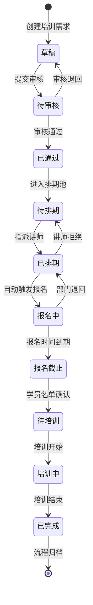

# 企业内训部-讲师排期与学员报名系统 PRD

## 1. 产品概述

解决企业内训部讲师排期与学员报名动作分散、流程断裂的问题。通过状态驱动的工作流，将培训需求、讲师排期、学员报名自然串联，让培训经理、部门负责人、讲师三个角色在同一系统中各司其职，无需额外消息提醒即可完成工作交接。

核心价值：**状态即流程，所见即所办**——默认列表自动呈现今天要办、已拖延、刚退回的数据，让工作自然流转。

## 2. 核心功能

### 2.1 用户角色

| 角色 | 入口页面 | 核心权限 |
|------|----------|----------|
| 培训经理 | 培训经理工作台 | 创建培训需求、指派讲师、审核退回、查看全局进度 |
| 部门负责人 | 部门负责人工作台 | 提交培训需求、确认学员名单、查看部门培训状态 |
| 讲师 | 讲师工作台 | 确认排期、查看学员名单、提交培训反馈 |

### 2.2 功能模块

1. **培训经理工作台**：待办看板、培训需求管理、讲师排期中心、学员报名监控
2. **部门负责人工作台**：培训需求提交、学员报名确认、部门培训日历
3. **讲师工作台**：排期确认、学员名单查看、培训记录回填

### 2.3 页面详情

| 页面名称 | 模块名称 | 功能描述 |
|----------|----------|----------|
| 培训经理工作台 | 待办看板 | 默认显示今天要办、已拖延、刚退回的数据，按紧急程度排序 |
| 培训经理工作台 | 培训需求管理 | 创建/编辑培训需求，状态：草稿→待审核→已通过→已排期 |
| 培训经理工作台 | 讲师排期中心 | 指派讲师、设置时间地点，排期完成后自动触发学员报名流程 |
| 培训经理工作台 | 学员报名监控 | 查看各部门报名进度、催办未完成部门、处理异常退回 |
| 部门负责人工作台 | 培训需求提交 | 选择培训课程、填写参训人数、提交审核 |
| 部门负责人工作台 | 学员报名确认 | 接收排期通知、确认/调整学员名单、提交最终名单 |
| 部门负责人工作台 | 部门培训日历 | 查看本部门所有已排期培训的时间安排 |
| 讲师工作台 | 排期确认 | 查看待确认排期、确认/拒绝排期、查看培训详情 |
| 讲师工作台 | 学员名单查看 | 查看已报名学员信息、导出学员名单 |
| 讲师工作台 | 培训记录回填 | 培训结束后填写培训反馈、上传培训材料 |

## 3. 核心流程

### 3.1 主流程描述

**培训需求到学员报名的完整流转**：

1. 培训经理创建培训需求 → 需求进入"待审核"状态
2. 需求审核通过 → 进入"待排期"状态，出现在讲师排期中心
3. 培训经理指派讲师并设置时间地点 → 排期状态变为"已排期"
4. **系统自动触发学员报名流程** → 相关部门负责人工作台出现报名任务
5. 部门负责人确认学员名单 → 报名状态变为"已确认"
6. 讲师查看学员名单 → 确认排期 → 状态变为"待培训"
7. 培训完成 → 讲师填写反馈 → 流程结束

### 3.2 状态流转图

### 3.3 默认列表数据规则

**智能待办列表**：系统自动聚合三类数据，无需手动筛选

- **今天要办**：截止日期为今天或今天需要处理的任务
- **已经拖延**：截止日期已过但未完成的任务（红色高亮）
- **刚刚被退回**：24小时内被退回的任务（橙色标记）

## 4. 用户界面设计

### 4.1 设计风格

- **主色调**：深蓝色系（#1E3A5F）为主，配合橙色（#FF6B35）作为强调色
- **按钮风格**：圆角矩形按钮，主操作按钮使用填充色，次操作使用边框样式
- **字体**：思源黑体（Source Han Sans）作为主字体，数字使用等宽字体
- **布局风格**：左侧固定导航栏 + 右侧内容区，卡片式布局
- **图标风格**：线性图标，统一使用2px线宽

### 4.2 页面设计概览

| 页面名称 | 模块名称 | UI元素 |
|----------|----------|--------|
| 培训经理工作台 | 待办看板 | 三列卡片布局（今天要办/已拖延/刚退回），每张卡片显示任务类型、标题、截止时间、操作按钮 |
| 培训经理工作台 | 讲师排期中心 | 左侧培训需求列表，右侧讲师日历视图，拖拽式排期 |
| 部门负责人工作台 | 学员报名确认 | 培训信息卡片 + 学员名单表格 + 确认/调整按钮组 |
| 讲师工作台 | 排期确认 | 时间线视图展示排期详情，确认/拒绝按钮，拒绝原因输入框 |

### 4.3 响应式设计

- 桌面优先设计，最小支持1440px宽度
- 平板端（768px-1024px）：导航栏收起为汉堡菜单，卡片单列布局
- 移动端（<768px）：暂不支持，提示用户使用桌面端

### 4.4 交互设计要点

- **状态变化即时反馈**：任何状态变更后，页面自动刷新待办列表
- **自然衔接提示**：排期完成后，系统在部门负责人工作台顶部显示"新排期待确认"横幅
- **时间线可视化**：每个培训详情页展示完整时间线，记录所有状态变更节点
- **数据重置确认**：任何数据重置操作需二次确认，防止误操作

## 5. 前后端边界定义

### 5.1 前端负责

- **讲师排期处理**：排期表单验证、讲师选择器、日历组件交互
- **详情时间线渲染**：从后端获取时间线数据，前端负责可视化展示
- **学员报名回看**：历史报名数据的列表展示和筛选

### 5.2 后端负责

- **状态流转逻辑**：所有状态变更的校验和执行
- **数据重置**：重置操作的权限校验和数据清理
- **自然衔接触发**：排期完成后自动创建部门报名任务
- **默认列表数据聚合**：聚合今天要办、已拖延、刚退回的数据

### 5.3 数据持久化

- 所有状态变更记录时间线日志
- 报名数据支持回看，不物理删除
- 重置操作标记为"已重置"状态，保留历史记录