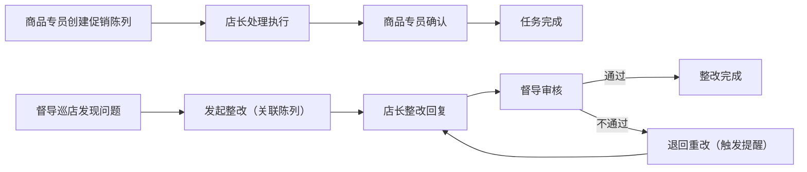

## 1. 产品概述
便利店连锁促销陈列与巡店整改系统，解决门店促销陈列执行不到位、巡店整改责任不清、沟通断层等问题。通过数字化流程明确各角色责任，实现促销陈列与巡店整改的全链路闭环管理。

- 目标用户：店长、督导、商品专员
- 核心价值：责任清晰化、流程标准化、数据可追溯

## 2. 核心功能

### 2.1 用户角色
| 角色 | 登录方式 | 核心权限 |
|------|----------|----------|
| 店长 | 演示账号登录 | 处理促销陈列任务、查看巡店整改、提交整改回复 |
| 督导 | 演示账号登录 | 发起巡店整改、审核整改结果、退回异常项、查看促销陈列 |
| 商品专员 | 演示账号登录 | 创建促销陈列任务、查看执行情况、确认陈列效果 |

### 2.2 功能模块
1. **登录页**：角色选择、演示账号快捷登录
2. **工作台**：角色差异化入口、待办任务统计
3. **促销陈列管理**：创建任务、处理执行、备注记录、状态流转
4. **巡店整改管理**：发起整改、整改处理、审核退回、历史回看
5. **系统管理**：数据重置、演示账号管理

### 2.3 页面详情
| 页面名称 | 模块名称 | 功能描述 |
|----------|----------|----------|
| 登录页 | 角色选择 | 三种角色卡片选择，演示账号一键登录 |
| 工作台 | 数据概览 | 待办数量、状态统计、快捷入口 |
| 促销陈列列表 | 列表展示 | 筛选、搜索、状态标签、责任标识 |
| 促销陈列详情 | 详情处理 | 基本信息、备注记录、状态操作、关联整改 |
| 巡店整改列表 | 列表展示 | 筛选、搜索、异常标记、退回记录 |
| 巡店整改详情 | 详情处理 | 问题描述、整改要求、回复记录、审核操作 |
| 系统设置 | 数据管理 | 一键重置数据、查看演示账号 |

## 3. 核心流程

### 3.1 促销陈列流程
商品专员创建促销陈列任务 → 店长接收并处理（上传照片、填写备注）→ 商品专员确认 → 任务完成
→ 若巡店发现陈列问题，督导可发起整改

### 3.2 巡店整改流程
督导巡店发现问题 → 创建整改任务（关联促销陈列）→ 店长接收并整改 → 督导审核
→ 审核通过：完成 → 审核不通过：退回重改（触发提醒）

## 4. 用户界面设计

### 4.1 设计风格
- 主色调：深蓝色 (#1e40af) 代表专业可靠，橙红色 (#f97316) 作为警示/异常色
- 按钮风格：圆角 8px，悬停有阴影过渡
- 字体：系统无衬线字体，清晰易读
- 布局：顶部导航 + 左侧菜单 + 内容区卡片式布局
- 图标：Lucide 图标库，线性风格

### 4.2 页面设计概览
| 页面名称 | 模块名称 | UI 元素 |
|----------|----------|---------|
| 登录页 | 角色卡片 | 渐变背景、卡片悬浮效果、角色图标 |
| 工作台 | 数据看板 | 统计卡片、进度条、待办列表、快捷操作 |
| 列表页 | 表格 | 状态标签、筛选栏、操作列、责任高亮 |
| 详情页 | 信息区 | 时间线、备注流、操作按钮组 |

### 4.3 响应式
桌面端优先，支持平板适配，主要操作区域保证最小宽度 1200px

### 4.4 交互细节
- 状态变更有确认弹窗
- 退回操作需填写原因，触发红色提醒
- 备注支持跨模块查看（促销陈列备注可在巡店整改中看到）
- 异常项有高亮边框和图标警示
