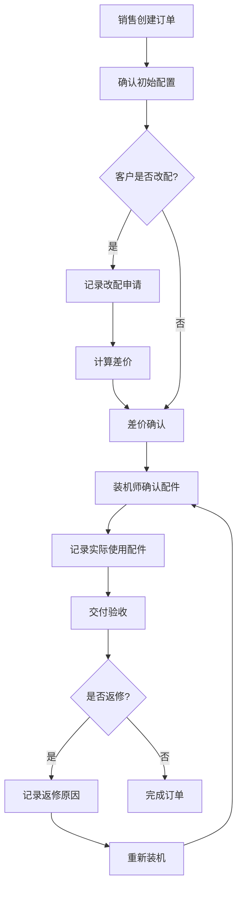

## 1. Product Overview
电脑装机店配置改动与差价复核系统，解决装机过程中临时变更导致的差价难以追踪问题。销售确认配置、装机师记录实际配件、售后客服追溯争议，确保配置改动自动影响差价计算。

## 2. Core Features

### 2.1 User Roles
| Role | Registration Method | Core Permissions |
|------|---------------------|------------------|
| 销售 | 本地账号 | 创建订单、确认配置、发起改配 |
| 装机师 | 本地账号 | 记录实际使用配件、确认库存批次 |
| 售后客服 | 本地账号 | 查看订单历史、处理争议、查看返修记录 |

### 2.2 Feature Module
1. **配置原单管理**: 创建和查看原始配置清单
2. **改配记录管理**: 记录客户临时升级、缺货替换等变更
3. **配件批次管理**: 管理配件库存和批次信息
4. **差价确认管理**: 自动计算差价、确认待补款项
5. **交付验收管理**: 记录交付状态、处理返修

### 2.3 Page Details
| Page Name | Module Name | Feature description |
|-----------|-------------|---------------------|
| 订单列表 | 配置原单 | 展示所有订单，支持筛选和搜索 |
| 订单详情 | 配置原单 | 查看完整配置清单和订单信息 |
| 改配记录 | 改配记录 | 记录和查看配置变更历史 |
| 配件管理 | 配件批次 | 管理配件库存和批次 |
| 差价复核 | 差价确认 | 查看和确认差价计算结果 |
| 交付验收 | 交付验收 | 记录交付状态和返修情况 |

## 3. Core Process

## 4. User Interface Design
### 4.1 Design Style
- Primary color: #3B82F6 (蓝色系，专业可靠)
- Secondary color: #10B981 (绿色系，用于成功状态)
- Warning color: #F59E0B (橙色系，用于待确认状态)
- Danger color: #EF4444 (红色系，用于异常状态)
- Button style: 圆角矩形，hover状态有阴影
- Font: Inter，清晰可读
- Layout: 卡片式布局，顶部导航
- Icon: Lucide图标库

### 4.2 Page Design Overview
| Page Name | Module Name | UI Elements |
|-----------|-------------|-------------|
| 订单列表 | 配置原单 | 表格展示、搜索框、筛选器、状态标签 |
| 订单详情 | 配置原单 | 配置卡片、价格明细、操作按钮 |
| 改配记录 | 改配记录 | 时间线展示、变更对比、差价显示 |
| 配件管理 | 配件批次 | 库存表格、批次信息、入库/出库操作 |
| 差价复核 | 差价确认 | 差价计算表、确认按钮、历史记录 |
| 交付验收 | 交付验收 | 验收表单、返修记录、状态追踪 |

### 4.3 Responsiveness
- Desktop-first design
- 侧边栏导航在移动端收起为汉堡菜单
- 表格在移动端转为卡片堆叠展示

### 4.4 Sample Scenarios
1. **客户临时升级**: 客户在装机前决定升级内存，销售记录改配，系统自动计算差价
2. **缺货替换**: 原定显卡缺货，装机师选择替代型号，记录替换原因和差价
3. **差价待确认**: 改配后差价需要客户确认，系统标记待确认状态
4. **交付后蓝屏返修**: 交付后客户反馈蓝屏，售后记录返修原因并重新装机
