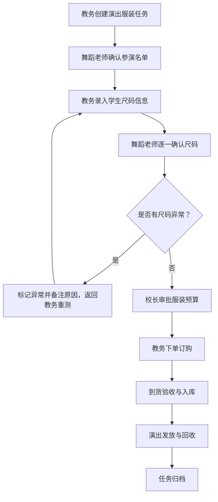

## 1. 产品概述

本系统为舞蹈培训机构提供演出服装与尺码确认的全流程追踪管理。解决传统排课表、考级名单和服装订购表只记录结果、责任不清的问题，通过责任人和时间线双维度，清晰呈现「谁在处理、卡在哪里、为什么未完成」三件事。

- 目标用户：教务人员、舞蹈老师、校长（管理层）
- 核心价值：让演出服装管理的每一步都可追溯、可问责、可回看

---

## 2. 核心功能

### 2.1 用户角色

| 角色 | 核心职能 | 系统权限 |
|------|----------|----------|
| 教务 | 发起服装需求、收集尺码、跟进供应商 | 新建演出服装任务、录入尺码、流转状态 |
| 舞蹈老师 | 确认学生名单、核对服装款式与尺码 | 确认名单、备注异常、标记尺码问题 |
| 校长 | 审批预算、监控整体进度 | 审批、查看全局统计、催促处理 |

### 2.2 功能模块

1. **演出服装工作台**：任务总览、快捷筛选、最近打开、待办提醒
2. **服装详情与时间线**：状态流转记录、责任人切换、每步操作备注
3. **尺码确认管理**：学生名单、尺码录入、尺码确认回看、异常标记
4. **责任人追踪**：当前处理人、历史处理人、各环节耗时统计

### 2.3 页面详情

| 页面名称 | 模块名称 | 功能描述 |
|----------|----------|----------|
| 工作台 | 顶部概览卡片 | 展示进行中/待确认/已完成/异常的演出服装数量 |
| 工作台 | 快捷筛选栏 | 按状态、责任人、演出日期、关键词多维筛选 |
| 工作台 | 最近打开 | 记录最近访问的 5 条服装任务，点击快速跳转 |
| 工作台 | 任务列表 | 展示演出名称、日期、当前状态、处理人、更新时间 |
| 服装详情 | 基本信息 | 演出名称、日期、服装套数、预算、关联班级 |
| 服装详情 | 状态时间线 | 每个状态节点显示时间、操作人、备注说明 |
| 服装详情 | 尺码确认表 | 学生名单、身高/体重/三围、尺码、确认状态、异常备注 |
| 服装详情 | 操作面板 | 状态流转按钮、指派处理人、添加备注 |
| 尺码回看 | 时间线视图 | 每个学生的尺码修改历史，含修改人、修改时间、变更内容 |

---

## 3. 核心流程

演出服装从创建到归档的完整流程：教务发起 → 老师确认名单 → 教务收集尺码 → 老师确认尺码 → 校长审批 → 订购 → 到货验收 → 归档。每个节点都必须记录：操作人、操作时间、备注说明。

---

## 4. 用户界面设计

### 4.1 设计风格

- **主色调**：深酒红 #7B2D26（舞台感、专业）+ 暖米金 #D4A574（优雅、品质）
- **辅助色**：墨绿 #2D5A3D（确认通过）、赭石 #C06E2C（待处理）、深灰 #3D3D3D（中性）
- **背景**：米白 #FAF7F2，配细腻噪点纹理营造纸质档案质感
- **按钮风格**：微圆角（6px）、轻微下沉阴影、悬停浮起过渡
- **字体**：标题用「思源宋体」（文艺庄重），正文用「思源黑体」（清晰易读）
- **布局风格**：卡片式布局，左侧筛选 + 右侧列表/详情的经典工作台布局
- **时间线视觉**：垂直时间轴，节点用圆形徽标，已完成节点填色，当前节点脉冲动画

### 4.2 页面设计概览

| 页面名称 | 模块名称 | UI 设计要点 |
|----------|----------|-------------|
| 工作台 | 顶部概览 | 4 张统计卡片，数字用大号思源宋体，底部小字说明，卡片间细线分隔 |
| 工作台 | 筛选栏 | 胶囊式筛选标签，选中态酒红填充 + 白色文字，未选中浅灰边框 |
| 工作台 | 最近打开 | 横向卡片排列，悬浮时左侧显示金色竖条强调 |
| 工作台 | 任务列表 | 每行显示演出名称（加粗）、日期（小号）、状态徽标、负责人头像+姓名 |
| 服装详情 | 时间线 | 左侧垂直时间轴贯穿页面，右侧对应展示状态内容与操作记录 |
| 服装详情 | 尺码表 | 斑马纹表格，异常行赭石底色高亮，操作列有确认/标记异常按钮 |
| 服装详情 | 操作面板 | 底部固定条，主操作按钮酒红色，次要操作描边按钮 |

### 4.3 响应式

桌面端优先设计（1440px 基准），平板端（≥768px）保持双栏布局但收窄侧边栏，移动端（<768px）切换为单栏堆叠，筛选栏变为抽屉式弹出。
