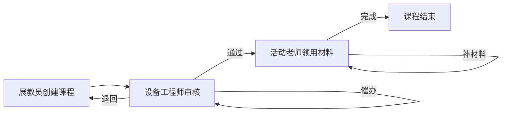

## 1. Product Overview
科技馆展教实验课程与材料领用管理系统，用于管理实验课程的申请、审核、材料领用流程，支持展教员、设备工程师、活动老师协同工作，解决实验课程与材料领用之间责任不清的问题。

## 2. Core Features

### 2.1 User Roles
| Role | Registration Method | Core Permissions |
|------|---------------------|------------------|
| 展教员 | 系统分配 | 创建实验课程、提交材料申请 |
| 设备工程师 | 系统分配 | 审核课程、确认材料需求 |
| 活动老师 | 系统分配 | 领用材料、反馈使用情况 |

### 2.2 Feature Module
1. **实验课程管理**: 课程列表、状态管理（待审核/已通过/已退回/催办中）、课程详情、历史备注
2. **材料领用管理**: 材料清单、领用记录、上一环节结论查看
3. **快捷筛选**: 按状态、角色、时间筛选
4. **备份恢复**: 数据导出、导入恢复

### 2.3 Page Details
| Page Name | Module Name | Feature description |
|-----------|-------------|---------------------|
| 首页 | 课程列表 | 展示所有实验课程，支持状态筛选、催办操作 |
| 课程详情 | 详情面板 | 课程信息、历史备注、材料清单、处理操作 |
| 材料领用 | 领用面板 | 材料列表、领用状态、上一环节结论 |
| 备份管理 | 备份恢复 | 数据导出、导入恢复功能 |

## 3. Core Process
用户流程：展教员创建课程 → 设备工程师审核（通过/退回/催办）→ 活动老师领用材料 → 课程完成

## 4. User Interface Design
### 4.1 Design Style
- Primary color: #1E40AF (深蓝色)
- Secondary color: #F59E0B (琥珀色)
- Button style: Rounded corners, shadow effects
- Font: Inter, 14px base size
- Layout: Card-based, sidebar navigation

### 4.2 Page Design Overview
| Page Name | Module Name | UI Elements |
|-----------|-------------|-------------|
| 首页 | 课程卡片 | 状态标签、操作按钮、快速筛选栏 |
| 课程详情 | 详情面板 | 标签页切换、历史备注列表、材料清单表格 |
| 材料领用 | 领用表单 | 材料勾选、数量输入、备注框 |

### 4.3 Responsiveness
Desktop-first design with responsive layout for tablet and mobile.

### 4.4 状态说明
| 状态 | 含义 | 处理角色 |
|------|------|----------|
| 待审核 | 课程等待设备工程师审核 | 设备工程师 |
| 已通过 | 审核通过，等待材料领用 | 活动老师 |
| 已退回 | 审核未通过，需修改 | 展教员 |
| 催办中 | 被催办状态 | 当前处理人 |
| 补材料 | 材料不足，需要补充 | 活动老师 |
| 已完成 | 课程结束 | 无 |