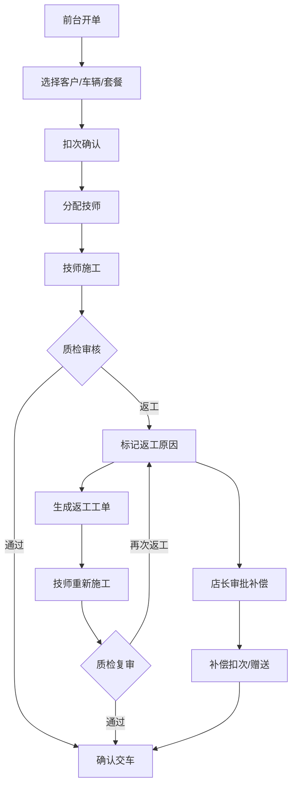

## 1. 产品概述

汽车美容店全流程管理系统——将开单、施工、质检、套餐扣次、返工补偿串联为一条完整业务闭环。解决"客户买套餐师傅不知道剩几次、质检返工无法联动扣次补偿"的断点问题，让前台、技师、质检员、店长各角色在统一平台上高效协作。

## 2. 核心功能

### 2.1 用户角色

| 角色 | 进入方式 | 核心权限 |
|------|----------|----------|
| 前台接待 | 默认角色 | 开单、查看客户/车辆/套餐、收款结算 |
| 施工技师 | 切换角色 | 查看今日施工队列、更新施工进度、标记完成 |
| 质检员 | 切换角色 | 质检审核、标记返工、确认交车 |
| 店长 | 切换角色 | 查看返工率、套餐消耗、全流程监控、补偿审批 |

### 2.2 功能模块

1. **工作台**：今日施工队列、待质检工单、角色快捷入口、车牌搜索框
2. **客户与车辆**：客户档案、多车辆管理、车牌搜索历史记录、套餐余量查看
3. **开单**：新建施工工单、关联套餐扣次、选择施工项目、分配技师
4. **施工处理**：技师查看待施工/进行中项目、更新进度、标记施工完成
5. **质检与返工**：质检员审核施工结果、标记返工原因、关联原工单、补偿扣次
6. **店长看板**：返工率统计、套餐消耗趋势、员工施工效率、补偿记录汇总

### 2.3 页面详情

| 页面名称 | 模块名称 | 功能描述 |
|----------|----------|----------|
| 工作台 | 车牌搜索框 | 输入车牌号实时搜索，快速定位客户及历史工单 |
| 工作台 | 今日施工队列 | 按状态分组展示待施工/进行中/待质检/已完成工单卡片 |
| 工作台 | 角色切换 | 顶部角色切换，不同角色看到不同快捷操作 |
| 工作台 | 统计概览 | 今日工单数、待施工数、返工数、套餐即将到期提醒 |
| 客户详情 | 客户信息 | 姓名、电话、备注、会员等级 |
| 客户详情 | 车辆列表 | 多辆车、车牌、品牌型号、颜色 |
| 客户详情 | 套餐列表 | 已购套餐、剩余次数、有效期、使用记录 |
| 客户详情 | 历史工单 | 按时间线展示所有施工记录 |
| 开单页 | 客户/车辆选择 | 支持搜索已有客户或新建 |
| 开单页 | 项目选择 | 从套餐扣次或单独付费项目 |
| 开单页 | 套餐扣次确认 | 显示套餐剩余次数，扣次前确认 |
| 开单页 | 技师分配 | 选择施工技师 |
| 施工页 | 待施工列表 | 技师视角的施工队列 |
| 施工页 | 施工详情 | 项目详情、车辆信息、施工注意事项 |
| 施工页 | 进度更新 | 标记开始施工、标记完成 |
| 质检页 | 待质检列表 | 所有施工完成待质检的工单 |
| 质检页 | 质检操作 | 通过/返工、返工原因、返工项目选择 |
| 质检页 | 交车确认 | 质检通过后确认交车 |
| 店长看板 | 返工率统计 | 按时段/技师统计返工率 |
| 店长看板 | 套餐消耗 | 各套餐使用频次、即将到期套餐 |
| 店长看板 | 补偿记录 | 返工补偿记录、补偿类型分布 |

## 3. 核心流程

**正常施工流程**：前台开单 → 选择客户/车辆/套餐 → 扣次确认 → 分配技师 → 技师施工 → 施工完成 → 质检员审核 → 通过交车

**返工补偿流程**：质检发现不合格 → 标记返工及原因 → 系统自动关联原工单 → 生成返工工单 → 技师重新施工 → 质检通过 → 套餐补偿（返还次数或额外赠送）

## 4. 用户界面设计

### 4.1 设计风格

- **主色调**：深藏青 (#0F172A) + 琥珀色 (#F59E0B) 作为强调色，传达专业与可信赖感
- **辅助色**：翡翠绿 (#10B981) 表示通过/完成，玫红 (#F43F5E) 表示返工/警告
- **按钮风格**：圆角矩形 (rounded-lg)，主操作按钮带微妙阴影，状态标签使用药丸形 (pill)
- **字体**：标题使用 Outfit (几何感、现代)，正文使用 Noto Sans SC (中文友好)
- **布局风格**：左侧固定导航 + 右侧内容区，卡片式布局，状态列使用看板风格
- **图标**：Lucide 图标库，线性风格

### 4.2 页面设计概览

| 页面名称 | 模块名称 | UI元素 |
|----------|----------|--------|
| 工作台 | 车牌搜索 | 顶部居中大搜索框，实时下拉匹配，搜索图标 + 键盘快捷键提示 |
| 工作台 | 施工队列 | 四列看板（待施工/进行中/待质检/已完成），每列内工单卡片纵向排列 |
| 工作台 | 统计卡片 | 四个统计数字卡片（今日工单/待施工/返工/即将到期），带图标和趋势箭头 |
| 客户详情 | 客户信息 | 左侧客户头像+基本信息卡片，右侧Tab切换（车辆/套餐/历史） |
| 客户详情 | 套餐卡片 | 每个套餐一张卡片，显示项目名/剩余次数/进度条/有效期 |
| 开单页 | 步骤表单 | 左侧步骤导航(1-客户2-项目3-扣次4-确认)，右侧对应表单 |
| 开单页 | 套餐扣次 | 套餐选择后显示剩余次数和本次扣次，低余量时红色警告 |
| 施工页 | 施工列表 | 列表式布局，每行显示车牌/项目/客户名，右侧操作按钮 |
| 质检页 | 质检卡片 | 大卡片布局，上方车辆+项目信息，下方通过/返工操作按钮 |
| 店长看板 | 统计图表 | 顶部汇总数字，下方柱状图/饼图展示返工率和套餐消耗 |

### 4.3 响应式

- 桌面优先设计，1280px 以上完整展示
- 平板适配：看板变为两列，表格支持横向滚动
- 手机适配：看板变为单列Tab切换，底部导航替代侧边栏

### 4.4 数据展示规范

- 金额：¥符号 + 千分位分隔
- 次数：数字 + "次" + 进度条
- 日期：YYYY-MM-DD HH:mm
- 状态：彩色药丸标签（待施工-蓝、进行中-琥珀、待质检-紫、已完成-绿、返工-红）
