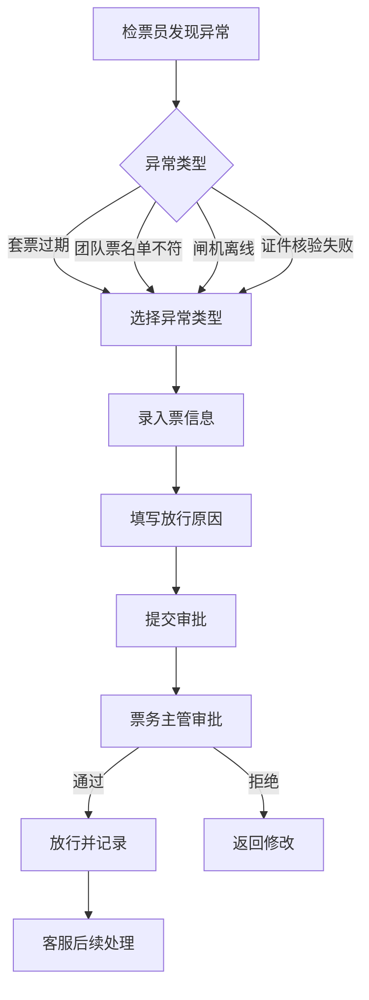

## 1. Product Overview
景区票务异常放行工作台 - 为检票口提供快速处理异常票的操作界面，记录放行原因、审批人、关联票信息，支持快速操作和合规追溯。

## 2. Core Features

### 2.1 User Roles
| Role | Registration Method | Core Permissions |
|------|---------------------|------------------|
| 检票员 | 账号密码登录 | 处理闸机失败、证件不符等异常，提交放行申请 |
| 票务主管 | 账号密码登录 | 审批特殊放行申请，查看放行记录 |
| 客服 | 账号密码登录 | 处理退改或投诉，查看放行记录 |

### 2.2 Feature Module
1. **异常放行工作台**: 快速处理异常票，支持扫码、手动输入票号
2. **放行记录查询**: 查看所有异常放行记录，支持筛选和导出
3. **审批管理**: 票务主管审批特殊放行申请

### 2.3 Page Details
| Page Name | Module Name | Feature description |
|-----------|-------------|---------------------|
| 异常放行工作台 | 快速操作区 | 扫码输入、票号输入、快速选择异常类型 |
| 异常放行工作台 | 票信息展示 | 展示票种、渠道、游客信息、现场备注 |
| 异常放行工作台 | 审批流程 | 检票员提交、主管审批、记录保存 |
| 放行记录查询 | 列表展示 | 按时间、票号、状态筛选，支持分页 |
| 放行记录查询 | 详情弹窗 | 展示完整放行记录和审批信息 |

## 3. Core Process

## 4. User Interface Design

### 4.1 Design Style
- 主色调: 深蓝色(#1e40af)，辅助色: 橙色(#f97316)用于强调
- 按钮风格: 圆角矩形，主按钮深蓝色背景白色文字，次按钮白色背景深蓝边框
- 字体: 微软雅黑/Inter，标题18-24px，正文14px，小字体12px
- 布局风格: 卡片式布局，左侧操作区，右侧信息展示区
- 图标风格: lucide-react图标库

### 4.2 Page Design Overview
| Page Name | Module Name | UI Elements |
|-----------|-------------|-------------|
| 异常放行工作台 | 快速操作区 | 扫码按钮、票号输入框、异常类型选择器、提交按钮 |
| 异常放行工作台 | 票信息卡片 | 票种标签、渠道标识、游客信息、有效期、状态标识 |
| 异常放行工作台 | 审批表单 | 放行原因下拉框、审批人选择、现场备注文本框 |
| 放行记录查询 | 筛选栏 | 时间范围选择、票号输入、状态筛选、搜索按钮 |
| 放行记录查询 | 记录列表 | 票号、游客姓名、异常类型、处理时间、状态 |

### 4.3 Responsiveness
- 桌面优先设计，支持1280px以上分辨率
- 操作按钮大尺寸设计，适合快速点击
- 关键信息突出显示，便于快速识别

## 5. Mock Data
### 5.1 异常类型配置
| 异常类型 | 说明 | 处理方式 |
|----------|------|----------|
| 套票过期 | 套票有效期已过 | 主管审批后放行 |
| 团队票名单不符 | 游客不在团队名单中 | 主管审批后放行 |
| 闸机离线 | 闸机网络故障 | 手动放行记录 |
| 老人证件核验失败 | 身份证读取失败 | 人工核验后放行 |

### 5.2 票种配置
| 票种名称 | 有效期 | 渠道 |
|----------|--------|------|
| 成人票 | 1天 | 官网/OTA/现场 |
| 儿童票 | 1天 | 官网/OTA/现场 |
| 老人票 | 1天 | 官网/OTA/现场 |
| 家庭套票 | 2天 | 官网/OTA |
| 团队票 | 1天 | 旅行社 |