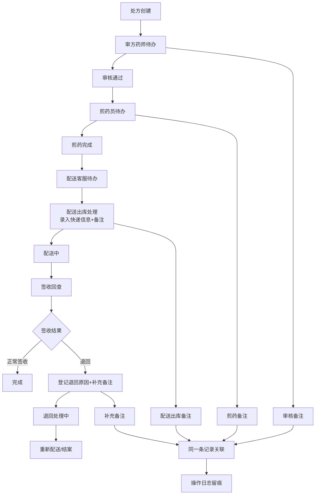

## 1. 产品概述

本系统为中药煎药房提供配送出库与签收回查的全链路追踪管理，解决当前信息分散、缺乏统一口径和操作留痕的核心痛点，实现处方从审核、煎药、配送、签收的完整可追溯链条。

- **目标用户**：审方药师、煎药员、配送客服三类角色
- **核心价值**：统一数据口径、完整操作留痕、角色化待办驱动、全链路状态可追溯

## 2. 核心功能

### 2.1 用户角色

| 角色 | 登录方式 | 核心权限 |
|------|----------|----------|
| 审方药师 | 角色选择（轻量实现） | 处方审核、查看待审处方、录入审核备注 |
| 煎药员 | 角色选择（轻量实现） | 煎药操作、查看待煎处方、录入煎药备注 |
| 配送客服 | 角色选择（轻量实现） | 配送出库处理、签收回查、退回原因登记、补充备注 |

### 2.2 功能模块

1. **角色切换入口**：登录/角色选择页面，快速切换身份
2. **待办看板**：按角色展示当前待处理任务列表
3. **处方详情**：单条处方全量信息展示（含全链路时间线）
4. **配送出库处理**：录入快递信息、配送备注，支持附件上传占位
5. **签收回查**：确认签收状态、登记退回原因、补充配送备注
6. **操作日志**：全链路操作留痕，支持回溯查看

### 2.3 页面详情

| 页面名称 | 模块名称 | 功能描述 |
|---------|---------|----------|
| 角色选择页 | 角色卡片 | 点击选择当前操作角色，进入对应待办看板 |
| 待办看板 | 待办列表 | 按角色展示待处理处方，支持搜索筛选 |
| 待办看板 | 状态概览 | 顶部展示各状态数量统计 |
| 处方详情页 | 基本信息 | 患者信息、处方内容、诊断信息 |
| 处方详情页 | 状态时间线 | 从审核到签收的全链路状态流转时间轴 |
| 处方详情页 | 操作区 | 根据当前状态和角色展示可用操作按钮 |
| 处方详情页 | 操作日志 | 展示所有操作记录（操作人、时间、内容） |
| 配送出库抽屉 | 表单区 | 快递公司、单号、配送备注输入 |
| 配送出库抽屉 | 附件区 | 处方照片、煎药标签、快递单上传占位 |
| 签收回查抽屉 | 签收确认 | 正常签收/退回选择 |
| 签收回查抽屉 | 退回原因 | 退回类型选择、原因说明、补充备注 |

## 3. 核心流程

**流程说明**：
1. 处方进入系统后，按状态自动进入对应角色的待办列表
2. 每个环节录入的备注全部关联到同一条处方记录，后续环节可见
3. 配送出库录入的快递信息和备注，签收回查环节可直接查看和补充
4. 所有操作（状态变更、备注录入）自动生成操作日志，可完整回溯

## 4. 用户界面设计

### 4.1 设计风格

**设计基调**：专业医疗级的冷静克制风格，强调可读性和操作效率

- **主色调**：深青色 `#0F766E`（代表专业、可信）
- **辅助色**：琥珀色 `#D97706`（提醒、待处理）、深绿 `#065F46`（完成、正常）、暗红 `#991B1B`（异常、退回）
- **中性色**：石板灰系列，保证长时间使用不疲劳
- **字体**：标题使用 `Noto Sans SC` 600，正文使用 `Noto Sans SC` 400，数字使用等宽字体
- **按钮风格**：方形微圆角（4px），2px 边框强调，悬停时轻微上浮
- **布局风格**：卡片式布局，清晰的区域分隔，大量留白保证信息可读性
- **图标**：Lucide 线性图标，保持统一粗细

### 4.2 页面设计概览

| 页面名称 | 模块名称 | UI 元素 |
|---------|---------|----------|
| 角色选择 | 角色卡片 | 三列等宽卡片，悬停放大动效，图标+角色名+职责说明 |
| 待办看板 | 顶部统计 | 四个状态卡片（待审核/待煎药/待配送/待签收），数字醒目 |
| 待办看板 | 列表区 | 斑马行表格，状态标签带颜色，操作按钮靠右 |
| 处方详情 | 时间线 | 左侧垂直时间轴，节点带状态色，右侧操作内容 |
| 处方详情 | 操作日志 | 折叠面板，展开显示操作人、时间、备注详情 |
| 抽屉表单 | 表单控件 | 标签左对齐，输入框统一高度，必填项红星标记 |

### 4.3 响应式

- **桌面优先**：主内容区最大宽度 1440px
- **平板适配**：≥768px 时保持双列布局，列表单列展示
- **触控优化**：按钮最小高度 44px，表单控件间距充足

## 5. 轻量实现说明

以下功能采用轻量级实现，真实生产环境需增强：

1. **账号体系**：使用角色选择模拟登录，无真实用户认证、权限控制
2. **附件上传**：仅提供上传入口 UI，无真实文件存储和预览
3. **第三方通知**：无短信/微信/快递 API 对接，状态变更仅在系统内展示
4. **数据持久化**：使用内存存储 + localStorage 模拟，刷新页面数据保留但不跨设备
5. **打印功能**：无煎药标签、快递单打印功能
