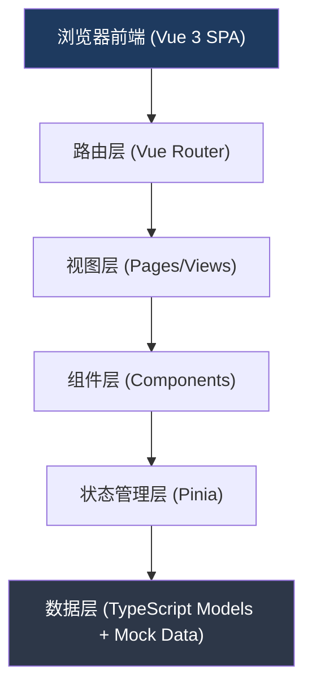
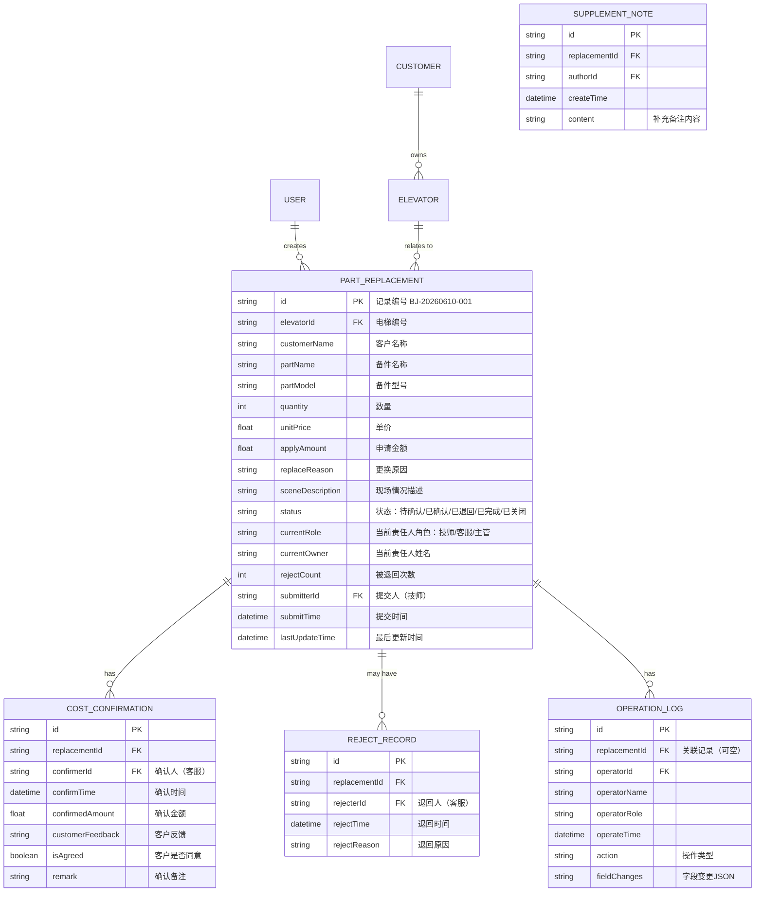

## 1. 架构设计



## 2. 技术描述

- **前端框架**：Vue 3.4 + TypeScript 5.x（使用 `<script setup>` 语法）
- **构建工具**：Vite 5.x
- **UI样式**：Tailwind CSS 3.x（实用优先，减少自定义CSS）
- **状态管理**：Pinia 2.x（按模块拆分：用户/角色、备件更换记录、操作历史）
- **路由**：Vue Router 4.x
- **图标**：Lucide Icons（简洁线性风格）
- **数据**：本地 Mock 数据，使用 TypeScript 接口定义类型，模拟后端响应
- **日期处理**：date-fns（轻量级日期格式化工具）
- **后端**：无（纯前端演示，数据全部存储在前端内存和 localStorage 中）
- **数据库**：localStorage 作为持久化存储，刷新页面数据不丢失

## 3. 路由定义

| 路由路径 | 页面名称 | 主要内容 |
|----------|----------|----------|
| `/` | 工作台首页 | 角色切换、待办统计、责任风险列表、快捷入口 |
| `/replacements` | 备件更换处理 | 密集表格、筛选、新建申请、记录详情抽屉 |
| `/cost-review` | 费用确认回看 | 筛选区、统计摘要、确认明细表格 |
| `/history` | 操作历史 | 全量操作日志、变更详情对比 |
| `/background` | 背景资料 | Tab切换：维保计划/故障电话/年检资料 |

## 4. 数据模型

### 4.1 核心实体定义



### 4.2 状态枚举

```typescript
// 备件更换记录状态
type ReplacementStatus = 'pending_confirm' | 'confirmed' | 'rejected' | 'completed' | 'closed'

// 用户角色
type UserRole = 'technician' | 'customer_service' | 'supervisor'

// 操作类型
type OperationAction = 
  | 'create_replacement'
  | 'submit_replacement'
  | 'confirm_cost_approved'
  | 'confirm_cost_rejected'
  | 'resubmit_replacement'
  | 'close_replacement'
  | 'add_supplement_note'
  | 'upload_attachment'
  | 'export_report'
```

## 5. 项目目录结构

```
frontend/
├── src/
│   ├── assets/            # 静态资源
│   ├── components/        # 可复用组件
│   │   ├── DataTable.vue           # 密集数据表格
│   │   ├── StatusBadge.vue         # 状态色块标签
│   │   ├── DetailDrawer.vue        # 右侧详情抽屉
│   │   ├── RoleSwitcher.vue        # 角色切换器
│   │   ├── StatCard.vue            # 统计数字卡片
│   │   ├── TimeLine.vue            # 操作时间线
│   │   └── FilterBar.vue           # 筛选栏
│   ├── composables/       # 组合式函数
│   │   ├── useRole.ts              # 角色相关逻辑
│   │   └── useTableFilter.ts       # 表格筛选逻辑
│   ├── layouts/           # 布局组件
│   │   └── MainLayout.vue          # 主布局（顶栏+侧边+内容）
│   ├── mock/              # Mock 数据
│   │   ├── replacements.ts         # 备件更换记录
│   │   ├── elevators.ts            # 电梯数据
│   │   ├── customers.ts            # 客户数据
│   │   ├── maintenancePlans.ts     # 维保计划
│   │   ├── faultCalls.ts           # 故障电话
│   │   ├── inspectionDocs.ts       # 年检资料
│   │   └── operations.ts           # 操作历史
│   ├── router/            # 路由配置
│   │   └── index.ts
│   ├── stores/            # Pinia 状态管理
│   │   ├── user.ts                 # 用户/角色状态
│   │   ├── replacements.ts         # 备件更换数据
│   │   └── operations.ts           # 操作历史
│   ├── types/             # TypeScript 类型定义
│   │   ├── index.ts
│   │   └── enums.ts
│   ├── utils/             # 工具函数
│   │   ├── format.ts               # 格式化（金额、日期）
│   │   └── storage.ts              # localStorage 封装
│   ├── views/             # 页面视图
│   │   ├── DashboardView.vue       # 工作台
│   │   ├── ReplacementsView.vue    # 备件更换处理
│   │   ├── CostReviewView.vue      # 费用确认回看
│   │   ├── HistoryView.vue         # 操作历史
│   │   └── BackgroundView.vue      # 背景资料
│   ├── App.vue
│   ├── main.ts
│   └── style.css           # 全局样式 + Tailwind 引入
├── index.html
├── package.json
├── tsconfig.json
├── vite.config.ts
└── tailwind.config.js
```

## 6. 关键技术决策

1. **单文件组件 `<script setup>`**：所有 Vue 组件使用 Composition API + `<script setup lang="ts">` 语法，确保类型安全和代码简洁。

2. **Pinia 模块划分**：
   - `user` store：管理当前登录用户、角色切换、权限判断
   - `replacements` store：核心业务数据，CRUD 操作、状态流转、筛选逻辑
   - `operations` store：操作日志的追加和查询

3. **数据持久化**：所有 store 的关键状态自动同步到 localStorage，刷新页面后数据保留。初始化时优先从 localStorage 读取，不存在则加载 mock 数据。

4. **密集表格实现**：使用原生 `<table>` 而非第三方组件库，配合 Tailwind 工具类实现高信息密度。固定表头、斑马纹、悬停高亮均通过 CSS 实现。

5. **状态流转控制**：封装 `canTransitionTo(currentStatus, targetStatus, userRole)` 工具函数，集中管理状态机逻辑，防止非法操作。

6. **占位数据说明**：
   - 附件上传：显示上传按钮和"已上传3个文件（占位）"文字
   - 外部通知：显示"已发送短信通知客户"、"已生成确认函（占位）"等状态标签
   - 导出功能：点击后生成 CSV 格式的模拟数据下载
