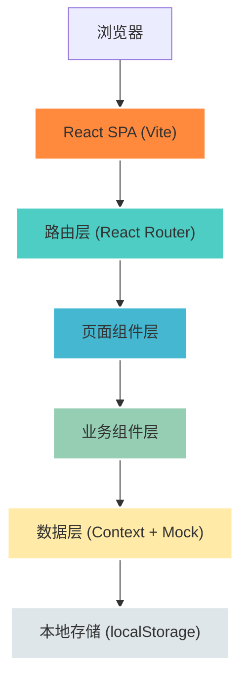

## 1. 架构设计



## 2. 技术描述

- **前端框架**：React@18 + TypeScript@5 + Vite@5
- **样式方案**：TailwindCSS@3.4 + CSS变量主题系统
- **路由管理**：React Router@6.20
- **图标库**：Lucide React
- **状态管理**：React Context API + useReducer（轻量级全局状态）
- **数据持久化**：localStorage（模拟后端存储）
- **动画库**：Framer Motion（用于页面过渡和微交互）
- **图表库**：Recharts（轻量级React图表，用于饮食睡眠数据可视化）
- **初始化工具**：npm create vite@latest

## 3. 目录结构

```
src/
├── components/          # 通用组件
│   ├── Layout/          # 布局组件
│   ├── UI/              # 基础UI组件（Button, Card, Badge等）
│   └── Features/        # 业务组件（Timeline, MessageList等）
├── pages/               # 页面组件
│   ├── Login.tsx
│   ├── TeacherDashboard.tsx
│   ├── PrincipalDashboard.tsx
│   └── ChildDetail.tsx
├── context/             # 全局状态
│   ├── AuthContext.tsx
│   └── DataContext.tsx
├── data/                # Mock数据
│   ├── mockChildren.ts
│   ├── mockRecords.ts
│   └── mockMessages.ts
├── types/               # TypeScript类型定义
│   └── index.ts
├── hooks/               # 自定义Hooks
│   └── useLocalStorage.ts
├── utils/               # 工具函数
│   └── format.ts
├── App.tsx
├── main.tsx
└── index.css
```

## 4. 路由定义

| 路由路径 | 页面 | 权限 | 说明 |
|---------|------|------|------|
| `/login` | 登录页 | 公开 | 角色选择和登录验证 |
| `/teacher` | 班主任工作台 | 班主任 | 班级孩子列表、待办提醒 |
| `/teacher/child/:id` | 孩子详情页 | 班主任 | 时间线、照片、饮食睡眠、消息 |
| `/principal` | 园长工作台 | 园长 | 数据概览、异常监控、待回复列表 |
| `/principal/child/:id` | 孩子详情页 | 园长 | 查看孩子完整记录（只读） |
| `*` | 404重定向 | - | 重定向到登录页 |

## 5. 数据模型

### 5.1 ER图

```mermaid
erDiagram
    USER ||--o{ CLASS : "manages"
    USER ||--o{ MESSAGE : "sends/replies"
    CLASS ||--o{ CHILD : "contains"
    CHILD ||--o{ RECORD : "has"
    CHILD ||--o{ MESSAGE : "related to"
    CHILD ||--o{ PHOTO : "has"
    CHILD ||--o{ HEALTH_ALERT : "has"
    
    USER {
        string id PK
        string name
        string role "teacher|principal"
        string avatar
        string password
    }
    
    CLASS {
        string id PK
        string name
        string teacherId FK
        number childCount
    }
    
    CHILD {
        string id PK
        string name
        number age
        string avatar
        string classId FK
        string parentName
        string parentPhone
        string[] allergies
        string[] medications
        date admissionDate
    }
    
    RECORD {
        string id PK
        string childId FK
        string type "arrival|meal|nap|mood|health|other"
        string time
        string content
        string[] tags
        string severity "normal|warning|danger"
        string[] photoIds
        string createdBy
    }
    
    MESSAGE {
        string id PK
        string childId FK
        string sender "parent|teacher"
        string senderName
        string content
        datetime timestamp
        boolean isRead
        string priority "low|medium|high"
    }
    
    PHOTO {
        string id PK
        string childId FK
        string url
        string caption
        datetime timestamp
    }
    
    HEALTH_ALERT {
        string id PK
        string childId FK
        string type "allergy|medication|special"
        string description
        boolean isActive
    }
```

### 5.2 TypeScript 类型定义

```typescript
export type UserRole = 'teacher' | 'principal';

export interface User {
  id: string;
  name: string;
  role: UserRole;
  avatar: string;
  password: string;
}

export interface Class {
  id: string;
  name: string;
  teacherId: string;
  childCount: number;
}

export type RecordType = 'arrival' | 'meal' | 'nap' | 'mood' | 'health' | 'other';
export type Severity = 'normal' | 'warning' | 'danger';

export interface Record {
  id: string;
  childId: string;
  type: RecordType;
  time: string;
  content: string;
  tags: string[];
  severity: Severity;
  photoIds: string[];
  createdBy: string;
}

export type MessagePriority = 'low' | 'medium' | 'high';

export interface Message {
  id: string;
  childId: string;
  sender: 'parent' | 'teacher';
  senderName: string;
  content: string;
  timestamp: string;
  isRead: boolean;
  priority: MessagePriority;
}

export interface Photo {
  id: string;
  childId: string;
  url: string;
  caption: string;
  timestamp: string;
}

export interface HealthAlert {
  id: string;
  childId: string;
  type: 'allergy' | 'medication' | 'special';
  description: string;
  isActive: boolean;
}

export interface Child {
  id: string;
  name: string;
  age: number;
  avatar: string;
  classId: string;
  parentName: string;
  parentPhone: string;
  allergies: string[];
  medications: string[];
  admissionDate: string;
}

export interface MealRecord {
  type: 'breakfast' | 'lunch' | 'snack' | 'dinner';
  time: string;
  food: string;
  amount: number; // 0-100 percentage
}

export interface NapRecord {
  startTime: string;
  endTime: string;
  duration: number; // minutes
  quality: 'good' | 'fair' | 'poor';
  notes: string;
}
```

## 6. 核心组件设计

### 6.1 通用组件

| 组件名 | 用途 | Props |
|-------|------|-------|
| `Button` | 通用按钮 | variant, size, onClick, children |
| `Card` | 卡片容器 | padding, shadow, children |
| `Badge` | 状态标签 | color, children |
| `Avatar` | 头像 | src, size, name |
| `Modal` | 弹窗 | isOpen, onClose, title, children |
| `TabBar` | 标签页切换 | tabs, activeTab, onChange |

### 6.2 业务组件

| 组件名 | 用途 | 所在页面 |
|-------|------|---------|
| `ChildCard` | 孩子信息卡片 | 班主任工作台 |
| `Timeline` | 记录时间线 | 孩子详情 |
| `TimelineItem` | 单条时间线记录 | 孩子详情 |
| `PhotoWall` | 照片展示墙 | 孩子详情 |
| `MealNapChart` | 饮食睡眠图表 | 孩子详情 |
| `HealthAlertPanel` | 健康提醒面板 | 孩子详情 |
| `MessageList` | 消息列表 | 孩子详情 |
| `QuickRecordModal` | 快速记录弹窗 | 全局 |
| `StatsCard` | 数据统计卡片 | 园长工作台 |
| `AlertList` | 异常列表 | 园长工作台 |
| `PendingReplyList` | 待回复家长列表 | 园长工作台 |

## 7. Mock 数据设计

### 7.1 预设账号

| 角色 | 账号 | 密码 |
|-----|------|------|
| 班主任 | teacher | 123456 |
| 园长 | principal | 123456 |

### 7.2 预设孩子（8个）

1. 小宝 - 2岁，入园第3天，新生，情绪敏感
2. 妞妞 - 3岁，睡眠不好
3. 浩浩 - 4岁，鸡蛋过敏
4. 壮壮 - 3.5岁，活泼好动
5. 朵朵 - 2.5岁，安静内向
6. 阳阳 - 3岁，挑食
7. 萌萌 - 4岁，班长
8. 天天 - 3.5岁，感冒恢复中

### 7.3 预设场景数据

- 小宝：3条哭闹记录 + 1条早餐记录（食量50%）+ 3条家长未读消息
- 妞妞：1条午睡记录（30分钟）+ 情绪烦躁记录
- 浩浩：1条午餐记录（无蛋餐，食量100%）+ 过敏健康提醒
- 壮壮：1条健康记录（轻微擦伤）+ 照片
- 其他孩子：正常记录若干

## 8. 开发规范

1. **组件命名**：PascalCase，业务组件前缀为功能模块名
2. **类型定义**：优先使用TypeScript接口，避免any类型
3. **样式规范**：优先使用TailwindCSS工具类，复杂样式使用CSS-in-JS或CSS模块
4. **状态提升**：组件间共享状态提升至最近公共父组件或Context
5. **性能优化**：列表使用key，合理使用React.memo、useMemo、useCallback
6. **可访问性**：图片添加alt，按钮添加aria-label，表单关联label
7. **错误处理**：页面添加错误边界，数据加载添加loading状态
