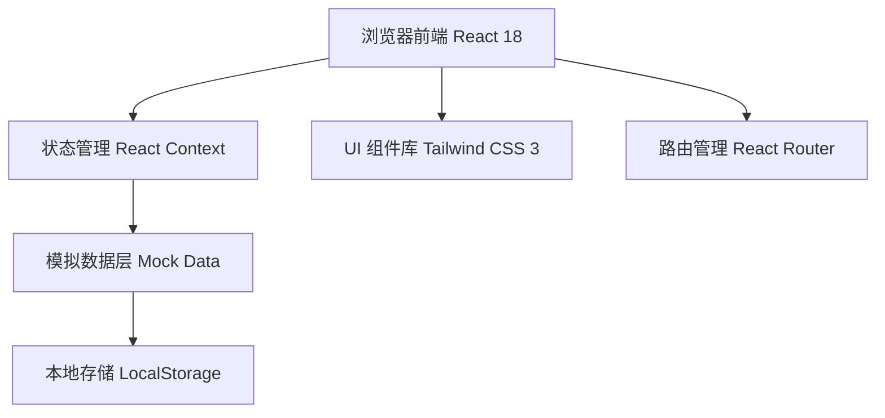
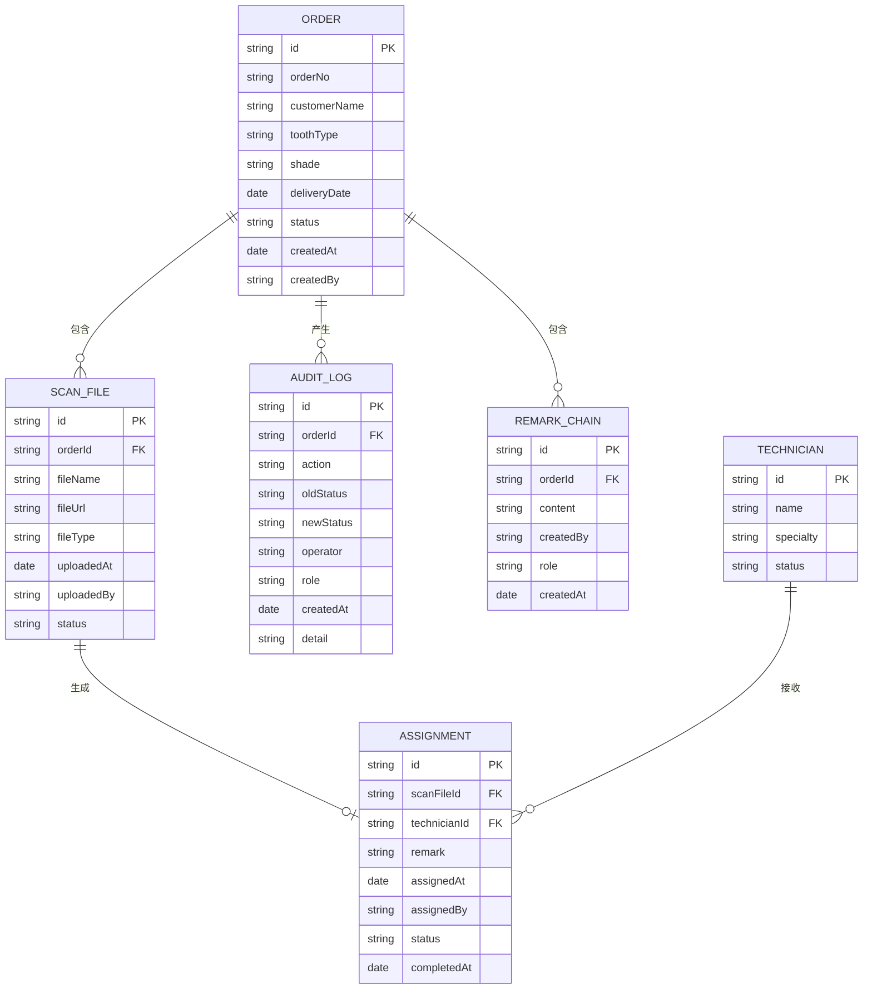

## 1. 架构设计



## 2. 技术选型说明

- **前端框架**：React@18 + TypeScript
- **构建工具**：Vite@5
- **样式方案**：Tailwind CSS@3
- **路由**：React Router DOM@6
- **图标**：Lucide React
- **图表**：原生实现（状态流转时间轴）
- **数据持久化**：LocalStorage（模拟后端存储）
- **模拟数据**：TypeScript 类型定义 + Mock 数据生成

## 3. 路由定义

| 路由路径 | 页面用途 | 访问角色 |
|---------|---------|---------|
| `/` | 角色入口页 | 所有 |
| `/customer-service` | 接单客服工作台 | 接单客服 |
| `/customer-service/order/:id` | 订单详情/扫描上传 | 接单客服 |
| `/designer` | 数字设计师工作台 | 数字设计师 |
| `/designer/scan/:id` | 扫描处理+技师派单 | 数字设计师 |
| `/designer/assignments` | 派单回看 | 数字设计师 |
| `/quality` | 质检员工作台 | 质检员 |
| `/quality/order/:id` | 质检处理 | 质检员 |
| `/audit` | 审计日志 | 质检员、管理员 |
| `/integration` | 集成点说明 | 管理员 |

## 4. 数据模型

### 4.1 实体关系图



### 4.2 状态流转约束

| 当前状态 | 可转换至 | 触发角色 | 前置条件 |
|---------|---------|---------|---------|
| `PENDING`（待上传扫描） | `SCAN_UPLOADED` | 接单客服 | 扫描文件已上传 |
| `SCAN_UPLOADED` | `PROCESSING` | 数字设计师 | 无 |
| `PROCESSING` | `ASSIGNED` | 数字设计师 | 已选择技师并提交派单 |
| `ASSIGNED` | `IN_PRODUCTION` | 系统自动 | 技师确认接收 |
| `IN_PRODUCTION` | `PENDING_INSPECTION` | 系统自动 | 生产完成 |
| `PENDING_INSPECTION` | `COMPLETED` | 质检员 | 质检合格 |
| `PENDING_INSPECTION` | `REWORK` | 质检员 | 质检不合格 |
| `REWORK` | `PROCESSING` | 系统自动 | 自动回退到设计师环节 |

### 4.3 TypeScript 类型定义

```typescript
// 订单状态枚举
export type OrderStatus = 
  | 'PENDING'
  | 'SCAN_UPLOADED'
  | 'PROCESSING'
  | 'ASSIGNED'
  | 'IN_PRODUCTION'
  | 'PENDING_INSPECTION'
  | 'COMPLETED'
  | 'REWORK';

// 角色枚举
export type Role = 'CUSTOMER_SERVICE' | 'DESIGNER' | 'QUALITY' | 'ADMIN';

// 订单
export interface Order {
  id: string;
  orderNo: string;
  customerName: string;
  toothType: string;
  shade: string;
  deliveryDate: string;
  status: OrderStatus;
  createdAt: string;
  createdBy: string;
}

// 扫描文件
export interface ScanFile {
  id: string;
  orderId: string;
  fileName: string;
  fileUrl: string;
  fileType: string;
  uploadedAt: string;
  uploadedBy: string;
  status: 'UPLOADED' | 'PROCESSED';
}

// 技师派单
export interface Assignment {
  id: string;
  scanFileId: string;
  orderId: string;
  technicianId: string;
  technicianName: string;
  remark: string;
  customerServiceRemark: string;
  designerRemark: string;
  assignedAt: string;
  assignedBy: string;
  status: 'PENDING' | 'ACCEPTED' | 'COMPLETED';
  completedAt?: string;
}

// 技师
export interface Technician {
  id: string;
  name: string;
  specialty: string;
  status: 'AVAILABLE' | 'BUSY';
}

// 备注链
export interface Remark {
  id: string;
  orderId: string;
  content: string;
  createdBy: string;
  role: Role;
  createdAt: string;
}

// 审计日志
export interface AuditLog {
  id: string;
  orderId: string;
  action: string;
  oldStatus?: string;
  newStatus?: string;
  operator: string;
  role: Role;
  createdAt: string;
  detail: string;
}

// 分页参数
export interface PaginationParams {
  page: number;
  pageSize: number;
}

// 筛选参数
export interface FilterParams {
  status?: OrderStatus;
  startDate?: string;
  endDate?: string;
  keyword?: string;
}
```

## 5. 验收接口清单

| 接口（模拟） | 功能描述 | 验收点 |
|-------------|---------|-------|
| `GET /api/orders` | 订单列表（分页筛选） | 分页正确、筛选条件生效 |
| `GET /api/orders/:id` | 订单详情 | 关联扫描文件、备注链完整 |
| `POST /api/orders` | 创建订单 | 订单号自动生成、状态默认为 PENDING |
| `POST /api/scan-files` | 上传扫描文件 | 自动记录操作日志 |
| `PUT /api/scan-files/:id/process` | 处理扫描文件 | 状态流转正确 |
| `POST /api/assignments` | 创建技师派单 | 备注自动继承、状态约束检查 |
| `GET /api/assignments` | 派单列表（回看） | 关联订单和扫描文件信息 |
| `PUT /api/orders/:id/quality-check` | 质检处理 | 合格/返工状态正确流转 |
| `GET /api/audit-logs` | 审计日志（分页筛选） | 按订单/角色/时间筛选 |
| `GET /api/technicians` | 技师列表 | 支持按专业筛选 |

## 6. 模拟数据说明

- **位置**：`src/data/mockData.ts`
- **内容**：包含 20 条模拟订单、5 名模拟技师、15 条扫描文件记录、10 条派单记录、30 条审计日志
- **状态分布**：覆盖所有 8 种订单状态，包含正常流程和返工流程

## 7. 暂未实现的集成点

| 集成点 | 说明 | 预期对接系统 |
|-------|------|-------------|
| 口扫设备对接 | 直接从口扫设备获取扫描文件 | 口扫设备软件 API |
| 微信消息推送 | 派单/状态变更自动推送至技师微信群 | 企业微信 API / 微信小程序 |
| ERP 系统对接 | 订单同步至 ERP 进行生产计划管理 | 现有 ERP 系统 |
| 财务系统对接 | 订单完成后自动生成应收账单 | 财务系统 |
| 短信通知 | 交付日期临近提醒客户 | 短信服务 API |
| 文件存储 | 扫描文件云存储（当前为本地模拟） | 阿里云 OSS / AWS S3 |
