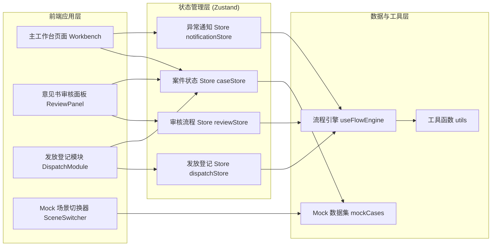
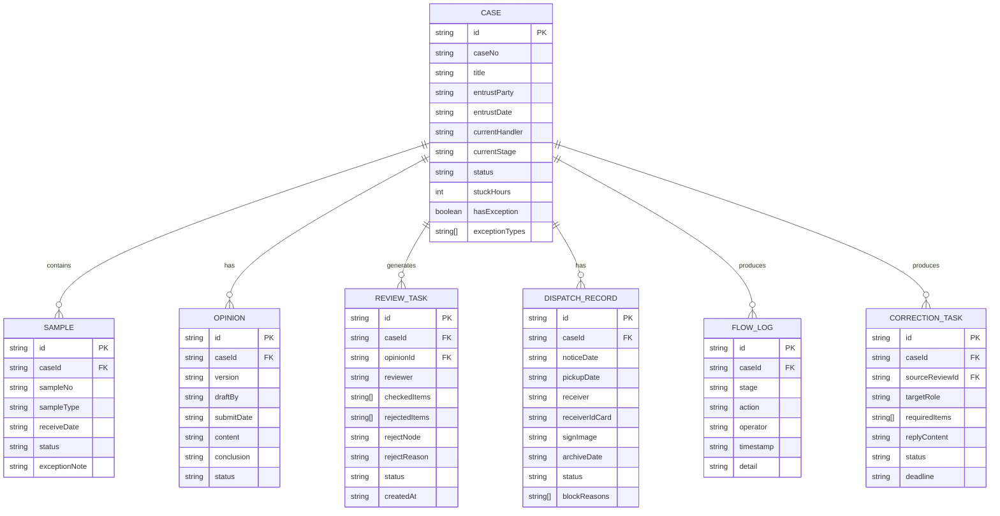

## 1. 架构设计

纯前端单页应用（SPA），使用 Zustand 管理全局状态和 Mock 数据层，无后端依赖。通过预置多套典型案例数据集实现"连续处理"场景切换。



## 2. 技术说明

- **前端框架**：React@18 + TypeScript
- **构建工具**：Vite@5
- **样式方案**：Tailwind CSS@3 + CSS 变量定义设计令牌
- **状态管理**：Zustand@4（多 store 拆分，避免单 store 臃肿）
- **路由**：React Router DOM@6（单页工作台，实际 1 个主路由 + 弹窗层）
- **图标库**：Lucide React@0.400
- **后端**：无，全部数据使用 Mock 预置 + 内存状态
- **数据库**：无，数据持久化可选 localStorage（默认不启用，保持纯演示）

## 3. 路由定义

| 路由 | 用途 |
|------|------|
| `/` | 主工作台，默认加载"正常全流程"场景数据，展示三栏完整布局 |

> 说明：意见书审核面板、发放登记详情、驳回操作抽屉等均以组件形式嵌入主工作台，通过 Zustand 状态控制显隐，不使用独立路由以保证"连续处理"的工作流不被打断。

## 4. 数据模型

### 4.1 核心实体关系



### 4.2 数据常量定义

**案件阶段枚举 (CaseStage)**：
- `entrust_register` - 委托书登记
- `sample_receive` - 样本接收
- `expert_examine` - 鉴定人检验
- `opinion_draft` - 意见书起草
- `quality_review` - 质控审核
- `correction_pending` - 补录/修改中
- `dispatch_notice` - 发放通知
- `dispatch_sign` - 签收确认
- `archived` - 已归档

**审核驳回节点 (RejectNode)**：
- `back_to_entrust` - 退回受理员（委托书/委托事项问题）
- `back_to_expert` - 退回鉴定人（检验/意见书内容问题）
- `back_to_sample` - 样本异常退回（触发样本退回单）

**发放未完成原因 (BlockReason)**：
- `awaiting_pickup` - 等待委托方领取
- `sign_missing` - 签收凭证缺失
- `recorrection_needed` - 退回后未重审通过
- `correction_unfinished` - 关联补录任务未完成
- `approval_pending` - 发放批准待签字

## 5. Zustand Store 划分

### 5.1 caseStore
- cases: Case[] - 全部案件列表
- activeCaseId: string | null - 当前选中案件
- filter: { role, stage, status, keyword } - 筛选条件
- actions: setFilter, selectCase, updateCaseStage, markException

### 5.2 reviewStore
- activeReview: ReviewTask | null - 当前审核任务
- reviewChecklist: ReviewItem[] - 审核项清单（分4大类）
- rejectDialogOpen: boolean - 驳回抽屉开关
- actions: startReview, toggleCheckItem, openRejectDialog, submitReject, submitPass, createCorrectionTask

### 5.3 dispatchStore
- dispatchRecords: Record<string, DispatchRecord> - 发放记录 map
- replayMode: boolean - 回看模式开关
- replayStepIndex: number - 回看当前步骤
- actions: updateDispatch, toggleReplayMode, setReplayStep, diagnoseBlockReason

### 5.4 notificationStore
- toasts: ToastItem[] - 浮层通知
- bannerAlert: BannerAlert | null - 顶部横幅异常提醒
- actions: pushToast, dismissToast, showBannerAlert, dismissBanner

## 6. 组件拆分规划

```
src/
├── App.tsx                           # 根组件 + 路由
├── main.tsx                          # 入口
├── index.css                         # Tailwind + CSS 变量 + 字体
├── stores/                           # Zustand stores
│   ├── caseStore.ts
│   ├── reviewStore.ts
│   ├── dispatchStore.ts
│   └── notificationStore.ts
├── data/                             # Mock 数据
│   ├── mockCases.ts                  # 5 套典型场景数据
│   ├── reviewChecklist.ts            # 审核项清单
│   └── constants.ts                  # 枚举/常量
├── components/
│   ├── layout/
│   │   ├── TopOverviewBar.tsx        # 三问速览条
│   │   ├── LeftRolePanel.tsx         # 左栏角色+筛选
│   │   └── SceneSwitcher.tsx         # 左下角 Mock 场景切换
│   ├── case/
│   │   ├── CaseCardList.tsx          # 中栏案件卡片流
│   │   ├── CaseCard.tsx              # 单案件卡片
│   │   └── StatusBadge.tsx           # 状态标签（带悬停详情）
│   ├── review/
│   │   ├── ReviewPanel.tsx           # 意见书审核主面板
│   │   ├── OpinionContentView.tsx    # 意见书正文视图
│   │   ├── ChecklistSidebar.tsx      # 审核项清单侧栏
│   │   ├── RejectDrawer.tsx          # 驳回操作抽屉（三栏）
│   │   └── SampleExceptionButton.tsx # 异常样本退回按钮
│   ├── dispatch/
│   │   ├── DispatchModule.tsx        # 发放登记模块
│   │   ├── DispatchTimeline.tsx      # 发放时间线
│   │   ├── BlockDiagnosisPanel.tsx   # 未完成诊断面板
│   │   └── ReplayControls.tsx        # 回看控制条
│   └── common/
│       ├── RoleAvatar.tsx            # 角色头像
│       ├── CorrectionTaskCard.tsx    # 补录任务卡
│       └── AlertBanner.tsx           # 异常横幅
├── hooks/
│   └── useFlowEngine.ts              # 流程引擎 hook（状态转移合法性检查）
├── utils/
│   ├── timeUtils.ts                  # 时间/时长格式化
│   └── flowUtils.ts                  # 流转判断工具
└── types/
    └── index.ts                      # 全部 TypeScript 类型定义
```

## 7. 异常触发机制

异常样例触发流程（直接可操作，不依赖提示文案）：

1. **样本异常触发**：在意见书审核面板点击「样本异常退回」按钮 → `flowUtils.validateSampleReject()` → `caseStore.markException()` → `notificationStore.showBannerAlert()` → 生成样本退回单（FlowLog 记录）→ 自动将案件阶段回退到 `sample_receive`

2. **驳回触发**：勾选问题条目 → 选择退回节点 → 填写原因 → 「确认驳回」→ `reviewStore.submitReject()` → 生成 `CorrectionTask` → `caseStore.updateCaseStage('correction_pending')` → `pushToast('已退回鉴定人，补录任务单已生成')`

3. **发放延迟触发**：场景切换到「发放延迟」→ `dispatchStore.diagnoseBlockReason()` → 诊断面板自动展开，列出阻塞原因（可点击跳转）→ 案件卡片滞留时长标红 → 顶部速览条发放未完成计数 +1

## 8. 视觉实现要点

- CSS 变量定义在 `:root` 中，包含所有设计令牌（色板、间距、圆角、字号、阴影）
- 案件卡片左侧色条用 `border-l-4` 实现，颜色映射至 `currentStage`
- 驳回抽屉使用 Tailwind `translate-x-full` + `transition-transform` 实现右侧滑入动画
- 时间线未完成节点使用自定义 keyframes `pulse-dash` 实现虚线闪烁
- 异常样例卡片边框使用 `animate-pulse-red` 自定义动画（3 秒红光呼吸）
