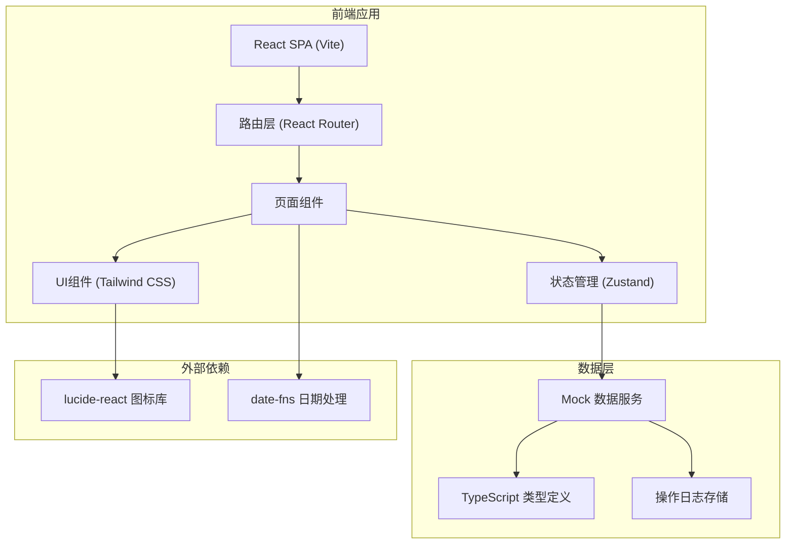
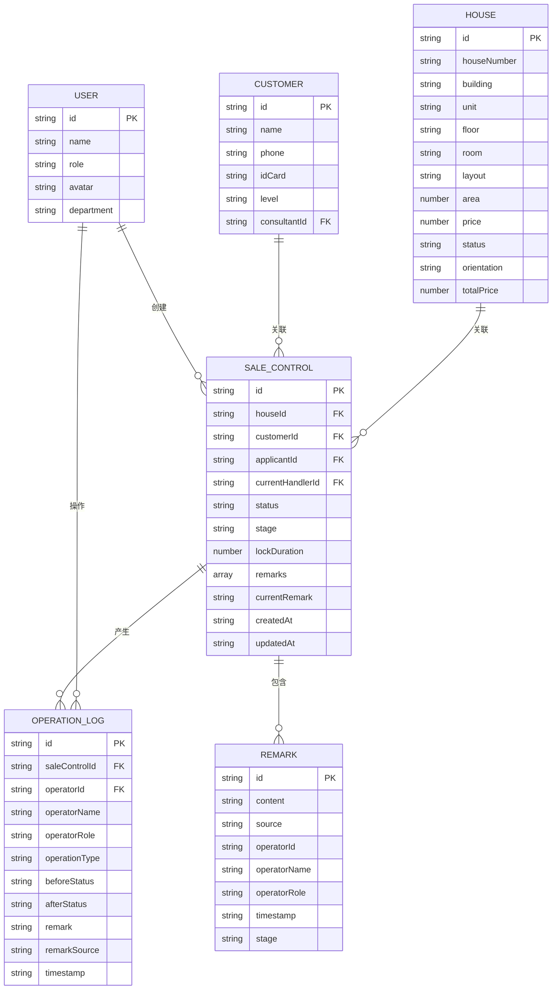

## 1. 架构设计



## 2. 技术选型说明

- **前端框架**：React 18 + TypeScript 5
- **构建工具**：Vite 5
- **路由管理**：react-router-dom 6
- **状态管理**：zustand 4（轻量级，适合企业级管理系统）
- **样式方案**：Tailwind CSS 3.4
- **图标库**：lucide-react
- **日期处理**：date-fns
- **数据方案**：纯前端 Mock 数据，状态持久化到 localStorage
- **包管理器**：npm

## 3. 路由定义

| 路由路径 | 页面名称 | 说明 |
|---------|---------|------|
| `/` | 房源销控处理 | 首页，展示房源列表和销控操作 |
| `/approval` | 锁定审批回看 | 审批流程展示和历史记录 |
| `/history` | 操作历史记录 | 完整的操作日志和审计追踪 |

## 4. 数据模型定义

### 4.1 实体关系图



### 4.2 核心类型定义

```typescript
// 房源状态
type HouseStatus = 'available' | 'locked' | 'sold' | 'reserved';

// 销控流程阶段
type ControlStage = 'application' | 'review' | 'lock' | 'completed' | 'rejected';

// 操作类型
type OperationType = 
  | 'create_application'
  | 'submit_for_review'
  | 'review_approve'
  | 'review_reject'
  | 'lock_house'
  | 'unlock_house'
  | 'complete_sale'
  | 'update_remark';

// 用户角色
type UserRole = 'consultant' | 'manager' | 'controller';

interface House {
  id: string;
  houseNumber: string;
  building: string;
  unit: string;
  floor: string;
  room: string;
  layout: string;
  area: number;
  unitPrice: number;
  totalPrice: number;
  orientation: string;
  status: HouseStatus;
  floorPlan?: string;
}

interface Customer {
  id: string;
  name: string;
  phone: string;
  idCard?: string;
  level: 'A' | 'B' | 'C' | 'D';
  consultantId: string;
  visitDate: string;
  intentLayout?: string;
  intentPrice?: number;
}

interface User {
  id: string;
  name: string;
  role: UserRole;
  roleName: string;
  avatar?: string;
  department: string;
}

interface Remark {
  id: string;
  content: string;
  source: string;
  sourceName: string;
  operatorId: string;
  operatorName: string;
  operatorRole: UserRole;
  operatorRoleName: string;
  timestamp: string;
  stage: ControlStage;
  stageName: string;
}

interface SaleControl {
  id: string;
  houseId: string;
  house: House;
  customerId: string;
  customer: Customer;
  applicantId: string;
  applicant: User;
  currentHandlerId: string;
  currentHandler: User;
  status: HouseStatus;
  stage: ControlStage;
  stageName: string;
  lockDuration: number;
  lockExpireAt?: string;
  remarks: Remark[];
  currentRemark: string;
  createdAt: string;
  updatedAt: string;
}

interface OperationLog {
  id: string;
  saleControlId: string;
  operatorId: string;
  operatorName: string;
  operatorRole: UserRole;
  operatorRoleName: string;
  operationType: OperationType;
  operationTypeName: string;
  beforeStatus: HouseStatus;
  afterStatus: HouseStatus;
  beforeStage?: ControlStage;
  afterStage?: ControlStage;
  remark?: string;
  remarkSource?: string;
  timestamp: string;
}
```

### 4.3 Mock 数据规划

1. **房源数据**：30 条，覆盖不同楼栋、户型、面积、价格、状态
2. **用户数据**：6 条，包含 3 名置业顾问、2 名案场经理、1 名销控专员
3. **客户数据**：20 条，不同意向等级、关联不同置业顾问
4. **销控记录**：15 条，覆盖不同流程阶段、包含完整备注历史
5. **操作日志**：50+ 条，完整记录所有状态变更和操作

## 5. 核心目录结构

```
src/
├── types/              # TypeScript 类型定义
│   └── index.ts
├── store/              # Zustand 状态管理
│   ├── useHouseStore.ts
│   ├── useSaleControlStore.ts
│   └── useUserStore.ts
├── data/               # Mock 数据
│   ├── houses.ts
│   ├── users.ts
│   ├── customers.ts
│   ├── saleControls.ts
│   └── operationLogs.ts
├── pages/              # 页面组件
│   ├── SaleControl.tsx
│   ├── Approval.tsx
│   └── History.tsx
├── components/         # 可复用组件
│   ├── layout/         # 布局组件
│   │   ├── Sidebar.tsx
│   │   └── Header.tsx
│   ├── house/          # 房源相关
│   │   ├── HouseCard.tsx
│   │   ├── HouseTable.tsx
│   │   └── HouseFilter.tsx
│   ├── sale/           # 销控相关
│   │   ├── ControlDrawer.tsx
│   │   ├── RemarkSection.tsx
│   │   └── StatusBadge.tsx
│   ├── approval/       # 审批相关
│   │   ├── ProcessTimeline.tsx
│   │   └── ApprovalCard.tsx
│   ├── history/        # 历史记录
│   │   ├── LogTimeline.tsx
│   │   └── LogFilter.tsx
│   └── common/         # 通用组件
│       ├── Button.tsx
│       ├── Input.tsx
│       ├── Select.tsx
│       └── DateRangePicker.tsx
├── utils/              # 工具函数
│   ├── date.ts
│   ├── status.ts
│   └── id.ts
├── App.tsx
├── main.tsx
└── index.css
```

## 6. 状态管理设计

### 6.1 房源状态管理

```typescript
interface HouseState {
  houses: House[];
  selectedHouse: House | null;
  filters: HouseFilters;
  loading: boolean;
  setHouses: (houses: House[]) => void;
  selectHouse: (house: House | null) => void;
  setFilters: (filters: Partial<HouseFilters>) => void;
  updateHouseStatus: (houseId: string, status: HouseStatus) => void;
}
```

### 6.2 销控状态管理

```typescript
interface SaleControlState {
  saleControls: SaleControl[];
  currentSaleControl: SaleControl | null;
  operationLogs: OperationLog[];
  createSaleControl: (data: CreateSaleControlData) => SaleControl;
  submitForReview: (id: string, remark: string) => void;
  reviewApprove: (id: string, remark?: string) => void;
  reviewReject: (id: string, remark: string) => void;
  lockHouse: (id: string, duration: number, remark?: string) => void;
  getSaleControlLogs: (saleControlId: string) => OperationLog[];
}
```

## 7. 备注复用机制

1. 销控申请时填写的 `remark` 存储在 `SaleControl.remarks` 数组中，标记 `source: 'application'`
2. 审批环节自动读取上一环节的 remark，展示在审批页面，支持追加新备注
3. 锁定环节自动展示前面所有环节的 remarks，按时间顺序排列，标记来源
4. 所有备注在 `OperationLog` 中独立记录，包含 `remarkSource` 字段
5. 历史记录页面按时间线展示所有备注，清晰标记每个备注的来源环节和操作人
