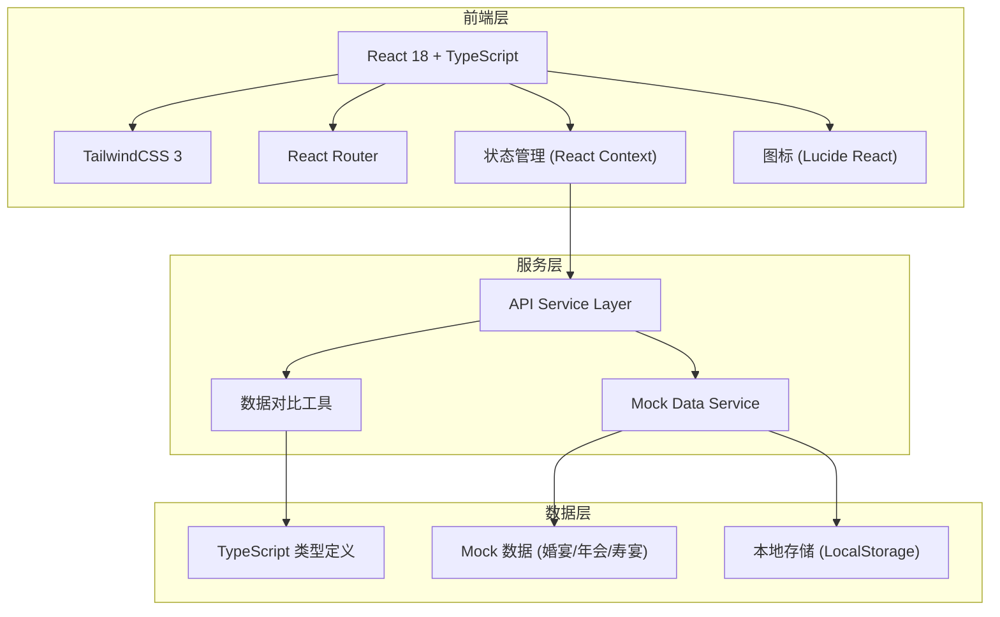
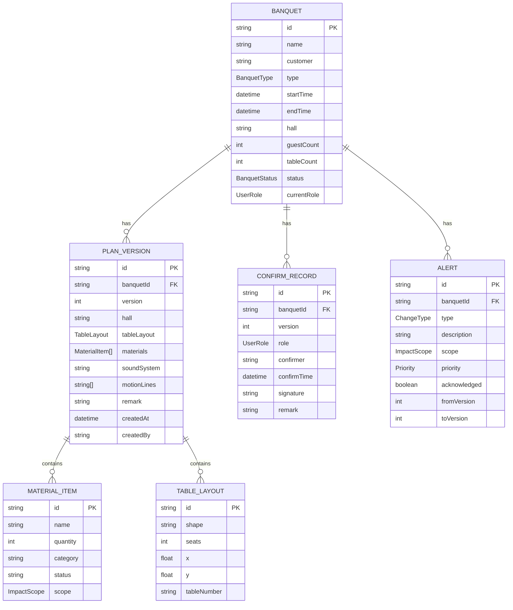

## 1. 架构设计



## 2. 技术描述

- **前端框架**: React@18 + TypeScript@5 + Vite@5
- **样式方案**: TailwindCSS@3 + CSS 变量
- **路由管理**: React Router DOM@6
- **图标库**: Lucide React
- **状态管理**: React Context + useReducer
- **数据层**: Mock API + LocalStorage 持久化
- **构建工具**: Vite@5
- **包管理**: npm

## 3. 路由定义

| 路由 | 页面名称 | 说明 |
|------|----------|------|
| / | 宴会列表页 | 展示所有宴会订单，支持筛选搜索 |
| /banquet/:id | 宴会详情页 | 展示宴会完整信息、方案、物资、版本 |
| /banquet/:id/compare | 版本对比页 | 对比两个方案版本的差异 |
| /alerts | 变更提醒中心 | 展示所有待处理变更提醒 |

## 4. API 定义（Mock Service）

### 4.1 类型定义

```typescript
// 宴会类型
type BanquetType = 'wedding' | 'annual' | 'birthday' | 'other';

// 宴会状态
type BanquetStatus = 'draft' | 'pending' | 'confirmed' | 'modified' | 'finalized';

// 变更类型
type ChangeType = 'hall' | 'table_count' | 'table_layout' | 'equipment' | 'material' | 'children_chair' | 'other';

// 影响范围
type ImpactScope = 'hall' | 'kitchen' | 'both';

// 优先级
type Priority = 'low' | 'medium' | 'high' | 'urgent';

// 用户角色
type UserRole = 'sales' | 'hall_manager' | 'kitchen_manager';
```

### 4.2 接口定义

| 接口 | 方法 | 说明 |
|------|------|------|
| /api/banquets | GET | 获取宴会列表 |
| /api/banquets/:id | GET | 获取宴会详情 |
| /api/banquets/:id/versions | GET | 获取版本列表 |
| /api/banquets/:id/versions/:version | GET | 获取指定版本详情 |
| /api/banquets/:id/compare?v1=1&v2=2 | GET | 版本对比 |
| /api/banquets/:id/confirm | POST | 确认方案 |
| /api/alerts | GET | 获取变更提醒列表 |
| /api/alerts/:id/ack | POST | 确认提醒 |

## 5. 数据模型

### 5.1 ER 图



### 5.2 核心数据结构

```typescript
// 宴会
interface Banquet {
  id: string;
  name: string;
  customer: string;
  customerContact: string;
  type: BanquetType;
  startTime: string;
  endTime: string;
  hall: string;
  guestCount: number;
  tableCount: number;
  status: BanquetStatus;
  currentVersion: number;
  versions: PlanVersion[];
  confirmRecords: ConfirmRecord[];
  alerts: Alert[];
  createdAt: string;
  createdBy: string;
}

// 方案版本
interface PlanVersion {
  id: string;
  banquetId: string;
  version: number;
  hall: string;
  tableLayout: Table[];
  materials: MaterialItem[];
  tableCards: TableCard[];
  soundSystem: SoundSystem;
  motionLines: MotionLine[];
  remark: string;
  changeDescription: string;
  createdAt: string;
  createdBy: string;
}

// 物资
interface MaterialItem {
  id: string;
  name: string;
  quantity: number;
  unit: string;
  category: 'hall' | 'kitchen' | 'both';
  status: 'pending' | 'confirmed' | 'shortage' | 'prepared';
  scope: ImpactScope;
}

// 餐桌
interface Table {
  id: string;
  tableNumber: string;
  shape: 'round' | 'square' | 'rectangle';
  seats: number;
  x: number;
  y: number;
  rotation: number;
}

// 变更提醒
interface Alert {
  id: string;
  banquetId: string;
  banquetName: string;
  type: ChangeType;
  description: string;
  scope: ImpactScope;
  priority: Priority;
  acknowledged: boolean;
  fromVersion: number;
  toVersion: number;
  createdAt: string;
  acknowledgedAt?: string;
  acknowledgedBy?: string;
}
```
