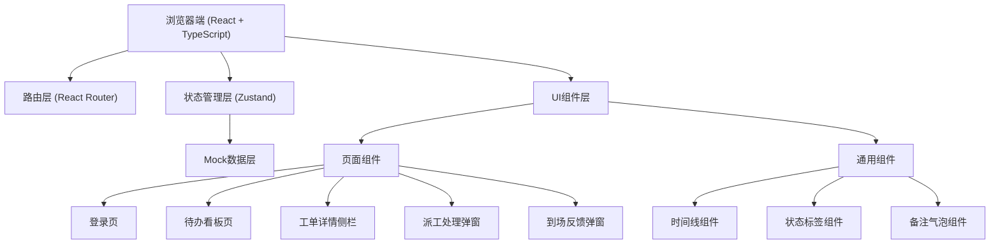
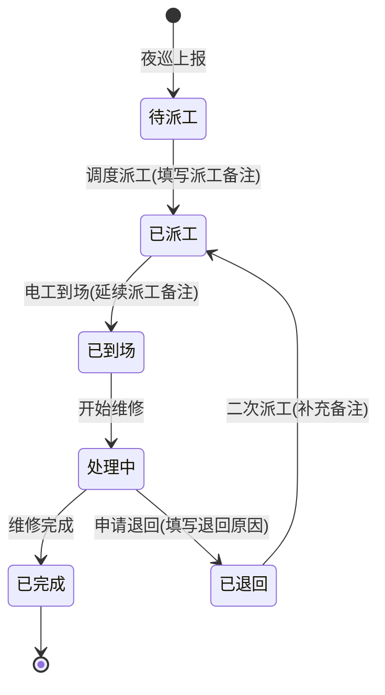

## 1. 架构设计



## 2. 技术描述

- **前端框架**: React 18 + TypeScript
- **构建工具**: Vite 5
- **路由管理**: React Router DOM 6
- **状态管理**: Zustand 4
- **样式方案**: Tailwind CSS 3
- **图标库**: Lucide React
- **后端**: 无后端，纯前端Mock数据
- **数据持久化**: LocalStorage（模拟）

## 3. 路由定义

| 路由 | 页面 | 访问角色 | 功能描述 |
|------|------|----------|----------|
| `/login` | 登录页 | 所有 | 角色选择、工号登录 |
| `/dashboard` | 待办看板 | 巡检员/电工/调度/主管 | 个人待办列表、工单筛选 |
| `/workorder/:id` | 工单详情 | 所有 | 侧栏详情、全流程时间线 |

## 4. 数据模型

### 4.1 核心类型定义

```typescript
// 用户角色
type UserRole = 'inspector' | 'electrician' | 'dispatcher' | 'supervisor';

// 工单状态
type WorkOrderStatus = 
  | 'pending_dispatch'    // 待派工
  | 'dispatched'          // 已派工
  | 'on_site'             // 已到场
  | 'in_progress'         // 处理中
  | 'returned'            // 已退回
  | 'completed';          // 已完成

// 优先级
type Priority = 'urgent' | 'high' | 'medium' | 'low';

// 用户信息
interface User {
  id: string;
  employeeNo: string;
  name: string;
  role: UserRole;
  avatar?: string;
  phone?: string;
}

// 灯杆台账
interface LampPost {
  id: string;
  lampNo: string;
  location: string;
  model: string;
  installDate: string;
  lastMaintenanceDate?: string;
  historyRecords: string[];
}

// 夜巡记录
interface NightPatrolRecord {
  id: string;
  workOrderId: string;
  inspectorId: string;
  inspectorName: string;
  reportTime: string;
  faultType: string;
  description: string;
  photos?: string[];
}

// 备注记录
interface Remark {
  id: string;
  workOrderId: string;
  authorId: string;
  authorName: string;
  authorRole: UserRole;
  content: string;
  type: 'dispatch' | 'onsite' | 'return' | 'supplement';
  timestamp: string;
}

// 工单
interface WorkOrder {
  id: string;
  orderNo: string;
  lampPostId: string;
  lampPost: LampPost;
  status: WorkOrderStatus;
  priority: Priority;
  faultType: string;
  patrolRecord: NightPatrolRecord;
  electricianId?: string;
  electricianName?: string;
  dispatchTime?: string;
  dispatchRemark?: string;
  onSiteTime?: string;
  onSiteRemark?: string;
  returnReason?: string;
  returnTime?: string;
  completeTime?: string;
  completeRemark?: string;
  remarks: Remark[];
  createdAt: string;
}

// 时间线节点
interface TimelineNode {
  id: string;
  type: 'report' | 'dispatch' | 'onsite' | 'return' | 'complete';
  title: string;
  operator: string;
  operatorRole: UserRole;
  time: string;
  remark?: string;
  expanded: boolean;
}
```

### 4.2 Mock 数据说明

**工单样例（5条）**:
1. **紧急工单 (LD-2026-0622-001)**: 人民路与建设路交叉口，路灯不亮，带3条历史备注
2. **进行中工单 (LD-2026-0622-002)**: 解放路56号灯杆，线路故障，已派工待到场
3. **退回工单 (LD-2026-0621-003)**: 中山路12号，需更换变压器，已退回待二次处理
4. **待派工工单 (LD-2026-0622-004)**: 环城路34号，灯罩破损，等待派工
5. **已完工单 (LD-2026-0620-005)**: 高新区88号，LED电源故障，已完成，带完整时间线

**用户样例**:
- 巡检员: 李巡检 (XJ001)
- 电工: 王电工 (DG001)、张电工 (DG002)、刘电工 (DG003)
- 调度员: 陈调度 (DD001)
- 主管: 赵主管 (ZG001)

**备注样例**:
- 派工备注: "请检查电源控制器，上周同路段出现过类似问题，可能是批次性故障"
- 到场反馈: "已到达现场，确认是电源控制器烧毁，已更换备用件，建议采购XX型号备存"
- 退回原因: "现场情况比预期复杂，需要高空作业车配合，明天上午9点可到场"
- 补充备注: "已协调高空作业车，请联系张师傅138XXXX"

## 5. 组件拆分

### 5.1 页面组件
- `Login.tsx` - 登录页（角色选择、工号登录）
- `Dashboard.tsx` - 待办看板（统计卡、工单列表、筛选）

### 5.2 通用组件
- `Sidebar.tsx` - 左侧导航栏
- `Header.tsx` - 顶部导航
- `WorkOrderList.tsx` - 工单列表
- `WorkOrderDetail.tsx` - 工单详情侧栏
- `DispatchModal.tsx` - 派工处理弹窗
- `OnSiteFeedbackModal.tsx` - 到场反馈弹窗
- `Timeline.tsx` - 全流程时间线
- `RemarkBubble.tsx` - 备注气泡
- `StatusBadge.tsx` - 状态标签
- `EmptyState.tsx` - 空状态
- `StatCard.tsx` - 统计卡片

### 5.3 状态管理
- `useAuthStore` - 认证状态（当前用户、角色、登录/登出）
- `useWorkOrderStore` - 工单状态（工单列表、详情、筛选、派工、反馈）

## 6. 状态流转



## 7. 交互设计要点

1. **侧栏滑出**: 点击工单列表行，右侧详情面板从右向左滑入（300ms，带阴影）
2. **备注延续**: 到场反馈页面顶部灰色框显示派工备注，标注"派工备注"标签
3. **时间线展开**: 点击时间线节点可展开查看该节点完整信息
4. **空状态**: 无数据时显示市政路灯图标 + 引导文字 + 操作按钮
5. **角色切换**: 登录时选择不同角色，进入对应视角的待办看板
