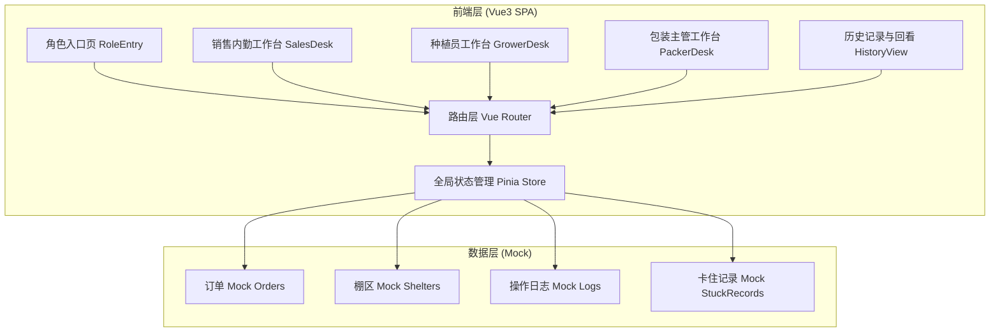
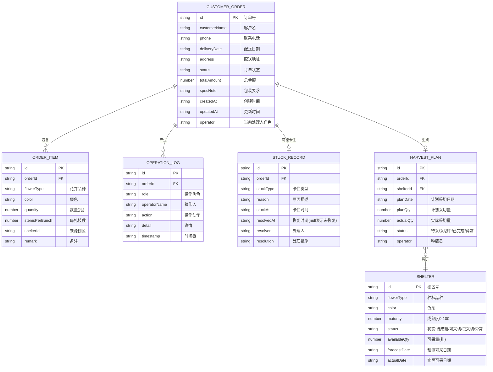

## 1. 架构设计



## 2. 技术选型

- **前端框架**：Vue@3.4 + TypeScript@5.0
- **构建工具**：Vite@5.0
- **UI组件库**：Element Plus@2.4（表格、抽屉、标签、时间线、看板等）
- **状态管理**：Pinia@2.1（订单/棚区/日志全局状态）
- **路由**：Vue Router@4.3
- **样式方案**：Tailwind CSS@3.4 + CSS 变量（主题色、状态色）
- **图标**：@element-plus/icons-vue + 自定义SVG业务图标
- **数据方案**：本地Mock数据（TS模块定义）+ Pinia持久化状态

## 3. 路由定义

| 路由路径 | 页面名称 | 页面说明 |
|----------|----------|----------|
| `/` | 角色选择入口 | 三角色卡片选择 + 全局卡住提醒横幅 |
| `/sales` | 销售内勤工作台 | 订单处理流水 + 详情抽屉 + 快捷操作 |
| `/grower` | 种植员工作台 | 采切排期时间轴 + 棚区状态看板 + 采切操作 |
| `/packer` | 包装主管工作台 | 待包装队列看板 + 规格核对 + 破损物流 |
| `/history` | 历史记录与回看 | 全流程筛选 + 卡住记录专区 + 流程时间线 |

## 4. 数据模型

### 4.1 数据模型ER图



### 4.2 核心类型定义

```typescript
// 订单状态
type OrderStatus = 'PENDING_CONFIRM' | 'CONFIRMED' | 'HARVESTING' | 'PACKING' | 'COMPLETED' | 'STUCK';

// 卡住类型
type StuckType = 'FORECAST_DEVIATION' | 'PACKAGE_DAMAGE' | 'CUSTOMER_CHANGE' | 'OTHER';

// 订单
interface CustomerOrder {
  id: string;
  customerName: string;
  phone: string;
  deliveryDate: string;
  address: string;
  status: OrderStatus;
  totalAmount: number;
  specNote: string;
  createdAt: string;
  updatedAt: string;
  operator: 'SALES' | 'GROWER' | 'PACKER';
  items: OrderItem[];
  harvestPlan?: HarvestPlan;
  stuckRecord?: StuckRecord;
}

interface OrderItem {
  id: string;
  orderId: string;
  flowerType: string;
  color: string;
  quantity: number;
  stemsPerBunch: number;
  shelterId: string;
  remark: string;
}

interface Shelter {
  id: string;
  flowerType: string;
  color: string;
  maturity: number;
  status: 'IMMATURE' | 'READY' | 'HARVESTED' | 'ABNORMAL';
  availableQty: number;
  forecastDate: string;
  actualDate?: string;
}

interface HarvestPlan {
  id: string;
  orderId: string;
  shelterId: string;
  planDate: string;
  planQty: number;
  actualQty?: number;
  status: 'PENDING' | 'HARVESTING' | 'DONE' | 'ABNORMAL';
  operator: string;
}

interface OperationLog {
  id: string;
  orderId: string;
  role: 'SALES' | 'GROWER' | 'PACKER' | 'SYSTEM';
  operatorName: string;
  action: string;
  detail: string;
  timestamp: string;
}

interface StuckRecord {
  id: string;
  orderId: string;
  stuckType: StuckType;
  reason: string;
  stuckAt: string;
  resolvedAt?: string;
  resolver?: string;
  resolution?: string;
}
```

### 4.3 状态流转规则

```
PENDING_CONFIRM →(销售内勤确认订单)→ CONFIRMED →(系统自动生成采切排期)→ HARVESTING
HARVESTING →(种植员完成采切)→ PACKING →(包装主管发货)→ COMPLETED
任意状态 →(触发异常)→ STUCK →(处理后恢复)→ 回到卡住前状态
```

## 5. 目录结构

```
frontend/
├── src/
│   ├── main.ts                # 入口
│   ├── App.vue
│   ├── router/index.ts        # 路由配置
│   ├── stores/
│   │   ├── orders.ts          # 订单状态Store
│   │   ├── shelters.ts        # 棚区Store
│   │   └── ui.ts              # UI状态(抽屉、通知)
│   ├── mock/
│   │   ├── orders.ts          # 订单Mock(含正常/卡住)
│   │   ├── shelters.ts        # 棚区Mock
│   │   └── logs.ts            # 操作日志Mock
│   ├── types/
│   │   └── index.ts           # 类型定义
│   ├── views/
│   │   ├── RoleEntry.vue      # 角色入口
│   │   ├── SalesDesk.vue      # 销售内勤工作台
│   │   ├── GrowerDesk.vue     # 种植员工作台
│   │   ├── PackerDesk.vue     # 包装主管工作台
│   │   └── HistoryView.vue    # 历史记录回看
│   ├── components/
│   │   ├── common/
│   │   │   ├── StuckBanner.vue    # 顶部卡住提醒横幅
│   │   │   ├── RoleSwitcher.vue   # 角色快速切换
│   │   │   └── StatusTag.vue      # 通用状态标签
│   │   ├── sales/
│   │   │   ├── OrderListTable.vue # 订单流水表
│   │   │   └── OrderDetailDrawer.vue  # 订单详情抽屉
│   │   ├── grower/
│   │   │   ├── HarvestTimeline.vue    # 采切排期时间轴
│   │   │   └── ShelterKanban.vue      # 棚区状态看板
│   │   ├── packer/
│   │   │   ├── PackingQueue.vue       # 待包装看板
│   │   │   └── SpecCheckList.vue      # 规格核对清单
│   │   └── history/
│   │       ├── LogFilterBar.vue       # 筛选器
│   │       ├── StuckRecordPanel.vue   # 卡住记录专区
│   │       └── OrderTimeline.vue      # 流程时间线回放
│   ├── styles/
│   │   ├── main.scss
│   │   └── variables.scss         # CSS变量(主题色)
│   └── utils/
│       ├── date.ts                # 日期工具
│       └── flow.ts                # 状态流转逻辑
```
