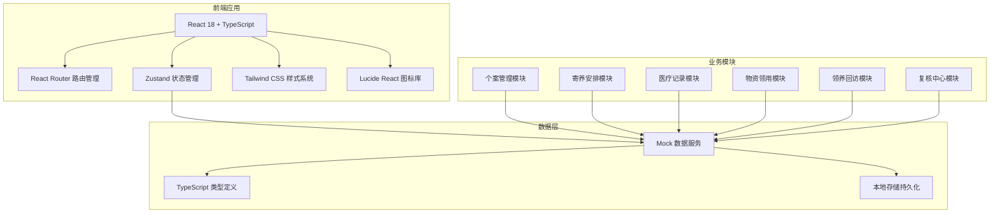
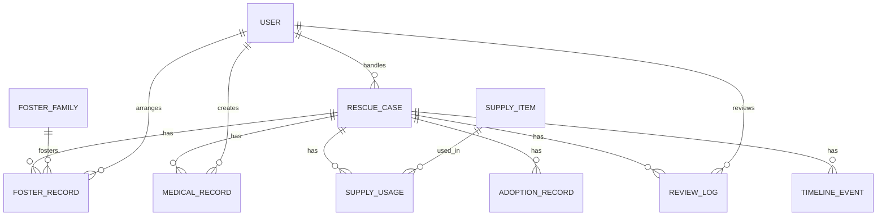

## 1. 架构设计



## 2. 技术描述

- **前端框架**: React@18 + TypeScript
- **构建工具**: Vite@5
- **路由管理**: react-router-dom@6
- **状态管理**: zustand@4
- **样式方案**: tailwindcss@3
- **图标组件**: lucide-react@0.344
- **数据方案**: Mock 数据 + localStorage 持久化（无后端）

## 3. 路由定义

| 路由路径 | 页面用途 |
|----------|---------|
| / | 工作台首页 - 数据概览与个案列表 |
| /case/:id | 个案详情页 - 时间线与全信息展示 |
| /case/:id/foster | 寄养安排页 - 寄养家庭匹配与安排 |
| /case/:id/supplies | 物资领用页 - 领用申请与回看 |
| /review | 复核中心 - 待复核列表与补录处理 |
| /demo | 样例演示页 - 三种流程的交互式演示 |

## 4. 数据模型定义

### 4.1 ER 图



### 4.2 核心类型定义

```typescript
// 救助个案
interface RescueCase {
  id: string;
  caseNo: string;
  animalName: string;
  animalType: 'cat' | 'dog' | 'other';
  breed: string;
  age: string;
  gender: 'male' | 'female' | 'unknown';
  rescueDate: string;
  rescueLocation: string;
  status: 'registered' | 'medical' | 'fostering' | 'adopted' | 'archived';
  currentHandler: string;
  assignee: string;
  medicalStatus: 'pending' | 'treating' | 'healthy';
  hasAdoptionApplication: boolean;
  createdAt: string;
  updatedAt: string;
}

// 寄养记录
interface FosterRecord {
  id: string;
  caseId: string;
  fosterFamilyId: string;
  fosterFamilyName: string;
  startDate: string;
  endDate?: string;
  status: 'active' | 'ended' | 'returned';
  keyJudgment: string;
  specialRequirements: string;
  returnReason?: string;
  createdBy: string;
  createdAt: string;
}

// 医疗记录
interface MedicalRecord {
  id: string;
  caseId: string;
  visitDate: string;
  diagnosis: string;
  treatment: string;
  cost: number;
  veterinarian: string;
  healthStatus: 'poor' | 'fair' | 'good';
  reviewed: boolean;
  reviewedBy?: string;
  reviewedAt?: string;
  notes: string;
}

// 物资领用
interface SupplyUsage {
  id: string;
  caseId: string;
  supplyItemId: string;
  supplyName: string;
  quantity: number;
  unit: string;
  usageReason: string;
  fosterJudgmentRef: string;
  requestedBy: string;
  approvedBy?: string;
  status: 'pending' | 'approved' | 'rejected';
  createdAt: string;
}

// 领养回访
interface AdoptionRecord {
  id: string;
  caseId: string;
  adopterName: string;
  adopterPhone: string;
  adoptDate: string;
  status: 'pending' | 'approved' | 'rejected';
  reviewNotes: string;
  reviewedBy: string;
  followUpPlan: FollowUpPlan[];
  followUpRecords: FollowUpRecord[];
}

// 复核记录
interface ReviewLog {
  id: string;
  caseId: string;
  type: 'medical' | 'foster' | 'archive';
  status: 'pending' | 'approved' | 'rejected' | 'supplement_needed';
  reviewer: string;
  reviewNotes: string;
  supplementReason?: string;
  createdAt: string;
}

// 时间线事件
interface TimelineEvent {
  id: string;
  caseId: string;
  type: 'register' | 'medical' | 'foster' | 'supply' | 'adoption' | 'review' | 'archive' | 'return' | 'supplement';
  title: string;
  description: string;
  operator: string;
  timestamp: string;
}
```

## 5. 模块结构

```
src/
├── components/          # 通用组件
│   ├── Layout/         # 布局组件
│   ├── CaseCard/       # 个案卡片
│   ├── Timeline/       # 时间线组件
│   ├── StatusTag/      # 状态标签
│   ├── Modal/          # 弹窗组件
│   └── Table/          # 表格组件
├── pages/              # 页面组件
│   ├── Dashboard/      # 工作台
│   ├── CaseDetail/     # 个案详情
│   ├── FosterArrangement/ # 寄养安排
│   ├── SupplyUsage/    # 物资领用
│   ├── ReviewCenter/   # 复核中心
│   └── DemoFlow/       # 样例演示
├── store/              # Zustand 状态
│   ├── useCaseStore.ts
│   ├── useUserStore.ts
│   └── useSupplyStore.ts
├── types/              # TypeScript 类型
│   └── index.ts
├── mock/               # Mock 数据
│   ├── cases.ts
│   ├── users.ts
│   ├── supplies.ts
│   └── fosterFamilies.ts
├── utils/              # 工具函数
│   ├── date.ts
│   └── format.ts
└── App.tsx             # 路由入口
```

## 6. 状态管理设计

使用 Zustand 管理全局状态，按领域拆分 store：

1. **useCaseStore**: 个案列表、当前个案、筛选条件
2. **useUserStore**: 当前用户、角色权限
3. **useSupplyStore**: 物资库存、领用记录

## 7. Mock 数据设计

预置 8+ 条完整个案数据，覆盖：
- 2 条顺利流程个案（从登记到归档）
- 3 条问题流程个案（含退回、补录、回访断档）
- 2 条进行中个案（寄养中/治疗中）
- 1 条待复核个案

预置物资数据 15+ 种，寄养家庭数据 6+ 个。
