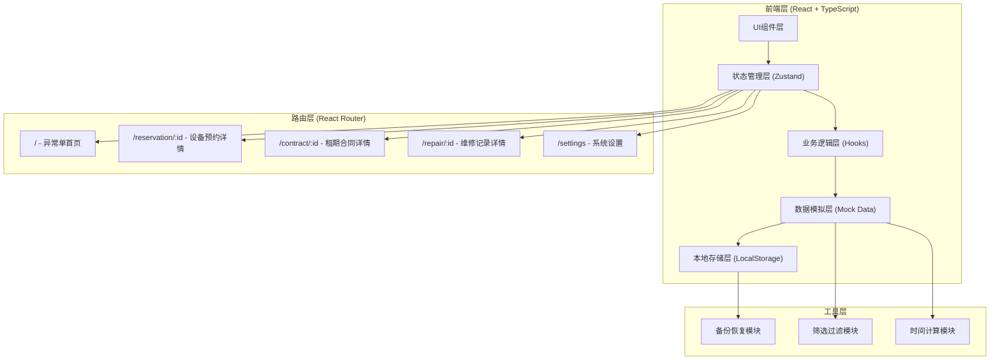
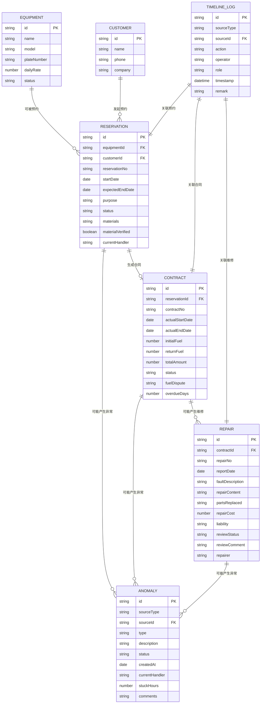

## 1. 架构设计



## 2. 技术选型

- 前端框架：React@18 + TypeScript
- 构建工具：Vite@5
- 状态管理：Zustand@4
- 路由管理：React Router DOM@6
- CSS框架：TailwindCSS@3
- 图标库：Lucide React
- 数据持久化：LocalStorage + JSON序列化
- 无后端服务，纯前端实现，数据全部存储在浏览器本地

## 3. 路由定义

| 路由路径 | 页面用途 |
|---------|---------|
| `/` | 异常单首页（核心入口，默认展示所有卡住的单子） |
| `/reservation/:id` | 设备预约详情页，包含材料核验、调度派单、交付确认 |
| `/contract/:id` | 租期合同详情页，包含租期跟踪、油耗管理、合同回看时间线 |
| `/repair/:id` | 维修记录详情页，包含维修处理、责任认定、经理复核 |
| `/settings` | 系统设置页，包含备份恢复、角色切换 |

## 4. 数据模型

### 4.1 ER图



### 4.2 数据类型定义

```typescript
// 角色类型
type Role = 'manager' | 'dispatcher' | 'repairer';

// 异常类型
type AnomalyType = 'material_missing' | 'overdue' | 'fuel_dispute' | 'liability_dispute' | 'review_failed';

// 异常状态
type AnomalyStatus = 'pending' | 'processing' | 'resolved';

// 设备
interface Equipment {
  id: string;
  name: string;
  model: string;
  plateNumber: string;
  dailyRate: number;
  status: 'available' | 'in_use' | 'repairing';
}

// 客户
interface Customer {
  id: string;
  name: string;
  phone: string;
  company: string;
}

// 设备预约
interface Reservation {
  id: string;
  equipmentId: string;
  customerId: string;
  reservationNo: string;
  startDate: string;
  expectedEndDate: string;
  purpose: string;
  status: 'pending' | 'material_verified' | 'dispatched' | 'delivered' | 'completed' | 'cancelled';
  materials: string[];
  materialVerified: boolean;
  missingMaterials: string[];
  currentHandler: Role;
}

// 租期合同
interface Contract {
  id: string;
  reservationId: string;
  contractNo: string;
  actualStartDate: string;
  actualEndDate: string | null;
  initialFuel: number;
  returnFuel: number | null;
  totalAmount: number | null;
  status: 'active' | 'returned' | 'fuel_verified' | 'completed' | 'overdue';
  fuelDispute: boolean;
  fuelDisputeReason: string;
  overdueDays: number;
  overdueFee: number;
}

// 维修记录
interface Repair {
  id: string;
  contractId: string;
  repairNo: string;
  reportDate: string;
  faultDescription: string;
  repairContent: string;
  partsReplaced: string[];
  repairCost: number;
  liability: 'customer' | 'owner' | 'natural' | null;
  reviewStatus: 'pending' | 'approved' | 'rejected';
  reviewComment: string;
  repairer: string;
  photos: string[];
}

// 异常单
interface Anomaly {
  id: string;
  sourceType: 'reservation' | 'contract' | 'repair';
  sourceId: string;
  type: AnomalyType;
  description: string;
  status: AnomalyStatus;
  createdAt: string;
  currentHandler: Role;
  stuckHours: number;
  comments: string;
}

// 时间线日志
interface TimelineLog {
  id: string;
  sourceType: 'reservation' | 'contract' | 'repair';
  sourceId: string;
  action: string;
  operator: string;
  role: Role;
  timestamp: string;
  remark: string;
}

// 应用状态
interface AppState {
  currentRole: Role;
  reservations: Reservation[];
  contracts: Contract[];
  repairs: Repair[];
  anomalies: Anomaly[];
  equipments: Equipment[];
  customers: Customer[];
  timelineLogs: TimelineLog[];
}
```

## 5. 目录结构

```
src/
├── components/          # 可复用组件
│   ├── layout/         # 布局组件
│   │   ├── Header.tsx
│   │   ├── Sidebar.tsx
│   │   └── RoleSwitcher.tsx
│   ├── common/         # 通用组件
│   │   ├── AnomalyCard.tsx
│   │   ├── FilterTabs.tsx
│   │   ├── Timeline.tsx
│   │   ├── StatCard.tsx
│   │   └── StatusBadge.tsx
│   └── form/           # 表单组件
│       ├── MaterialCheck.tsx
│       ├── FuelCalculator.tsx
│       └── LiabilitySelect.tsx
├── pages/              # 页面组件
│   ├── Dashboard.tsx   # 异常单首页
│   ├── ReservationDetail.tsx
│   ├── ContractDetail.tsx
│   ├── RepairDetail.tsx
│   └── Settings.tsx
├── store/              # Zustand状态管理
│   └── useAppStore.ts
├── hooks/              # 自定义Hooks
│   ├── useAnomaly.ts
│   ├── useTimeline.ts
│   ├── useBackup.ts
│   └── useRole.ts
├── data/               # Mock数据
│   ├── mockEquipments.ts
│   ├── mockCustomers.ts
│   ├── mockReservations.ts
│   ├── mockContracts.ts
│   ├── mockRepairs.ts
│   ├── mockAnomalies.ts
│   └── mockTimeline.ts
├── types/              # TypeScript类型定义
│   └── index.ts
├── utils/              # 工具函数
│   ├── dateUtils.ts
│   ├── filterUtils.ts
│   ├── backupUtils.ts
│   └── anomalyUtils.ts
├── App.tsx
├── main.tsx
└── index.css
```

## 6. 状态管理设计

使用Zustand管理全局状态，按领域划分actions：

```typescript
// 状态切片
interface AppStore extends AppState {
  // 角色切换
  setCurrentRole: (role: Role) => void;
  
  // 异常单操作
  updateAnomalyStatus: (id: string, status: AnomalyStatus, comment: string) => void;
  filterAnomalies: (filters: FilterOptions) => Anomaly[];
  
  // 预约操作
  verifyMaterials: (id: string, verified: boolean, missing: string[]) => void;
  dispatchReservation: (id: string) => void;
  confirmDelivery: (id: string) => void;
  
  // 合同操作
  updateFuel: (id: string, returnFuel: number, hasDispute: boolean, reason: string) => void;
  confirmReturn: (id: string) => void;
  calculateOverdue: (id: string) => number;
  
  // 维修操作
  updateRepair: (id: string, content: string, parts: string[], cost: number) => void;
  setLiability: (id: string, liability: 'customer' | 'owner' | 'natural') => void;
  reviewRepair: (id: string, approved: boolean, comment: string) => void;
  
  // 时间线
  addTimelineLog: (log: Omit<TimelineLog, 'id' | 'timestamp'>) => void;
  
  // 备份恢复
  exportData: () => string;
  importData: (data: string) => boolean;
  resetData: () => void;
}
```

## 7. Mock数据设计

必须包含以下演示场景数据：

| 异常类型 | 示例数据说明 |
|---------|-------------|
| 缺材料 | 预约单RES-2026-003，缺少"身份证复印件"和"项目委托书"，已卡顿48小时 |
| 超时 | 合同HT-2026-012，应还日期2026-06-10，已超期5天，超期费用计算中 |
| 复核不通过 | 维修单WX-2026-007，经理驳回"责任认定为自然损耗"的判定，要求重新核实 |
| 油耗争议 | 合同HT-2026-008，出库油位85%，入库30%，客户质疑油耗过高 |
| 维修责任 | 维修单WX-2026-009，液压泵损坏，客户与租赁方各执一词 |

所有数据需包含完整的时间线日志，支持合同回看功能。
