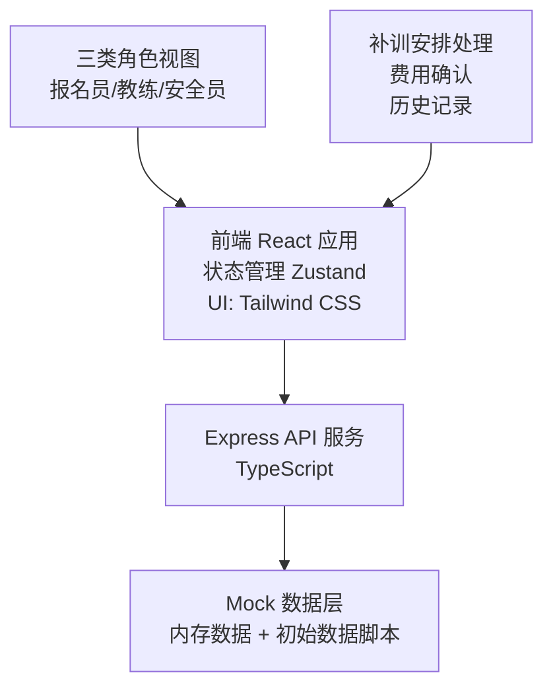
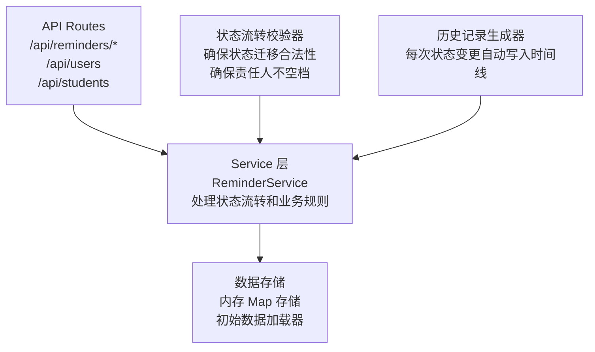
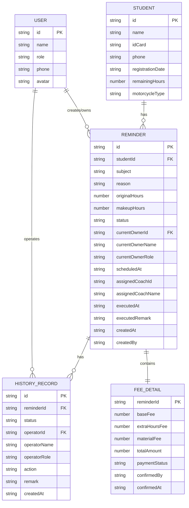

## 1. 架构设计



## 2. 技术说明

- **前端**: React 18 + TypeScript + Tailwind CSS 3 + Vite
- **状态管理**: Zustand（轻量级 store，管理补训列表、当前选中、用户角色）
- **路由**: React Router DOM（单页应用，主路由 + 详情视图）
- **后端**: Express 4 + TypeScript
- **数据**: Mock 数据存储在内存中，启动时加载初始化数据（含历史记录、处理人、时间点）
- **图标**: Lucide React
- **初始化工具**: vite-init
- **项目模板**: react-express-ts

## 3. 路由定义

| 路由 | 用途 |
|------|------|
| / | 补训列表主页（默认视图） |
| /reminders | 补训列表主页（同根路径） |
| /reminders/:id | 补训详情（通过侧栏展示，URL 同步） |

## 4. API 定义

### 类型定义

```typescript
// 角色类型
type UserRole = 'enroller' | 'coach' | 'safety_officer';

// 补训状态
type ReminderStatus = 'pending_schedule' | 'pending_execute' | 'pending_confirm' | 'completed' | 'disputed';

// 用户信息
interface User {
  id: string;
  name: string;
  role: UserRole;
  avatar?: string;
  phone: string;
}

// 学员信息
interface Student {
  id: string;
  name: string;
  idCard: string;
  phone: string;
  registrationDate: string;
  remainingHours: number;
  motorcycleType: 'E' | 'D' | 'F';
}

// 费用明细
interface FeeDetail {
  baseFee: number;
  extraHoursFee: number;
  materialFee?: number;
  totalAmount: number;
  paymentStatus: 'unpaid' | 'paid' | 'pending';
  confirmedBy?: string;
  confirmedAt?: string;
}

// 历史记录节点
interface HistoryRecord {
  id: string;
  reminderId: string;
  status: ReminderStatus;
  operatorId: string;
  operatorName: string;
  operatorRole: UserRole;
  action: string;
  remark: string;
  createdAt: string;
}

// 补训记录
interface Reminder {
  id: string;
  studentId: string;
  student: Student;
  subject: string;
  reason: string;
  originalHours: number;
  makeupHours: number;
  status: ReminderStatus;
  currentOwnerId: string;
  currentOwnerName: string;
  currentOwnerRole: UserRole;
  scheduledAt?: string;
  assignedCoachId?: string;
  assignedCoachName?: string;
  executedAt?: string;
  executedRemark?: string;
  fee: FeeDetail;
  createdAt: string;
  createdBy: string;
  history: HistoryRecord[];
}
```

### API 端点

| 方法 | 路径 | 说明 | 请求/响应 |
|------|------|------|-----------|
| GET | /api/reminders | 获取补训列表（支持 status 筛选、keyword 搜索） | Query: status?, keyword?<br/>Response: Reminder[] |
| GET | /api/reminders/:id | 获取补训详情 | Response: Reminder |
| POST | /api/reminders | 创建补训申请 | Body: { studentId, subject, reason, originalHours, makeupHours, fee }<br/>Response: Reminder |
| PUT | /api/reminders/:id/schedule | 安排补训（报名员） | Body: { scheduledAt, assignedCoachId, remark }<br/>Response: Reminder |
| PUT | /api/reminders/:id/execute | 执行补训（教练） | Body: { executedAt, executedRemark }<br/>Response: Reminder |
| PUT | /api/reminders/:id/confirm-fee | 确认费用（报名员） | Body: { paymentStatus, confirmedBy, remark }<br/>Response: Reminder |
| PUT | /api/reminders/:id/review | 安全审核（安全员） | Body: { remark, approve: boolean }<br/>Response: Reminder |
| PUT | /api/reminders/:id/dispute | 标记争议 | Body: { remark, operatorId }<br/>Response: Reminder |
| GET | /api/users | 获取用户列表（按角色） | Query: role?<br/>Response: User[] |
| GET | /api/students | 获取学员列表 | Response: Student[] |

## 5. 服务端架构图



## 6. 数据模型

### 6.1 ER 图



### 6.2 初始数据说明

初始数据包含：
- 6 名学员（不同车型、不同报名时间）
- 9 名用户（3 报名员 + 3 教练 + 3 安全员）
- 10 条补训记录（覆盖 5 种状态：待安排/待执行/待确认/已完成/有争议）
- 每条补训记录包含 3-6 条历史记录（含操作人、时间、备注）
- 时间跨度覆盖 2026 年 3 月至 6 月

所有时间戳使用真实的日期时间格式（ISO 8601），操作人姓名真实可信，备注内容模拟实际业务场景（如"学员科目二桩考未通过，需补训 2 课时"、"教练请假延后一天"、"费用已微信转账"等）。
