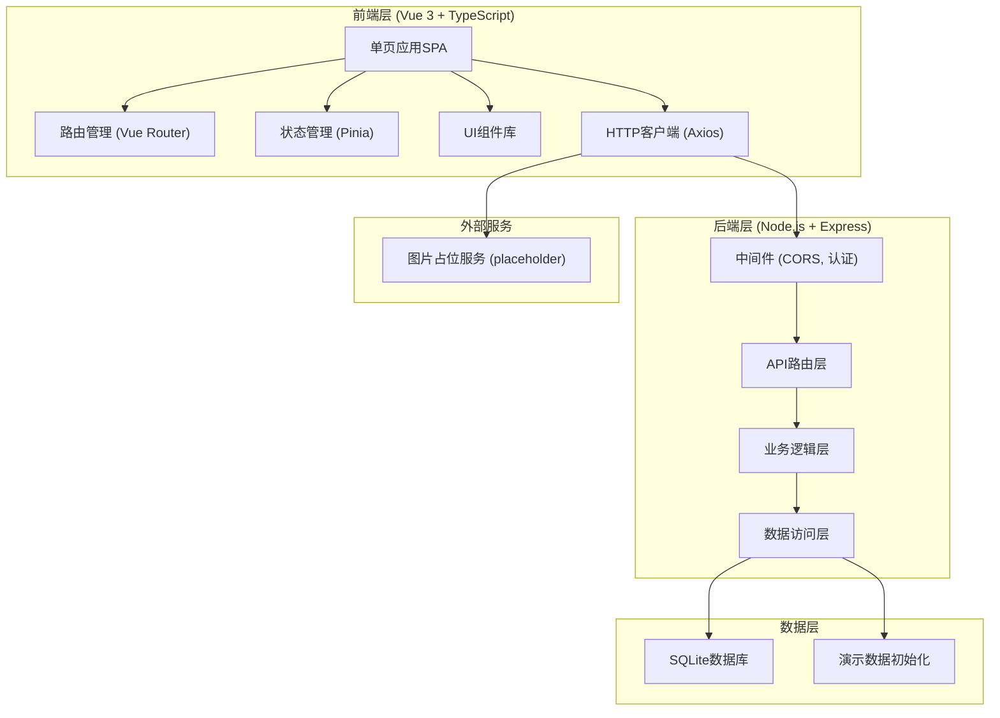
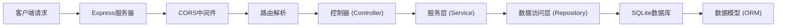
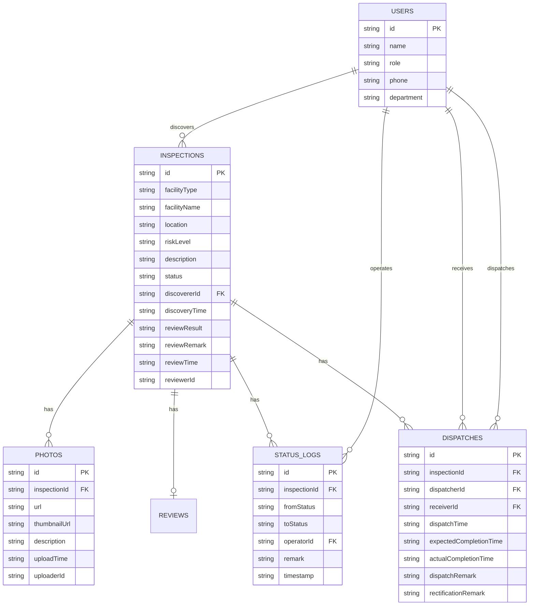

## 1. 架构设计



## 2. 技术描述

- **前端**：Vue 3 + TypeScript + Vite + Vue Router 4 + Pinia + Tailwind CSS 3
- **初始化工具**：Vite
- **后端**：Node.js + Express 4 + TypeScript
- **数据库**：SQLite（文件型数据库，便于演示部署）
- **HTTP通信**：Axios
- **图标**：Lucide Icons
- **日期处理**：dayjs

## 3. 路由定义

| 前端路由 | 页面 | 说明 |
|---------|------|------|
| /inspections | 抽检列表 | 展示所有抽检记录 |
| /inspections/:id | 隐患详情 | 展示单个隐患详细信息 |
| /dispatches | 派发记录 | 展示所有派发记录 |
| /rectification | 整改状态 | 展示整改状态统计和列表 |
| /review | 复查入口 | 展示待复查列表和复查功能 |

| 后端API路由 | 方法 | 说明 |
|------------|------|------|
| /api/inspections | GET | 获取抽检列表 |
| /api/inspections | POST | 创建新的抽检记录 |
| /api/inspections/:id | GET | 获取抽检详情 |
| /api/inspections/:id | PUT | 更新抽检记录 |
| /api/inspections/:id/status | PATCH | 更新隐患状态 |
| /api/dispatches | GET | 获取派发记录列表 |
| /api/dispatches | POST | 创建派发记录 |
| /api/dispatches/:id | PUT | 更新派发记录 |
| /api/rectification/stats | GET | 获取整改统计数据 |
| /api/reviews | GET | 获取待复查列表 |
| /api/reviews | POST | 提交复查结果 |
| /api/users | GET | 获取用户列表（用于派发选择） |

## 4. API 类型定义

```typescript
// 风险等级枚举
enum RiskLevel {
  LOW = 'low',
  MEDIUM = 'medium',
  HIGH = 'high',
  CRITICAL = 'critical'
}

// 隐患状态枚举
enum InspectionStatus {
  PENDING_REVIEW = 'pending_review',    // 待审核
  DISPATCHED = 'dispatched',            // 已派发
  IN_PROGRESS = 'in_progress',          // 整改中
  COMPLETED = 'completed',              // 整改完成
  PENDING_REVIEW_AFTER = 'pending_review_after', // 待复查
  PASSED = 'passed',                    // 复查通过
  REJECTED = 'rejected'                 // 复查不通过
}

// 用户角色枚举
enum UserRole {
  ENGINEER = 'engineer',
  SUPERVISOR = 'supervisor',
  PROPERTY = 'property'
}

// 用户类型
interface User {
  id: string;
  name: string;
  role: UserRole;
  phone: string;
  department: string;
}

// 照片类型
interface Photo {
  id: string;
  url: string;
  thumbnailUrl: string;
  description?: string;
  uploadTime: string;
  uploaderId: string;
}

// 状态流转记录
interface StatusLog {
  id: string;
  inspectionId: string;
  fromStatus: InspectionStatus | null;
  toStatus: InspectionStatus;
  operatorId: string;
  operatorName: string;
  remark?: string;
  timestamp: string;
}

// 派发记录
interface Dispatch {
  id: string;
  inspectionId: string;
  dispatcherId: string;
  dispatcherName: string;
  receiverId: string;
  receiverName: string;
  dispatchTime: string;
  expectedCompletionTime?: string;
  actualCompletionTime?: string;
  dispatchRemark: string;
  rectificationRemark?: string;
}

// 抽检记录
interface Inspection {
  id: string;
  facilityType: string;
  facilityName: string;
  location: string;
  riskLevel: RiskLevel;
  description: string;
  status: InspectionStatus;
  discovererId: string;
  discovererName: string;
  discoveryTime: string;
  photos: Photo[];
  statusLogs: StatusLog[];
  dispatches: Dispatch[];
  reviewResult?: string;
  reviewRemark?: string;
  reviewTime?: string;
  reviewerId?: string;
  reviewerName?: string;
}

// 整改统计
interface RectificationStats {
  total: number;
  pending: number;
  inProgress: number;
  pendingReview: number;
  completed: number;
  overdue: number;
}

// 复查请求
interface ReviewRequest {
  inspectionId: string;
  result: 'pass' | 'fail';
  remark: string;
  photos: Photo[];
}
```

## 5. 服务器架构图



## 6. 数据模型

### 6.1 数据模型ER图



### 6.2 DDL语句

```sql
-- 用户表
CREATE TABLE users (
  id TEXT PRIMARY KEY,
  name TEXT NOT NULL,
  role TEXT NOT NULL CHECK (role IN ('engineer', 'supervisor', 'property')),
  phone TEXT,
  department TEXT
);

-- 抽检记录表
CREATE TABLE inspections (
  id TEXT PRIMARY KEY,
  facility_type TEXT NOT NULL,
  facility_name TEXT NOT NULL,
  location TEXT NOT NULL,
  risk_level TEXT NOT NULL CHECK (risk_level IN ('low', 'medium', 'high', 'critical')),
  description TEXT NOT NULL,
  status TEXT NOT NULL DEFAULT 'pending_review',
  discoverer_id TEXT NOT NULL,
  discovery_time TEXT NOT NULL,
  review_result TEXT CHECK (review_result IN ('pass', 'fail')),
  review_remark TEXT,
  review_time TEXT,
  reviewer_id TEXT,
  FOREIGN KEY (discoverer_id) REFERENCES users(id),
  FOREIGN KEY (reviewer_id) REFERENCES users(id)
);

-- 照片表
CREATE TABLE photos (
  id TEXT PRIMARY KEY,
  inspection_id TEXT NOT NULL,
  url TEXT NOT NULL,
  thumbnail_url TEXT NOT NULL,
  description TEXT,
  upload_time TEXT NOT NULL,
  uploader_id TEXT NOT NULL,
  FOREIGN KEY (inspection_id) REFERENCES inspections(id),
  FOREIGN KEY (uploader_id) REFERENCES users(id)
);

-- 状态流转记录表
CREATE TABLE status_logs (
  id TEXT PRIMARY KEY,
  inspection_id TEXT NOT NULL,
  from_status TEXT,
  to_status TEXT NOT NULL,
  operator_id TEXT NOT NULL,
  remark TEXT,
  timestamp TEXT NOT NULL,
  FOREIGN KEY (inspection_id) REFERENCES inspections(id),
  FOREIGN KEY (operator_id) REFERENCES users(id)
);

-- 派发记录表
CREATE TABLE dispatches (
  id TEXT PRIMARY KEY,
  inspection_id TEXT NOT NULL,
  dispatcher_id TEXT NOT NULL,
  receiver_id TEXT NOT NULL,
  dispatch_time TEXT NOT NULL,
  expected_completion_time TEXT,
  actual_completion_time TEXT,
  dispatch_remark TEXT,
  rectification_remark TEXT,
  FOREIGN KEY (inspection_id) REFERENCES inspections(id),
  FOREIGN KEY (dispatcher_id) REFERENCES users(id),
  FOREIGN KEY (receiver_id) REFERENCES users(id)
);

-- 索引
CREATE INDEX idx_inspections_status ON inspections(status);
CREATE INDEX idx_inspections_risk_level ON inspections(risk_level);
CREATE INDEX idx_dispatches_inspection_id ON dispatches(inspection_id);
CREATE INDEX idx_photos_inspection_id ON photos(inspection_id);
CREATE INDEX idx_status_logs_inspection_id ON status_logs(inspection_id);
```

### 6.3 初始化演示数据

```sql
-- 用户数据
INSERT INTO users (id, name, role, phone, department) VALUES
('u001', '张工', 'engineer', '13800138001', '巡检部'),
('u002', '李主管', 'supervisor', '13800138002', '维保部'),
('u003', '王经理', 'property', '13800138003', '物业部');

-- 抽检数据：灭火器过期
INSERT INTO inspections (id, facility_type, facility_name, location, risk_level, description, status, discoverer_id, discovery_time) VALUES
('i001', '灭火器', '干粉灭火器 MFZ/ABC4', 'A栋1层走廊西侧', 'high', '灭火器压力表显示压力不足，瓶身锈蚀，有效期至2025年12月，已过期6个月', 'dispatched', 'u001', '2026-06-01 09:30:00');

-- 抽检数据：通道堵塞
INSERT INTO inspections (id, facility_type, facility_name, location, risk_level, description, status, discoverer_id, discovery_time) VALUES
('i002', '消防通道', '疏散通道', 'B栋地下车库2区', 'critical', '消防通道被杂物和废弃家具堵塞，通道宽度不足1米，严重影响疏散', 'in_progress', 'u001', '2026-06-02 14:20:00');

-- 抽检数据：消防栓水压异常
INSERT INTO inspections (id, facility_type, facility_name, location, risk_level, description, status, discoverer_id, discovery_time) VALUES
('i003', '消防栓', '室内消火栓 SN65', 'C栋15层东侧', 'medium', '消防栓出水压力不足，测试时水压仅0.15MPa，低于规范要求的0.35MPa', 'pending_review_after', 'u001', '2026-06-03 10:45:00');

-- 照片数据
INSERT INTO photos (id, inspection_id, url, thumbnail_url, description, upload_time, uploader_id) VALUES
('p001', 'i001', 'https://picsum.photos/seed/fire-extinguisher/800/600', 'https://picsum.photos/seed/fire-extinguisher/200/150', '灭火器过期压力表照片', '2026-06-01 09:31:00', 'u001'),
('p002', 'i001', 'https://picsum.photos/seed/fire-extinguisher2/800/600', 'https://picsum.photos/seed/fire-extinguisher2/200/150', '瓶身锈蚀情况', '2026-06-01 09:32:00', 'u001'),
('p003', 'i002', 'https://picsum.photos/seed/blocked-passage/800/600', 'https://picsum.photos/seed/blocked-passage/200/150', '通道堵塞全景', '2026-06-02 14:21:00', 'u001'),
('p004', 'i002', 'https://picsum.photos/seed/blocked-passage2/800/600', 'https://picsum.photos/seed/blocked-passage2/200/150', '堵塞物细节', '2026-06-02 14:22:00', 'u001'),
('p005', 'i003', 'https://picsum.photos/seed/fire-hydrant/800/600', 'https://picsum.photos/seed/fire-hydrant/200/150', '消防栓外观', '2026-06-03 10:46:00', 'u001'),
('p006', 'i003', 'https://picsum.photos/seed/fire-hydrant2/800/600', 'https://picsum.photos/seed/fire-hydrant2/200/150', '水压测试表读数', '2026-06-03 10:47:00', 'u001');

-- 状态流转记录
INSERT INTO status_logs (id, inspection_id, from_status, to_status, operator_id, remark, timestamp) VALUES
('s001', 'i001', NULL, 'pending_review', 'u001', '提交抽检记录', '2026-06-01 09:30:00'),
('s002', 'i001', 'pending_review', 'dispatched', 'u002', '高风险隐患，需立即整改', '2026-06-01 10:00:00'),
('s003', 'i002', NULL, 'pending_review', 'u001', '提交抽检记录', '2026-06-02 14:20:00'),
('s004', 'i002', 'pending_review', 'dispatched', 'u002', '紧急隐患，24小时内必须清理', '2026-06-02 14:30:00'),
('s005', 'i002', 'dispatched', 'in_progress', 'u003', '已安排人员清理', '2026-06-02 15:00:00'),
('s006', 'i003', NULL, 'pending_review', 'u001', '提交抽检记录', '2026-06-03 10:45:00'),
('s007', 'i003', 'pending_review', 'dispatched', 'u002', '请检查水泵压力', '2026-06-03 11:00:00'),
('s008', 'i003', 'dispatched', 'in_progress', 'u003', '已联系维保公司检修', '2026-06-03 14:00:00'),
('s009', 'i003', 'in_progress', 'completed', 'u003', '水泵已检修，水压恢复正常', '2026-06-04 16:30:00'),
('s010', 'i003', 'completed', 'pending_review_after', 'u003', '申请复查', '2026-06-04 16:31:00');

-- 派发记录
INSERT INTO dispatches (id, inspection_id, dispatcher_id, receiver_id, dispatch_time, expected_completion_time, dispatch_remark) VALUES
('d001', 'i001', 'u002', 'u003', '2026-06-01 10:00:00', '2026-06-05 17:00:00', '高风险隐患，请立即更换过期灭火器'),
('d002', 'i002', 'u002', 'u003', '2026-06-02 14:30:00', '2026-06-03 14:30:00', '紧急隐患，24小时内必须清理完毕，确保通道畅通'),
('d003', 'i003', 'u002', 'u003', '2026-06-03 11:00:00', '2026-06-05 17:00:00', '请检查消防水泵压力，必要时联系维保公司检修');
```
