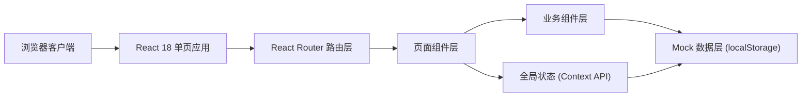
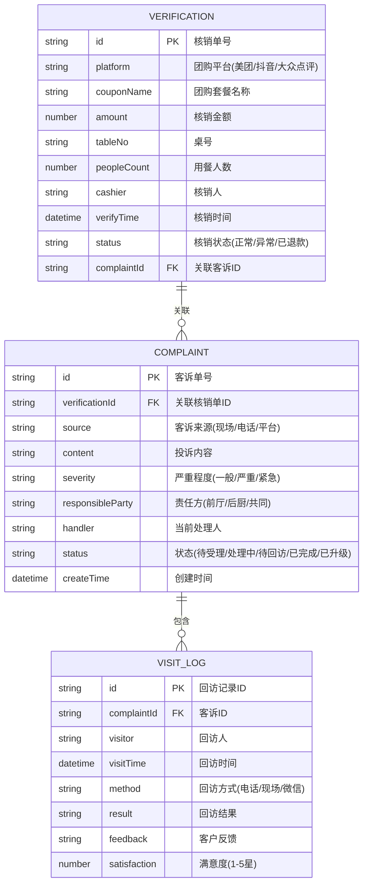

## 1. 架构设计



## 2. 技术选型

- 前端框架：React 18 + TypeScript
- 构建工具：Vite 5
- 样式方案：Tailwind CSS 3
- 路由管理：React Router 6
- 图标库：Lucide React
- 数据存储：Mock 数据 + localStorage 模拟持久化（不接真实接口）
- 状态管理：React Context + useReducer

## 3. 路由定义

| 路由 | 页面用途 |
|------|---------|
| `/` | 角色工作台首页（根据当前角色展示对应视图） |
| `/verification` | 团购核销列表 |
| `/verification/:id` | 团购核销详情 |
| `/complaints` | 客诉回访列表 |
| `/complaints/:id` | 客诉回访详情 |

## 4. 数据模型

### 4.1 核心数据实体



### 4.2 状态枚举定义

```typescript
// 核销状态
type VerificationStatus = 'normal' | 'abnormal' | 'refunded';

// 客诉状态
type ComplaintStatus = 'pending' | 'processing' | 'to_visit' | 'completed' | 'escalated';

// 严重程度
type SeverityLevel = 'normal' | 'serious' | 'urgent';

// 责任方
type ResponsibleParty = 'front' | 'kitchen' | 'both';

// 角色
type UserRole = 'cashier' | 'kitchen_lead' | 'floor_manager';
```

## 5. 组件层级结构

```
src/
├── App.tsx                    # 根组件，角色导航布局
├── main.tsx                   # 入口文件
├── index.css                  # 全局样式 + Tailwind
├── types/
│   └── index.ts               # TypeScript 类型定义
├── data/
│   └── mockData.ts            # Mock 初始数据
├── context/
│   └── AppContext.tsx         # 全局状态（角色、核销单、客诉数据）
├── components/
│   ├── layout/
│   │   ├── RoleSidebar.tsx    # 左侧角色切换导航
│   │   ├── TopNav.tsx         # 顶部导航栏
│   │   └── PageLayout.tsx     # 通用页面布局容器
│   ├── dashboard/
│   │   ├── StatCard.tsx       # 顶部统计卡片
│   │   ├── RiskPanel.tsx      # 风险项专区
│   │   ├── TodoList.tsx       # 待处理列表（含批量操作）
│   │   └── ActivityTimeline.tsx # 最近变更时间线
│   ├── verification/
│   │   ├── VerificationTable.tsx  # 核销列表表格
│   │   ├── VerificationDetail.tsx # 核销详情面板
│   │   └── StatusBadge.tsx        # 状态标签组件
│   └── complaint/
│       ├── ComplaintTable.tsx     # 客诉列表表格
│       ├── ComplaintDetail.tsx    # 客诉详情面板
│       ├── ProcessTimeline.tsx    # 处理时间线
│       ├── VisitRecordList.tsx    # 回访记录回看
│       └── StatusFlowButtons.tsx  # 状态流转操作按钮
└── pages/
    ├── Dashboard.tsx          # 角色工作台首页
    ├── VerificationList.tsx   # 团购核销列表页
    ├── VerificationDetail.tsx # 团购核销详情页
    ├── ComplaintList.tsx      # 客诉回访列表页
    └── ComplaintDetail.tsx    # 客诉回访详情页
```

## 6. 视觉设计关键实现

- CSS 变量定义主题色，确保全局一致性
- 状态标签使用胶囊形（`rounded-full`）+ 指示圆点（`before` 伪元素）
- 风险项左侧色条用 `border-l-4` + `border-red-600` 实现
- 时间线使用 `border-l` + 绝对定位圆点实现
- 批量操作条：选中时底部悬浮操作栏出现，支持全选/反选
- 状态流转按钮：根据当前状态动态渲染可操作的下一个状态
