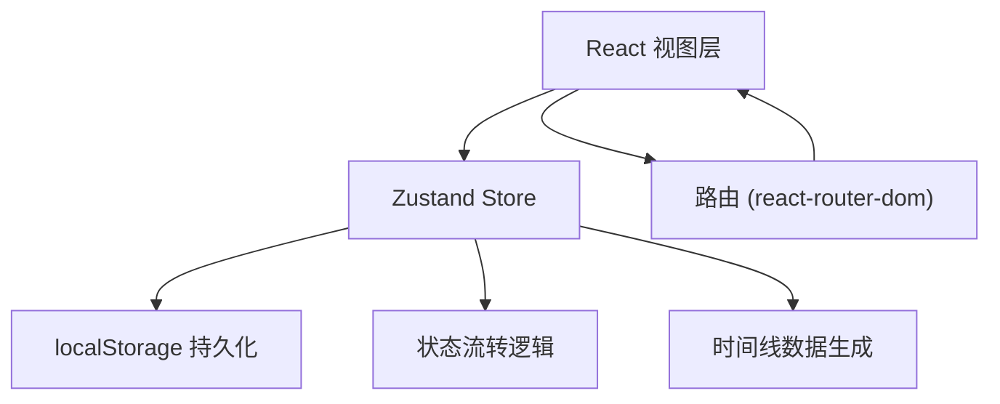
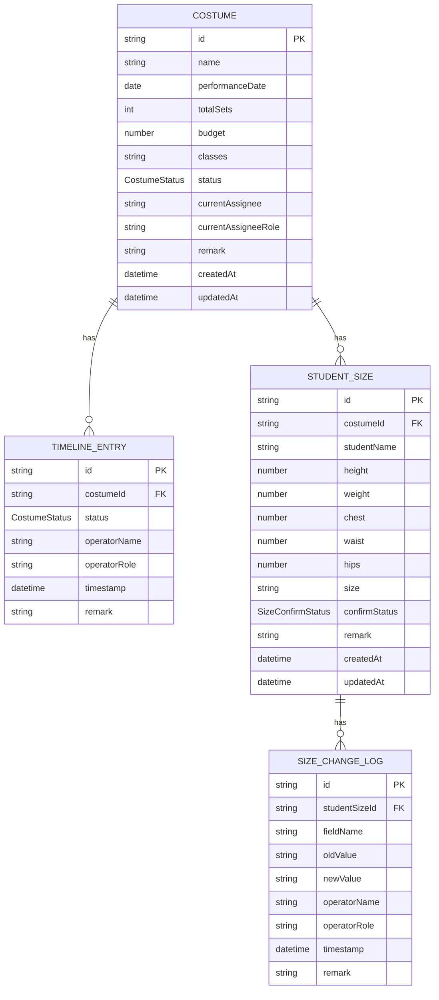

## 1. 架构设计

纯前端单页应用，数据通过 Zustand Store 管理并使用 localStorage 持久化，确保断网或重开后状态不丢失。无需后端服务。



## 2. 技术描述

- **前端框架**：React 18 + TypeScript
- **构建工具**：Vite 5
- **样式方案**：Tailwind CSS 3
- **状态管理**：Zustand（配合 persist 中间件做 localStorage 持久化）
- **路由**：react-router-dom 6
- **图标**：lucide-react
- **初始化模板**：react-ts（纯前端，无需后端）
- **数据存储**：浏览器 localStorage（key: `dance-costume-app-state`）

## 3. 路由定义

| 路由 | 用途 |
|------|------|
| `/` | 工作台首页：概览统计、快捷筛选、最近打开、任务列表 |
| `/costumes/:id` | 演出服装详情页：基本信息、状态时间线、尺码确认表、操作面板 |
| `/costumes/:id/size-history/:studentId` | 尺码回看弹窗：单个学生的尺码修改历史时间线 |

## 4. 数据模型

### 4.1 实体关系



### 4.2 TypeScript 类型定义

```typescript
export type UserRole = 'admin' | 'teacher' | 'principal';

export type CostumeStatus =
  | 'created'          // 已创建（教务发起）
  | 'roster_pending'   // 待确认名单（老师处理）
  | 'roster_confirmed' // 名单已确认
  | 'sizing_pending'   // 待录入尺码（教务处理）
  | 'sizing_entered'   // 尺码已录入
  | 'size_confirm_pending' // 待确认尺码（老师处理）
  | 'size_confirmed'   // 尺码已确认
  | 'approval_pending' // 待审批（校长处理）
  | 'approved'         // 已审批
  | 'ordering'         // 订购中
  | 'received'         // 已到货
  | 'distributed'      // 已发放
  | 'archived';        // 已归档

export type SizeConfirmStatus = 'pending' | 'confirmed' | 'exception';

export interface Operator {
  name: string;
  role: UserRole;
}

export interface TimelineEntry {
  id: string;
  costumeId: string;
  status: CostumeStatus;
  operatorName: string;
  operatorRole: UserRole;
  timestamp: string;
  remark: string;
}

export interface SizeChangeLog {
  id: string;
  studentSizeId: string;
  fieldName: string;
  oldValue: string;
  newValue: string;
  operatorName: string;
  operatorRole: UserRole;
  timestamp: string;
  remark: string;
}

export interface StudentSize {
  id: string;
  costumeId: string;
  studentName: string;
  height?: number;
  weight?: number;
  chest?: number;
  waist?: number;
  hips?: number;
  size?: string;
  confirmStatus: SizeConfirmStatus;
  remark: string;
  createdAt: string;
  updatedAt: string;
  changeLogs: SizeChangeLog[];
}

export interface Costume {
  id: string;
  name: string;
  performanceDate: string;
  totalSets: number;
  budget: number;
  classes: string;
  status: CostumeStatus;
  currentAssignee: string;
  currentAssigneeRole: UserRole;
  remark: string;
  createdAt: string;
  updatedAt: string;
  timeline: TimelineEntry[];
  studentSizes: StudentSize[];
}

export interface AppState {
  costumes: Costume[];
  recentOpenedIds: string[];
  currentUser: Operator;
  filters: {
    status?: CostumeStatus;
    assigneeRole?: UserRole;
    keyword?: string;
  };
}
```

### 4.3 状态流转规则

```
created (教务) → roster_pending (老师) → roster_confirmed → sizing_pending (教务)
→ sizing_entered → size_confirm_pending (老师) → size_confirmed
→ approval_pending (校长) → approved → ordering (教务) → received
→ distributed → archived
```

每个状态转换时：
1. 写入 TimelineEntry（记录状态、操作人、时间、备注）
2. 更新 Costume.status 和 currentAssignee
3. 触发 localStorage 持久化

### 4.4 localStorage 持久化方案

使用 Zustand 的 persist 中间件，对整个 Store 做持久化：

- Storage Key: `dance-costume-app-state`
- 持久化内容：`costumes`、`recentOpenedIds`、`currentUser`、`filters`
- 不持久化内容：无（全部状态都需保留）
- 初始化策略：应用启动时自动从 localStorage 读取，若为空则写入 3 条示例数据作为种子数据
