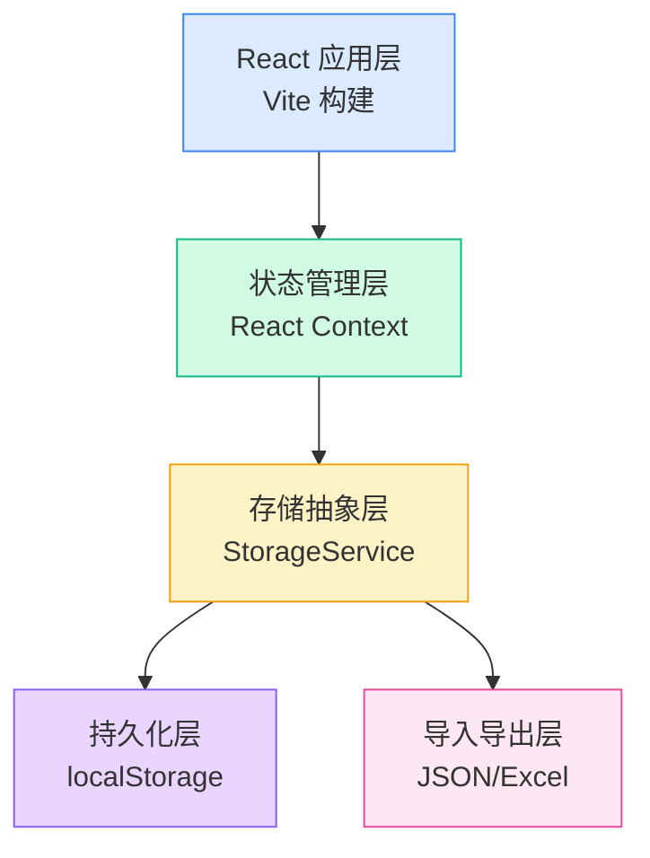
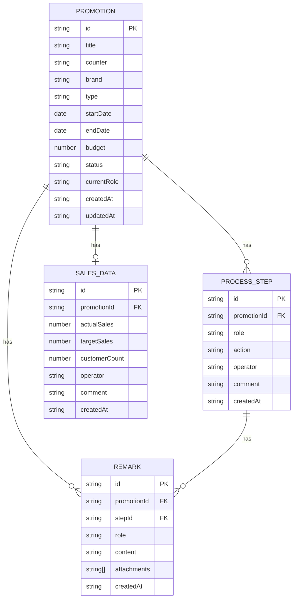

## 1. 架构设计



---

## 2. 技术描述

- **前端框架**：React 18 + TypeScript
- **构建工具**：Vite 5
- **样式方案**：Tailwind CSS 3
- **路由管理**：React Router 6
- **状态管理**：React Context + useReducer
- **数据持久化**：localStorage（自动同步）
- **图标库**：Lucide React
- **日期处理**：date-fns
- **Excel 处理**：SheetJS (xlsx)

---

## 3. 目录结构

```
src/
├── types/              # 类型定义
│   └── index.ts
├── context/            # 全局状态
│   └── AppContext.tsx
├── services/           # 业务服务
│   ├── storage.ts      # 本地存储服务
│   ├── promotion.ts    # 促销单服务
│   └── io.ts           # 导入导出服务
├── hooks/              # 自定义 Hooks
│   ├── usePromotion.ts
│   └── useRecent.ts
├── components/         # 组件
│   ├── layout/         # 布局组件
│   ├── promotion/      # 促销单相关组件
│   ├── timeline/       # 时间线组件
│   └── common/         # 通用组件
├── pages/              # 页面
│   ├── Dashboard.tsx   # 工作台
│   ├── PromotionDetail.tsx
│   ├── SalesReview.tsx
│   └── ImportExport.tsx
├── utils/              # 工具函数
├── data/               # Mock 数据
└── App.tsx             # 入口
```

---

## 4. 路由定义

| 路由 | 页面 | 说明 |
|------|------|------|
| `/` | Dashboard | 工作台首页，默认进入 |
| `/promotion/new` | PromotionDetail | 新建促销单 |
| `/promotion/:id` | PromotionDetail | 促销单详情/处理 |
| `/sales` | SalesReview | 销售核对回看列表 |
| `/sales/:id` | SalesReview | 单条销售核对详情 |
| `/io` | ImportExport | 导入导出页面 |

---

## 5. 数据模型

### 5.1 ER 图



### 5.2 类型定义

```typescript
// 角色类型
type Role = 'counterManager' | 'floorSupervisor' | 'brandSupervisor';

// 促销单状态
type PromotionStatus = 'draft' | 'pendingSupervisor' | 'pendingBrand' | 'active' | 'salesPending' | 'completed' | 'rejected';

// 促销单类型
interface Promotion {
  id: string;
  title: string;
  counter: string;
  brand: string;
  type: string;
  startDate: string;
  endDate: string;
  budget: number;
  description: string;
  status: PromotionStatus;
  currentRole: Role;
  createdAt: string;
  updatedAt: string;
  steps: ProcessStep[];
  remarks: Remark[];
  salesData?: SalesData;
}

// 处理步骤
interface ProcessStep {
  id: string;
  promotionId: string;
  role: Role;
  action: 'submit' | 'approve' | 'reject' | 'complete';
  operator: string;
  comment: string;
  createdAt: string;
}

// 备注
interface Remark {
  id: string;
  promotionId: string;
  stepId?: string;
  role: Role;
  content: string;
  attachments: string[];
  createdAt: string;
}

// 销售数据
interface SalesData {
  id: string;
  promotionId: string;
  actualSales: number;
  targetSales: number;
  customerCount: number;
  operator: string;
  comment: string;
  createdAt: string;
}

// 最近打开记录
interface RecentItem {
  id: string;
  promotionId: string;
  title: string;
  openedAt: string;
}
```

---

## 6. 核心服务设计

### 6.1 StorageService

```typescript
interface StorageService {
  // 促销单 CRUD
  getPromotions(): Promotion[];
  getPromotion(id: string): Promotion | undefined;
  savePromotion(promotion: Promotion): void;
  deletePromotion(id: string): void;
  
  // 最近打开
  getRecentItems(): RecentItem[];
  addRecentItem(item: RecentItem): void;
  
  // 角色切换
  getCurrentRole(): Role;
  setCurrentRole(role: Role): void;
  
  // 导出导入
  exportAll(): string;
  importAll(data: string): void;
}
```

### 6.2 状态流转规则

| 当前状态 | 当前角色 | 可执行操作 | 下一状态 | 下一角色 |
|---------|---------|-----------|---------|---------|
| draft | counterManager | 提交审核 | pendingSupervisor | floorSupervisor |
| pendingSupervisor | floorSupervisor | 通过 | pendingBrand | brandSupervisor |
| pendingSupervisor | floorSupervisor | 驳回 | draft | counterManager |
| pendingBrand | brandSupervisor | 通过 | active | - |
| pendingBrand | brandSupervisor | 驳回 | pendingSupervisor | floorSupervisor |
| active | brandSupervisor | 录入销售 | salesPending | brandSupervisor |
| salesPending | brandSupervisor | 完成核对 | completed | - |
