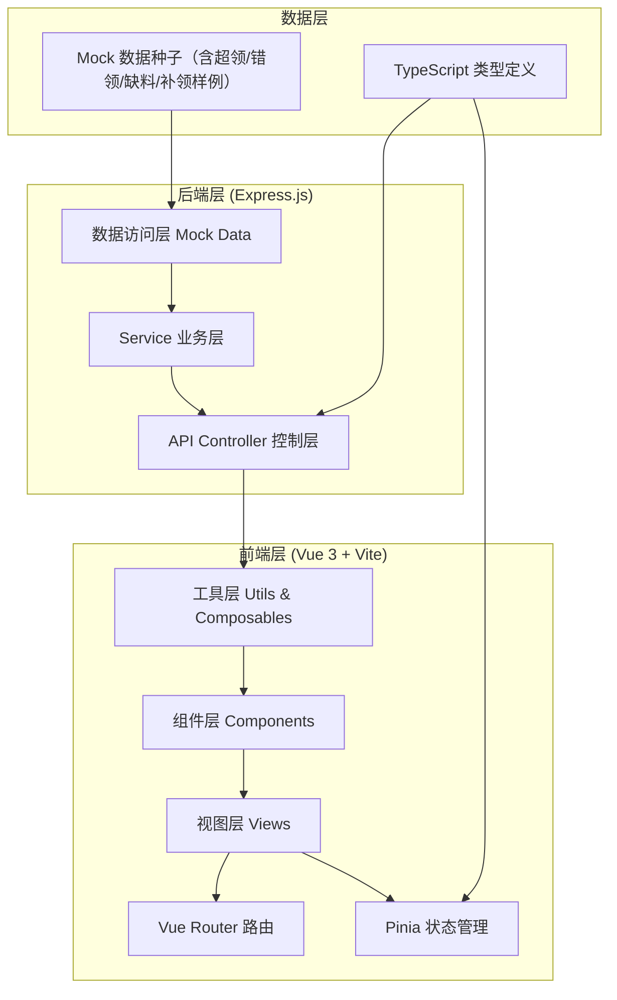
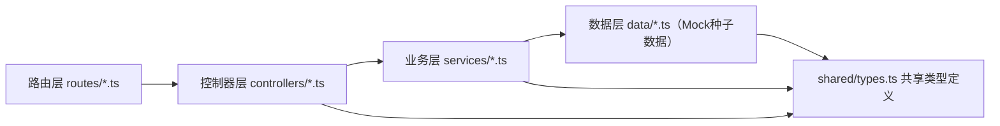
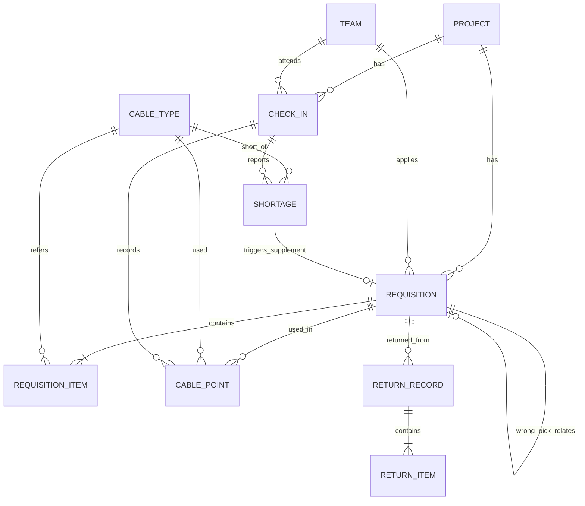

## 1. 架构设计



## 2. 技术描述
- **前端**：Vue@3.4 + TypeScript@5 + Vite@5 + Vue Router@4 + Pinia@2 + Tailwind CSS@3 + Lucide Vue@latest
- **初始化工具**：vite-init vue-express-ts 模板
- **后端**：Express@4 + TypeScript@5
- **数据库**：使用前端 Mock 数据 + 后端内存存储（演示用），预置完整样例数据
- **UI 组件**：自行封装 Tailwind 组件（Button/Card/Table/Badge/Modal/Timeline/Form 等）
- **状态管理**：Pinia 分模块（领料 store、打卡 store、材料 store、用户 store）

## 3. 路由定义
| 路由路径 | 页面名称 | 用途 |
|----------|----------|------|
| `/` | 仪表盘首页 | 项目概览、待办、最近动态 |
| `/requisitions` | 领料管理 | 领料申请列表、审批、发料 |
| `/requisitions/new` | 新建领料 | 填写领料单，含超领/错领标记 |
| `/checkin` | 现场打卡 | 签到、点位记录、照片上传、缺料上报 |
| `/returns` | 补领与退回 | 补领申请、剩余材料退回、台账 |
| `/history` | 历史记录 | 全链路时间轴、领用-点位对照表、筛选导出 |

## 4. API 定义（Express 接口）

### 4.1 TypeScript 类型
```typescript
// 项目
interface Project {
  id: string;
  name: string;
  address: string;
  manager: string;
  status: 'active' | 'completed';
  startDate: string;
}

// 线缆型号
interface CableType {
  id: string;
  model: string;           // 如 CAT6-305
  name: string;            // 六类非屏蔽双绞线
  unit: string;            // 米/卷
  spec: string;            // 规格说明
  stock: number;           // 库存数量
  designQty?: number;      // 设计用量（用于超领判断）
}

// 领料申请
interface Requisition {
  id: string;
  code: string;            // 领料单号 LL-20260611-001
  projectId: string;
  teamId: string;
  items: RequisitionItem[];
  status: 'pending' | 'approved' | 'rejected' | 'issued' | 'completed';
  tags: ('normal' | 'over' | 'wrong' | 'supplement')[];  // 正常/超领/错领/补领
  applicant: string;
  applyTime: string;
  approver?: string;
  approveTime?: string;
  approverRemark?: string;
  issuer?: string;
  issueTime?: string;
  relatedId?: string;      // 关联单ID（补领关联缺料单，错领关联原领料单）
  remark?: string;
}

interface RequisitionItem {
  cableId: string;
  cableModel: string;
  cableName: string;
  quantity: number;        // 申请数量
  designQty?: number;      // 设计用量
  overFlag?: boolean;      // 是否超领
}

// 签到打卡
interface CheckIn {
  id: string;
  projectId: string;
  teamId: string;
  checkInTime: string;
  checkOutTime?: string;
  location: { lat: number; lng: number; address: string };
  workers: string[];       // 到场工人
  weather?: string;
  remark?: string;
}

// 点位记录
interface CablePoint {
  id: string;
  checkInId: string;
  requisitionId: string;   // 关联领料单
  projectId: string;
  pointCode: string;       // 点位编号 A-01-03
  cableId: string;
  cableModel: string;
  usedMeters: number;      // 使用米数
  startPoint: string;      // 起始端
  endPoint: string;        // 终止端
  photos: string[];        // 现场照片URL
  tester: string;          // 测试人
  testResult: 'pass' | 'fail' | 'pending';
  remark?: string;
  createTime: string;
}

// 缺料上报
interface Shortage {
  id: string;
  code: string;            // QL-20260611-001
  projectId: string;
  checkInId: string;
  cableId: string;
  cableModel: string;
  shortageQty: number;
  priority: 'normal' | 'urgent' | 'critical';
  photos: string[];
  reporter: string;
  reportTime: string;
  status: 'reported' | 'approved' | 'supplied' | 'closed';
  supplementReqId?: string; // 补领领料单ID
  remark?: string;
}

// 材料退回
interface ReturnRecord {
  id: string;
  code: string;            // TH-20260611-001
  requisitionId: string;   // 关联原领料单
  projectId: string;
  teamId: string;
  items: ReturnItem[];
  returner: string;
  returnTime: string;
  receiver: string;        // 仓库接收人
  receiveTime?: string;
  photos: string[];        // 退回材料照片
  status: 'pending' | 'received' | 'rejected';
  remark?: string;
}

interface ReturnItem {
  cableId: string;
  cableModel: string;
  returnQty: number;       // 退回数量/米数
  condition: 'good' | 'damaged' | 'partial';  // 完好/损坏/部分使用
}

// 班组
interface Team {
  id: string;
  name: string;
  leader: string;
  phone: string;
  members: string[];
}
```

### 4.2 接口列表
| 方法 | 路径 | 用途 |
|------|------|------|
| GET | `/api/projects` | 获取项目列表 |
| GET | `/api/cables` | 获取线缆型号库存 |
| GET | `/api/teams` | 获取班组列表 |
| GET | `/api/requisitions` | 领料单列表（支持筛选） |
| GET | `/api/requisitions/:id` | 领料单详情 |
| POST | `/api/requisitions` | 创建领料单（含超领判断） |
| PUT | `/api/requisitions/:id/approve` | 审批领料单 |
| PUT | `/api/requisitions/:id/issue` | 仓库发料 |
| POST | `/api/checkins` | 现场签到 |
| PUT | `/api/checkins/:id/checkout` | 签退 |
| GET | `/api/checkins` | 打卡记录列表 |
| POST | `/api/points` | 新增点位记录 |
| GET | `/api/points` | 点位记录列表（关联领料+照片） |
| POST | `/api/shortages` | 缺料上报 |
| GET | `/api/shortages` | 缺料列表 |
| PUT | `/api/shortages/:id` | 更新缺料状态 |
| POST | `/api/returns` | 提交退回单 |
| GET | `/api/returns` | 退回列表 |
| PUT | `/api/returns/:id/receive` | 仓库接收退回 |
| GET | `/api/timeline/:projectId` | 全链路时间轴数据 |
| GET | `/api/trace/:requisitionId` | 领料-点位对应追溯 |

## 5. 后端分层结构


## 6. 数据模型

### 6.1 ER 关系图


### 6.2 预置 Mock 样例数据（核心场景覆盖）
| 数据类型 | 样例场景 | 说明 |
|----------|----------|------|
| 项目 | 智慧园区A栋弱电工程 | 在建项目，地址 + 负责人 |
| 项目 | 数据中心机房综合布线 | 第二个项目做区分 |
| 班组 | 张伟施工班、李强施工班 | 两个班组各有3名成员 |
| 线缆型号 | CAT6、CAT6A、单模光纤、电源线RVV2×1.5 | 4种型号，含设计用量、库存 |
| 领料单1 | LL-20260601-001 正常领料 | 张伟班，CAT6 10卷 2000米，正常审批发料 |
| 领料单2 | LL-20260602-002 **超领** | 设计2000米，申请2500米（超25%），标红超领 |
| 领料单3 | LL-20260603-003 **错领** | 申请CAT6A实为CAT6，错领标签，关联调换单 |
| 领料单4 | LL-20260604-004 **补领** | 关联缺料单 QL-20260603-001，补领CAT6 5卷 |
| 签到记录 | 4条打卡记录 | 对应4个工作日，有到场/离场时间 |
| 点位记录 | 15条点位 | 关联领料单、使用米数、照片URL、测试结果 |
| 缺料单 | QL-20260603-001 现场缺料 | 李强班现场上报，紧急，触发补领流程 |
| 退回单 | TH-20260605-001 剩余退回 | 剩CAT6 2卷 + RVV 120米，完好入库 |
| 全链路时间轴 | 智慧园区A栋完整链路 | 领料2→审批→发料→打卡→点位7个→缺料→补领→打卡→点位→退回→归档 |
