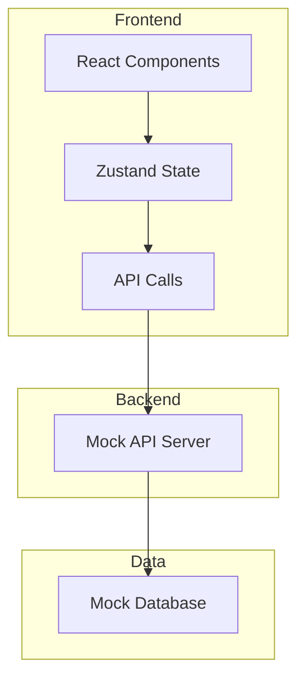
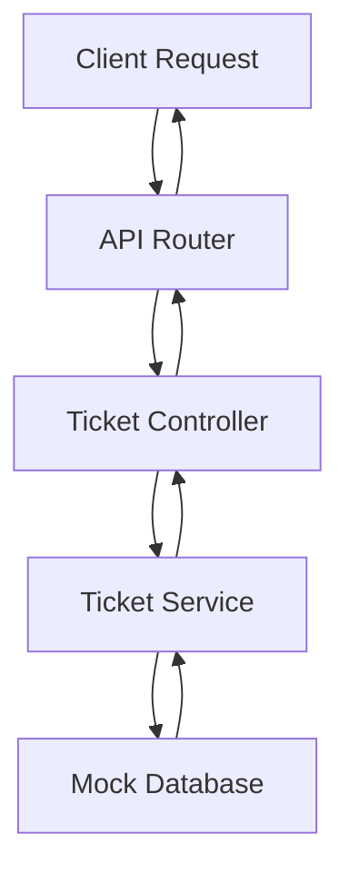
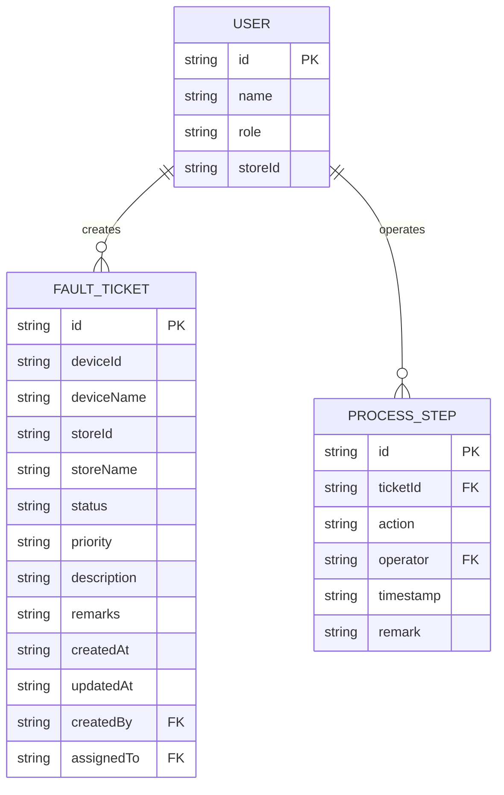

## 1. Architecture Design


## 2. Technology Description
- Frontend: React@18 + TypeScript + TailwindCSS@3
- Initialization Tool: vite-init
- State Management: Zustand
- Icons: Lucide React
- Mock Data: Internal mock API

## 3. Route Definitions
| Route | Purpose |
|-------|---------|
| / | 工作台首页，显示故障单列表和详情 |

## 4. API Definitions

### 4.1 Fault Ticket Types
```typescript
interface FaultTicket {
  id: string;
  deviceId: string;
  deviceName: string;
  storeId: string;
  storeName: string;
  status: 'pending' | 'approved' | 'repairing' | 'completed' | 'rejected';
  priority: 'low' | 'medium' | 'high';
  description: string;
  remarks: string;
  createdAt: string;
  updatedAt: string;
  createdBy: string;
  assignedTo?: string;
  processHistory: ProcessStep[];
}

interface ProcessStep {
  id: string;
  action: string;
  operator: string;
  timestamp: string;
  remark?: string;
}

interface User {
  id: string;
  name: string;
  role: 'clerk' | 'manager' | 'admin';
  storeId?: string;
}
```

### 4.2 API Endpoints
| Method | Endpoint | Purpose |
|--------|----------|---------|
| GET | /api/tickets | 获取故障单列表 |
| GET | /api/tickets/:id | 获取单个故障单详情 |
| POST | /api/tickets | 创建新故障单 |
| PUT | /api/tickets/:id/status | 更新故障单状态 |
| PUT | /api/tickets/:id/remark | 添加处理备注 |

## 5. Server Architecture Diagram


## 6. Data Model

### 6.1 Data Model Definition


### 6.2 Initial Mock Data
- 预设3个角色用户（店员、店长、管理员）
- 预设5-10条故障单数据，覆盖不同状态
- 预设处理历史记录
