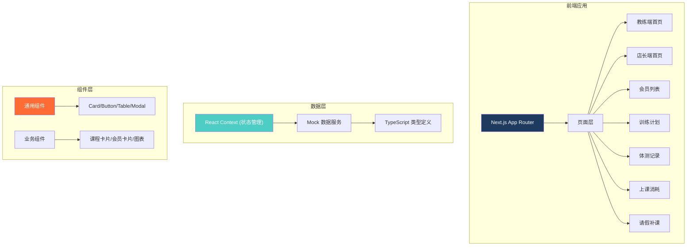

# 私教工作室管理系统 技术架构文档

## 1. 架构设计



## 2. 技术栈说明

- **前端框架**: Next.js 14 (App Router)
- **编程语言**: TypeScript 5.x
- **样式方案**: Tailwind CSS 3.x
- **图表库**: Recharts (数据可视化)
- **图标库**: Lucide React
- **状态管理**: React Context + useState (轻量级)
- **构建工具**: Next.js 内置
- **后端**: 纯前端 Mock 数据，无需后端服务

## 3. 路由定义

| 路由 | 用途 |
|------|------|
| / | 角色选择页 |
| /coach | 教练端首页 |
| /manager | 店长端首页 |
| /members | 会员列表 |
| /members/[id] | 会员详情 |
| /training | 训练计划 |
| /body-measurements | 体测记录 |
| /attendance | 上课消耗 |
| /leave | 请假补课 |

## 4. 类型定义

```typescript
// 会员类型
interface Member {
  id: string;
  name: string;
  avatar: string;
  phone: string;
  joinDate: string;
  status: 'active' | 'inactive' | 'risk';
  packageRemaining: number;
  packageTotal: number;
  lastVisit: string;
  coachId: string;
  goals: string[];
}

// 课程类型
interface Course {
  id: string;
  memberId: string;
  memberName: string;
  coachId: string;
  date: string;
  startTime: string;
  endTime: string;
  status: 'scheduled' | 'completed' | 'cancelled' | 'no-show';
  type: string;
}

// 体测记录
interface BodyMeasurement {
  id: string;
  memberId: string;
  date: string;
  weight: number;
  bodyFat: number;
  muscle: number;
  bmi: number;
  photos: string[];
  notes: string;
}

// 训练计划
interface TrainingPlan {
  id: string;
  memberId: string;
  week: number;
  exercises: Exercise[];
}

// 请假记录
interface LeaveRequest {
  id: string;
  memberId: string;
  startDate: string;
  endDate: string;
  reason: string;
  status: 'pending' | 'approved' | 'rejected';
  makeupCourse?: string;
}
```

## 5. 组件架构

### 5.1 通用组件
- `Button` - 按钮组件（主按钮、次要按钮、危险按钮）
- `Card` - 卡片容器
- `Modal` - 弹窗组件
- `Table` - 数据表格
- `Badge` - 状态徽章
- `Avatar` - 头像组件
- `Tabs` - 标签页切换

### 5.2 业务组件
- `CourseCard` - 课程卡片
- `MemberCard` - 会员卡片
- `RiskAlert` - 风险提醒卡片
- `StatCard` - 数据统计卡片
- `WeeklyCalendar` - 周日历
- `BodyChart` - 体测数据图表

## 6. Mock 数据策略

### 6.1 数据规模
- 会员：30-50 人
- 今日课程：8-12 节
- 待跟进会员：5-8 人
- 高风险会员：3-5 人
- 体测记录：每人 2-5 条历史

### 6.2 真实场景数据
- 有会员连续 3 周未到店
- 有会员减脂进度停滞（最近 2 次体测无变化）
- 有会员课包剩余 < 5 节且无续费意向
- 有请假待审批
- 有补课待安排
- 体测数据有波动（非满分状态）
