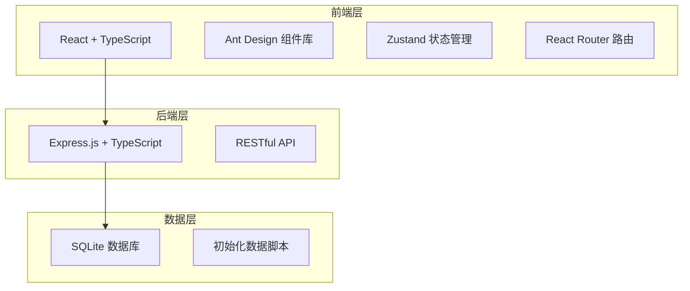
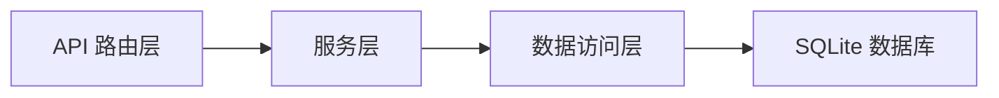
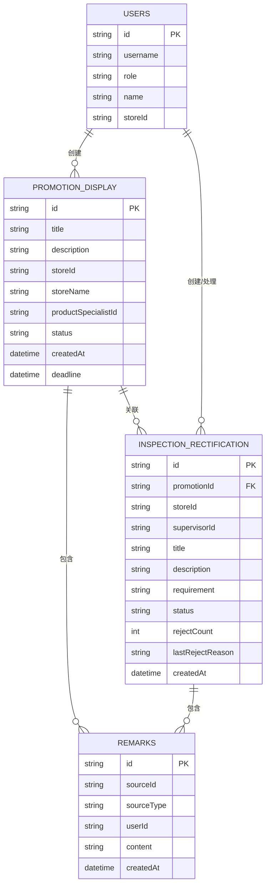

## 1. 架构设计



## 2. 技术描述
- 前端：React@18 + TypeScript + Vite + Ant Design@5 + Tailwind CSS@3 + Zustand + React Router@6
- 后端：Express@4 + TypeScript + better-sqlite3
- 数据库：SQLite（本地文件，无需额外安装）
- 初始化工具：vite-init（react-express-ts 模板）

## 3. 路由定义
| 路由 | 用途 |
|------|------|
| /login | 登录页，角色选择和演示账号登录 |
| /dashboard | 工作台，数据概览和快捷入口 |
| /promotion | 促销陈列列表 |
| /promotion/:id | 促销陈列详情 |
| /promotion/create | 创建促销陈列（商品专员） |
| /inspection | 巡店整改列表 |
| /inspection/:id | 巡店整改详情 |
| /inspection/create | 创建巡店整改（督导） |
| /settings | 系统设置，数据重置 |

## 4. API 定义

### 4.1 类型定义
```typescript
type UserRole = 'store_manager' | 'supervisor' | 'product_specialist';

interface User {
  id: string;
  username: string;
  role: UserRole;
  name: string;
  storeId?: string;
}

interface PromotionDisplay {
  id: string;
  title: string;
  description: string;
  storeId: string;
  storeName: string;
  productSpecialistId: string;
  productSpecialistName: string;
  status: 'pending' | 'processing' | 'completed' | 'has_issue';
  createdAt: string;
  deadline: string;
  remarks: Remark[];
  images: string[];
}

interface InspectionRectification {
  id: string;
  promotionId?: string;
  promotionTitle?: string;
  storeId: string;
  storeName: string;
  supervisorId: string;
  supervisorName: string;
  title: string;
  description: string;
  requirement: string;
  status: 'pending' | 'processing' | 'reviewing' | 'completed' | 'rejected';
  createdAt: string;
  deadline: string;
  remarks: Remark[];
  rejectCount: number;
  lastRejectReason?: string;
  images: string[];
  replyImages: string[];
  replyContent?: string;
}

interface Remark {
  id: string;
  userId: string;
  userName: string;
  userRole: UserRole;
  content: string;
  createdAt: string;
  source: 'promotion' | 'inspection';
}
```

### 4.2 API 端点
| 方法 | 路径 | 描述 |
|------|------|------|
| POST | /api/auth/login | 登录，返回用户信息和 token |
| GET | /api/users/demo | 获取演示账号列表 |
| GET | /api/promotions | 获取促销陈列列表 |
| GET | /api/promotions/:id | 获取促销陈列详情 |
| POST | /api/promotions | 创建促销陈列 |
| PUT | /api/promotions/:id/status | 更新促销陈列状态 |
| POST | /api/promotions/:id/remarks | 添加促销陈列备注 |
| GET | /api/inspections | 获取巡店整改列表 |
| GET | /api/inspections/:id | 获取巡店整改详情 |
| POST | /api/inspections | 创建巡店整改 |
| PUT | /api/inspections/:id/status | 更新巡店整改状态（含退回） |
| POST | /api/inspections/:id/remarks | 添加巡店整改备注 |
| POST | /api/inspections/:id/reply | 店长提交整改回复 |
| POST | /api/system/reset | 重置所有数据 |

## 5. 服务端架构



## 6. 数据模型

### 6.1 ER 图


### 6.2 初始化数据
- 3 个演示账号：店长、督导、商品专员
- 3 条促销陈列示例数据（不同状态）
- 3 条巡店整改示例数据（含异常/退回案例）
- 若干备注记录，演示跨模块备注查看
