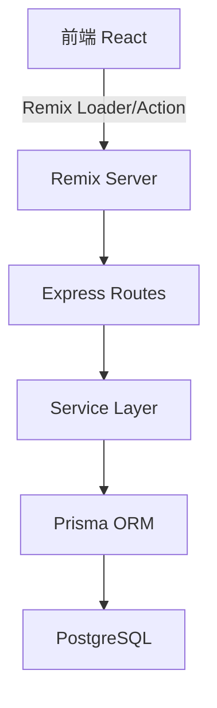
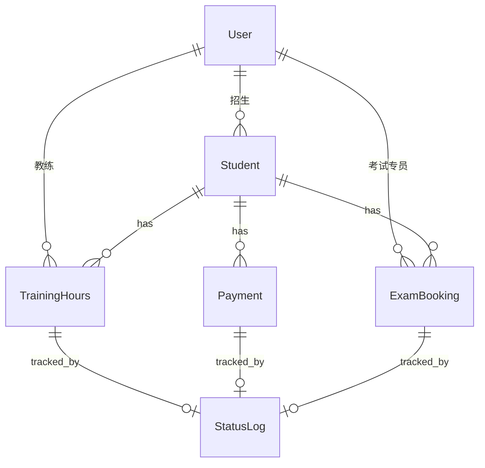

# 驾校运营-学时确认与费用结算系统 技术架构文档

## 1. 技术选型

### 1.1 技术栈
- **前端框架**：Remix (React 18 + TypeScript)
- **UI 组件**：TailwindCSS + Radix UI
- **状态管理**：Remix Loader/Action + Zustand
- **后端框架**：Remix Server + Express
- **数据库**：PostgreSQL
- **ORM**：Prisma
- **开发工具**：Vite

### 1.2 项目初始化
```bash
# 使用 Remix 官方模板
npx create-remix@latest . --template remix-run/remix/templates/remix
```

## 2. 架构设计

### 2.1 系统架构图


### 2.2 分层架构
```
┌─────────────────┐
│   前端页面层     │  (Remix Routes/Components)
├─────────────────┤
│   路由处理层     │  (Remix Loader/Action)
├─────────────────┤
│   业务服务层     │  (Services)
├─────────────────┤
│   数据访问层     │  (Prisma Repositories)
├─────────────────┤
│   数据库层       │  (PostgreSQL)
└─────────────────┘
```

## 3. 数据库设计

### 3.1 ER 图


### 3.2 数据表定义

#### 3.2.1 用户表 (users)
```sql
CREATE TABLE users (
    id UUID PRIMARY KEY DEFAULT gen_random_uuid(),
    username VARCHAR(50) UNIQUE NOT NULL,
    password_hash VARCHAR(255) NOT NULL,
    real_name VARCHAR(100) NOT NULL,
    role VARCHAR(20) NOT NULL CHECK (role IN ('advisor', 'coach', 'examiner', 'admin')),
    phone VARCHAR(20),
    status VARCHAR(20) DEFAULT 'active' CHECK (status IN ('active', 'inactive')),
    created_at TIMESTAMP DEFAULT CURRENT_TIMESTAMP,
    updated_at TIMESTAMP DEFAULT CURRENT_TIMESTAMP
);

CREATE INDEX idx_users_role ON users(role);
CREATE INDEX idx_users_status ON users(status);
```

#### 3.2.2 学员表 (students)
```sql
CREATE TABLE students (
    id UUID PRIMARY KEY DEFAULT gen_random_uuid(),
    name VARCHAR(100) NOT NULL,
    phone VARCHAR(20) UNIQUE NOT NULL,
    id_card VARCHAR(18) UNIQUE NOT NULL,
    exam_type VARCHAR(50) NOT NULL COMMENT 'C1/C2/其他',
    advisor_id UUID REFERENCES users(id),
    coach_id UUID REFERENCES users(id),
    status VARCHAR(20) DEFAULT 'enrolled' CHECK (status IN ('enrolled', 'studying', 'training', 'examining', 'graduated', 'dropped')),
    created_at TIMESTAMP DEFAULT CURRENT_TIMESTAMP,
    updated_at TIMESTAMP DEFAULT CURRENT_TIMESTAMP
);

CREATE INDEX idx_students_status ON students(status);
CREATE INDEX idx_students_advisor ON students(advisor_id);
CREATE INDEX idx_students_coach ON students(coach_id);
CREATE INDEX idx_students_phone ON students(phone);
```

#### 3.2.3 学时记录表 (training_hours)
```sql
CREATE TABLE training_hours (
    id UUID PRIMARY KEY DEFAULT gen_random_uuid(),
    student_id UUID REFERENCES students(id) NOT NULL,
    coach_id UUID REFERENCES users(id) NOT NULL,
    scheduled_at TIMESTAMP NOT NULL,
    actual_at TIMESTAMP,
    hours DECIMAL(4,2) NOT NULL COMMENT '预约学时',
    actual_hours DECIMAL(4,2) COMMENT '实际学时',
    location VARCHAR(100),
    status VARCHAR(20) DEFAULT 'scheduled' CHECK (status IN ('scheduled', 'coach_confirmed', 'hours_recorded', 'student_confirmed', 'completed', 'cancelled', 'exception')),
    exception_reason TEXT,
    created_at TIMESTAMP DEFAULT CURRENT_TIMESTAMP,
    updated_at TIMESTAMP DEFAULT CURRENT_TIMESTAMP
);

CREATE INDEX idx_training_hours_student ON training_hours(student_id);
CREATE INDEX idx_training_hours_coach ON training_hours(coach_id);
CREATE INDEX idx_training_hours_status ON training_hours(status);
CREATE INDEX idx_training_hours_scheduled ON training_hours(scheduled_at);
```

#### 3.2.4 费用记录表 (payments)
```sql
CREATE TABLE payments (
    id UUID PRIMARY KEY DEFAULT gen_random_uuid(),
    student_id UUID REFERENCES students(id) NOT NULL,
    payment_type VARCHAR(50) NOT NULL CHECK (payment_type IN ('registration', 'training', 'retest', 'reinstatement', 'refund')),
    amount DECIMAL(10,2) NOT NULL,
    status VARCHAR(20) DEFAULT 'pending' CHECK (status IN ('pending', 'confirmed', 'paid', 'settled', 'refund_pending', 'refunded', 'exception')),
    paid_at TIMESTAMP,
    settled_at TIMESTAMP,
    refund_reason TEXT,
    handler_id UUID REFERENCES users(id),
    created_at TIMESTAMP DEFAULT CURRENT_TIMESTAMP,
    updated_at TIMESTAMP DEFAULT CURRENT_TIMESTAMP
);

CREATE INDEX idx_payments_student ON payments(student_id);
CREATE INDEX idx_payments_status ON payments(status);
CREATE INDEX idx_payments_type ON payments(payment_type);
CREATE INDEX idx_payments_handler ON payments(handler_id);
```

#### 3.2.5 考试预约表 (exam_bookings)
```sql
CREATE TABLE exam_bookings (
    id UUID PRIMARY KEY DEFAULT gen_random_uuid(),
    student_id UUID REFERENCES students(id) NOT NULL,
    exam_type VARCHAR(50) NOT NULL CHECK (exam_type IN ('科目一', '科目二', '科目三', '科目四')),
    scheduled_date DATE,
    location VARCHAR(100),
    examiner_id UUID REFERENCES users(id),
    status VARCHAR(20) DEFAULT 'pending' CHECK (status IN ('pending', 'booked', 'completed', 'absent', 'scored', 'archived', 'retest', 'cancelled')),
    score DECIMAL(5,2),
    retest_fee DECIMAL(10,2),
    created_at TIMESTAMP DEFAULT CURRENT_TIMESTAMP,
    updated_at TIMESTAMP DEFAULT CURRENT_TIMESTAMP
);

CREATE INDEX idx_exam_bookings_student ON exam_bookings(student_id);
CREATE INDEX idx_exam_bookings_status ON exam_bookings(status);
CREATE INDEX idx_exam_bookings_date ON exam_bookings(scheduled_date);
```

#### 3.2.6 状态流转记录表 (status_logs)
```sql
CREATE TABLE status_logs (
    id UUID PRIMARY KEY DEFAULT gen_random_uuid(),
    entity_type VARCHAR(50) NOT NULL COMMENT 'training_hours/payment/exam_booking',
    entity_id UUID NOT NULL,
    previous_status VARCHAR(50),
    new_status VARCHAR(50) NOT NULL,
    handler_id UUID REFERENCES users(id),
    handler_name VARCHAR(100) NOT NULL,
    handler_role VARCHAR(20) NOT NULL,
    reason TEXT NOT NULL,
    remark TEXT,
    created_at TIMESTAMP DEFAULT CURRENT_TIMESTAMP
);

CREATE INDEX idx_status_logs_entity ON status_logs(entity_type, entity_id);
CREATE INDEX idx_status_logs_handler ON status_logs(handler_id);
CREATE INDEX idx_status_logs_created ON status_logs(created_at);
```

## 4. 路由设计

### 4.1 路由结构
```
/                           # 首页/登录页
/login                      # 登录
/logout                     # 登出

/advisor                    # 招生顾问工作台
/advisor/students           # 学员列表
/advisor/students/:id       # 学员详情
/advisor/training           # 待确认练车
/advisor/payments           # 待结算费用
/advisor/exceptions         # 异常记录

/coach                      # 教练工作台
/coach/schedule             # 练车计划
/coach/confirm              # 待确认练车
/coach/hours                # 学时审核
/coach/students             # 学员列表

/examiner                   # 考试专员工作台
/examiner/bookings          # 预约列表
/examiner/scores            # 成绩录入
/examiner/retests           # 补考管理

/shared/students/:id        # 共享的学员详情页
/shared/export              # 导出功能
```

### 4.2 主要路由说明
| 路由 | 方法 | 说明 |
|------|------|------|
| /login | POST | 登录验证 |
| /advisor/training/:id/confirm | POST | 招生顾问确认练车 |
| /coach/hours/:id/record | POST | 教练录入学时 |
| /payments/:id/settle | POST | 结算费用 |
| /exam_bookings/:id/score | POST | 录入成绩 |

## 5. API 定义

### 5.1 认证接口
```typescript
// POST /api/auth/login
interface LoginRequest {
  username: string;
  password: string;
}

interface LoginResponse {
  user: {
    id: string;
    username: string;
    realName: string;
    role: 'advisor' | 'coach' | 'examiner' | 'admin';
  };
  token: string;
}
```

### 5.2 待办列表接口
```typescript
// GET /api/todos
interface TodoQuery {
  role: 'advisor' | 'coach' | 'examiner';
  status?: string;
  startDate?: string;
  endDate?: string;
}

interface TodoResponse {
  todos: Array<{
    id: string;
    type: 'training' | 'payment' | 'exam';
    studentId: string;
    studentName: string;
    status: string;
    createdAt: string;
    priority: 'normal' | 'urgent';
  }>;
  total: number;
}
```

### 5.3 学时操作接口
```typescript
// POST /api/training/:id/confirm
interface TrainingConfirmRequest {
  status: 'coach_confirmed' | 'hours_recorded' | 'student_confirmed' | 'completed';
  actualHours?: number;
  exceptionReason?: string;
  remark?: string;
}

// POST /api/training/:id/exception
interface TrainingExceptionRequest {
  exceptionReason: string;
  remark: string;
}
```

### 5.4 费用操作接口
```typescript
// POST /api/payments/:id/settle
interface PaymentSettleRequest {
  status: 'paid' | 'settled' | 'refund_pending' | 'refunded';
  refundReason?: string;
  remark?: string;
}
```

### 5.5 考试操作接口
```typescript
// POST /api/exam-bookings/:id/book
interface ExamBookRequest {
  scheduledDate: string;
  location: string;
}

// POST /api/exam-bookings/:id/score
interface ExamScoreRequest {
  score: number;
  status: 'scored' | 'retest';
  retestFee?: number;
  remark?: string;
}
```

### 5.6 状态流转查询接口
```typescript
// GET /api/status-logs/:entityType/:entityId
interface StatusLogResponse {
  logs: Array<{
    id: string;
    previousStatus: string;
    newStatus: string;
    handlerName: string;
    handlerRole: string;
    reason: string;
    remark: string;
    createdAt: string;
  }>;
}
```

## 6. 核心业务逻辑

### 6.1 状态流转服务
```typescript
// services/statusLogService.ts
interface StatusLogInput {
  entityType: 'training_hours' | 'payment' | 'exam_booking';
  entityId: string;
  previousStatus: string;
  newStatus: string;
  handlerId: string;
  reason: string;
  remark?: string;
}

async function createStatusLog(input: StatusLogInput): Promise<StatusLog> {
  const user = await getUser(input.handlerId);
  return await prisma.statusLog.create({
    data: {
      entityType: input.entityType,
      entityId: input.entityId,
      previousStatus: input.previousStatus,
      newStatus: input.newStatus,
      handlerId: input.handlerId,
      handlerName: user.realName,
      handlerRole: user.role,
      reason: input.reason,
      remark: input.remark,
    },
  });
}
```

### 6.2 待办查询服务
```typescript
// services/todoService.ts
async function getTodosByRole(role: string, filters?: object): Promise<Todo[]> {
  switch (role) {
    case 'advisor':
      return getAdvisorTodos(filters);
    case 'coach':
      return getCoachTodos(filters);
    case 'examiner':
      return getExaminerTodos(filters);
    default:
      return [];
  }
}

async function getAdvisorTodos(filters: object) {
  // 查询待确认练车
  const training = await prisma.trainingHours.findMany({
    where: { status: 'scheduled' },
    include: { student: true },
  });

  // 查询待结算费用
  const payments = await prisma.payments.findMany({
    where: { status: 'confirmed' },
    include: { student: true },
  });

  // 查询异常记录
  const exceptions = await prisma.$queryRaw`
    SELECT * FROM training_hours WHERE status = 'exception'
    UNION
    SELECT * FROM payments WHERE status = 'exception'
  `;

  return mergeAndPrioritize([...training, ...payments, ...exceptions]);
}
```

### 6.3 费用计算服务
```typescript
// services/paymentService.ts
async function calculateRefund(studentId: string): Promise<number> {
  const student = await prisma.student.findUnique({
    where: { id: studentId },
    include: {
      trainingHours: true,
      payments: true,
    },
  });

  const totalPaid = student.payments
    .filter(p => p.status === 'settled')
    .reduce((sum, p) => sum + p.amount, 0);

  const totalHours = student.trainingHours
    .filter(t => t.status === 'completed')
    .reduce((sum, t) => sum + Number(t.actualHours), 0);

  const refund = calculateByPolicy(totalPaid, totalHours, student.examType);

  return refund;
}
```

## 7. 权限设计

### 7.1 角色权限矩阵
| 功能 | 招生顾问 | 教练 | 考试专员 | 管理员 |
|------|---------|------|---------|--------|
| 查看所有学员 | ✓ | 自己学员 | ✓ | ✓ |
| 确认练车 | ✓ | ✓ | ✗ | ✓ |
| 录入学时 | ✗ | ✓ | ✗ | ✓ |
| 结算费用 | ✓ | ✗ | ✗ | ✓ |
| 预约考试 | ✗ | ✗ | ✓ | ✓ |
| 录入成绩 | ✗ | ✗ | ✓ | ✓ |
| 处理退款 | ✓ | ✗ | ✗ | ✓ |

## 8. 前端页面组件

### 8.1 核心组件
- `TodoCard`：待办卡片，显示学员信息、状态、紧急程度
- `StatusTimeline`：状态流转时间轴
- `PaymentList`：费用列表，支持筛选
- `StudentDetail`：学员详情聚合页
- `ExceptionBadge`：异常状态标记
- `FilterBar`：通用筛选栏
- `ConfirmModal`：确认操作弹窗

### 8.2 布局结构
```
┌─────────────────────────┐
│      Header (用户信息)    │
├──────────┬──────────────┤
│          │              │
│  Sidebar │   Main Content│
│  (角色菜单)│   (待办列表)  │
│          │              │
│          ├──────────────┤
│          │   Detail Panel│
│          │   (详情抽屉)   │
└──────────┴──────────────┘
```

## 9. 性能优化

### 9.1 数据库优化
- 为常用查询字段创建索引
- 使用分区表处理历史数据
- 定期归档已完成记录

### 9.2 前端优化
- 使用 Remix 的 Loader 缓存
- 列表分页 + 虚拟滚动
- 异常状态使用红色标记优先展示

## 10. 测试计划

### 10.1 功能测试
- [ ] 登录登出流程
- [ ] 多角色待办列表加载
- [ ] 学时确认流程（正常 + 异常）
- [ ] 费用结算流程（正常 + 退款）
- [ ] 考试预约流程
- [ ] 状态流转记录完整性
- [ ] 筛选列表准确性
- [ ] 费用结算回看准确性

### 10.2 性能测试
- [ ] 1000学员数据下列表加载 < 2秒
- [ ] 状态变更响应 < 500ms
- [ ] 筛选查询 < 1秒

### 10.3 异常场景测试
- [ ] 练车排不上 → 异常状态标记
- [ ] 考试名额漏抢 → 漏抢记录
- [ ] 补考费用争议 → 完整费用链展示
