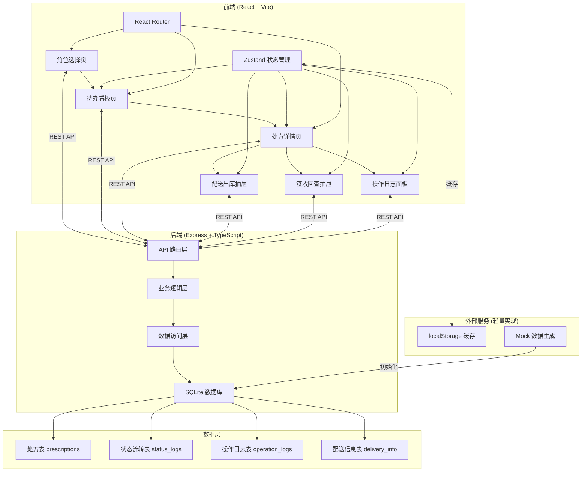
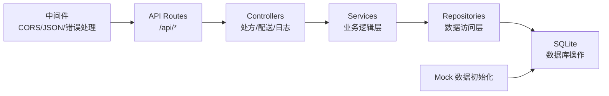
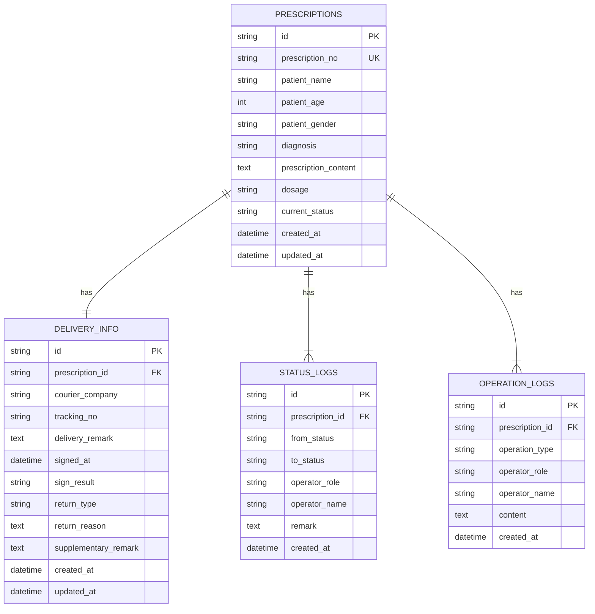

## 1. 架构设计



## 2. 技术说明

- **前端框架**：React@18 + TypeScript + Vite
- **状态管理**：Zustand
- **路由**：React Router DOM
- **UI 样式**：Tailwind CSS@3
- **图标库**：Lucide React
- **后端框架**：Express@4 + TypeScript
- **数据库**：SQLite（通过 better-sqlite3 驱动）
- **ORM**：原生 SQL + 类型化访问层
- **数据持久化**：后端内存 + SQLite，前端 localStorage 备份

## 3. 路由定义

| 路由 | 页面 | 说明 |
|------|------|------|
| `/` | 角色选择页 | 入口页，选择操作角色 |
| `/dashboard` | 待办看板页 | 按角色展示待办列表和统计 |
| `/prescription/:id` | 处方详情页 | 处方全量信息和操作入口 |

## 4. API 定义

### 4.1 类型定义

```typescript
// 处方状态枚举
type PrescriptionStatus = 
  | 'PENDING_REVIEW'      // 待审核
  | 'REVIEWED'            // 已审核
  | 'PENDING_DECOCTION'   // 待煎药
  | 'DECOCTED'            // 已煎药
  | 'PENDING_DELIVERY'    // 待配送
  | 'OUT_FOR_DELIVERY'    // 配送中
  | 'DELIVERED'           // 已签收
  | 'RETURNED'            // 已退回
  | 'COMPLETED';          // 已完成

// 角色枚举
type Role = 'PHARMACIST' | 'DECOCTION_STAFF' | 'DELIVERY_STAFF';

// 处方
interface Prescription {
  id: string;
  prescriptionNo: string;
  patientName: string;
  patientAge: number;
  patientGender: '男' | '女';
  diagnosis: string;
  prescriptionContent: string;
  dosage: string;
  currentStatus: PrescriptionStatus;
  createdAt: string;
  updatedAt: string;
}

// 配送信息
interface DeliveryInfo {
  id: string;
  prescriptionId: string;
  courierCompany: string;
  trackingNo: string;
  deliveryRemark: string;
  signedAt?: string;
  signResult?: 'NORMAL' | 'RETURNED';
  returnReason?: string;
  returnType?: string;
  supplementaryRemark?: string;
  createdAt: string;
}

// 状态流转记录
interface StatusLog {
  id: string;
  prescriptionId: string;
  fromStatus: PrescriptionStatus;
  toStatus: PrescriptionStatus;
  operatorRole: Role;
  operatorName: string;
  remark: string;
  createdAt: string;
}

// 操作日志
interface OperationLog {
  id: string;
  prescriptionId: string;
  operationType: string;
  operatorRole: Role;
  operatorName: string;
  content: string;
  createdAt: string;
}
```

### 4.2 接口列表

| 方法 | 路径 | 说明 |
|------|------|------|
| GET | `/api/prescriptions` | 获取处方列表（支持按状态筛选） |
| GET | `/api/prescriptions/:id` | 获取处方详情（含配送信息、状态日志、操作日志） |
| GET | `/api/prescriptions/by-role/:role` | 按角色获取待办列表 |
| POST | `/api/prescriptions` | 创建处方（Mock 数据用） |
| PUT | `/api/prescriptions/:id/review` | 审方药师审核通过 |
| PUT | `/api/prescriptions/:id/decoct` | 煎药员标记煎药完成 |
| POST | `/api/prescriptions/:id/delivery` | 配送出库处理 |
| PUT | `/api/prescriptions/:id/sign` | 签收回查确认 |
| GET | `/api/prescriptions/:id/logs` | 获取操作日志 |

## 5. 服务端架构图



## 6. 数据模型

### 6.1 ER 图



### 6.2 DDL 语句

```sql
-- 处方表
CREATE TABLE prescriptions (
  id TEXT PRIMARY KEY,
  prescription_no TEXT UNIQUE NOT NULL,
  patient_name TEXT NOT NULL,
  patient_age INTEGER,
  patient_gender TEXT CHECK(patient_gender IN ('男', '女')),
  diagnosis TEXT,
  prescription_content TEXT,
  dosage TEXT,
  current_status TEXT NOT NULL DEFAULT 'PENDING_REVIEW',
  created_at TEXT NOT NULL DEFAULT CURRENT_TIMESTAMP,
  updated_at TEXT NOT NULL DEFAULT CURRENT_TIMESTAMP
);

-- 配送信息表
CREATE TABLE delivery_info (
  id TEXT PRIMARY KEY,
  prescription_id TEXT UNIQUE NOT NULL REFERENCES prescriptions(id),
  courier_company TEXT,
  tracking_no TEXT,
  delivery_remark TEXT,
  signed_at TEXT,
  sign_result TEXT CHECK(sign_result IN ('NORMAL', 'RETURNED')),
  return_type TEXT,
  return_reason TEXT,
  supplementary_remark TEXT,
  created_at TEXT NOT NULL DEFAULT CURRENT_TIMESTAMP,
  updated_at TEXT NOT NULL DEFAULT CURRENT_TIMESTAMP
);

-- 状态流转表
CREATE TABLE status_logs (
  id TEXT PRIMARY KEY,
  prescription_id TEXT NOT NULL REFERENCES prescriptions(id),
  from_status TEXT,
  to_status TEXT NOT NULL,
  operator_role TEXT NOT NULL,
  operator_name TEXT NOT NULL,
  remark TEXT,
  created_at TEXT NOT NULL DEFAULT CURRENT_TIMESTAMP
);

-- 操作日志表
CREATE TABLE operation_logs (
  id TEXT PRIMARY KEY,
  prescription_id TEXT NOT NULL REFERENCES prescriptions(id),
  operation_type TEXT NOT NULL,
  operator_role TEXT NOT NULL,
  operator_name TEXT NOT NULL,
  content TEXT NOT NULL,
  created_at TEXT NOT NULL DEFAULT CURRENT_TIMESTAMP
);

-- 索引
CREATE INDEX idx_prescriptions_status ON prescriptions(current_status);
CREATE INDEX idx_status_logs_prescription ON status_logs(prescription_id);
CREATE INDEX idx_operation_logs_prescription ON operation_logs(prescription_id);
```

### 6.3 初始化 Mock 数据

系统启动时自动插入 8-10 条模拟处方数据，覆盖各个状态节点，便于演示完整流程。
