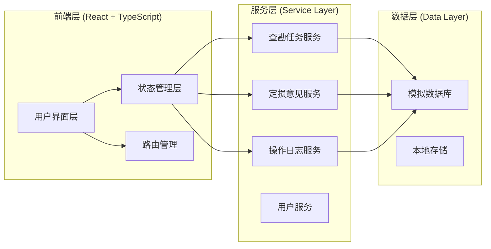

# 保险理赔中心 - 技术架构文档

## 1. 架构设计总览

### 1.1 系统架构图



### 1.2 技术栈选型

| 层级 | 技术选型 | 版本 | 说明 |
|------|---------|------|------|
| 前端框架 | React | 18.x | 组件化开发，生态成熟 |
| 开发语言 | TypeScript | 5.x | 类型安全，提高代码质量 |
| 构建工具 | Vite | 5.x | 快速构建，开发体验好 |
| 路由管理 | React Router | 6.x | SPA路由管理 |
| 状态管理 | Zustand | 4.x | 轻量级状态管理 |
| UI组件库 | Tailwind CSS | 3.x | 原子化CSS，快速开发 |
| 图表库 | Recharts | 2.x | 数据可视化 |
| 日期处理 | Day.js | 1.x | 轻量级日期库 |
| 数据持久化 | localStorage | - | 本地数据存储 |

## 2. 项目结构设计

### 2.1 目录结构

```
insurance-claims-center/
├── public/
│   └── index.html
├── src/
│   ├── assets/
│   │   └── styles/
│   │       └── index.css
│   ├── components/
│   │   ├── common/           # 通用组件
│   │   │   ├── Button/
│   │   │   ├── Card/
│   │   │   ├── Table/
│   │   │   ├── Modal/
│   │   │   └── StatusTag/
│   │   ├── layout/            # 布局组件
│   │   │   ├── Sidebar/
│   │   │   ├── Header/
│   │   │   └── Layout/
│   │   ├── task/              # 查勘任务相关组件
│   │   │   ├── TaskList/
│   │   │   ├── TaskDetail/
│   │   │   ├── TaskForm/
│   │   │   └── TaskTimeline/
│   │   └── assessment/        # 定损意见相关组件
│   │       ├── AssessmentForm/
│   │       ├── AssessmentList/
│   │       └── AssessmentDetail/
│   ├── pages/                 # 页面组件
│   │   ├── Dashboard/         # 首页/仪表盘
│   │   ├── Task/              # 查勘任务页面
│   │   │   ├── TaskList/
│   │   │   ├── TaskDetail/
│   │   │   └── CreateTask/
│   │   ├── Assessment/        # 定损意见页面
│   │   │   ├── AssessmentList/
│   │   │   ├── AssessmentForm/
│   │   │   └── AssessmentReview/
│   │   ├── Trace/            # 流程追溯页面
│   │   └── User/             # 人员管理页面
│   ├── services/             # 服务层
│   │   ├── task.service.ts
│   │   ├── assessment.service.ts
│   │   ├── log.service.ts
│   │   └── user.service.ts
│   ├── stores/               # 状态管理
│   │   ├── task.store.ts
│   │   ├── assessment.store.ts
│   │   ├── log.store.ts
│   │   └── user.store.ts
│   ├── types/                # TypeScript类型定义
│   │   ├── task.types.ts
│   │   ├── assessment.types.ts
│   │   ├── log.types.ts
│   │   └── user.types.ts
│   ├── utils/                # 工具函数
│   │   ├── storage.ts
│   │   ├── format.ts
│   │   └── validate.ts
│   ├── data/                 # 模拟数据
│   │   ├── mockTasks.ts
│   │   ├── mockAssessments.ts
│   │   └── mockLogs.ts
│   ├── App.tsx
│   └── main.tsx
├── package.json
├── tsconfig.json
├── vite.config.ts
├── tailwind.config.js
├── postcss.config.js
└── README.md
```

## 3. 数据模型定义

### 3.1 数据模型关系图

```mermaid
erDiagram
    SurveyTask ||--o{ DamageAssessment : "has one"
    SurveyTask ||--o{ OperationLog : "generates many"
    DamageAssessment ||--o{ DamageDetail : "contains many"
    DamageAssessment ||--o{ OperationLog : "generates many"
    SurveyTask {
        string taskId PK
        string taskNo UK
        string claimNo
        string policyNo
        string licensePlate
        string vehicleType
        string ownerName
        string ownerPhone
        datetime accidentTime
        string accidentLocation
        text accidentDesc
        int urgencyLevel
        string status
        string assignedSurveyorId
        datetime assignedTime
        datetime surveyStartTime
        datetime surveyEndTime
        decimal claimAmount
        string createdBy
        datetime createdTime
        datetime updatedTime
    }

    DamageAssessment |||--|| DamageDetail : "includes"
    DamageAssessment {
        string assessmentId PK
        string taskId FK
        string assessmentNo UK
        string assessorId
        string assessorName
        datetime assessmentTime
        decimal partsFee
        decimal laborFee
        decimal materialFee
        decimal totalAmount
        string repairMethod
        text repairPlan
        string status
        string reviewerId
        datetime reviewTime
        text reviewComment
        string createdBy
        datetime createdTime
        datetime updatedTime
    }

    DamageDetail {
        string detailId PK
        string assessmentId FK
        string partName
        string damageType
        string damageLevel
        string repairMethod
        decimal partFee
        decimal laborFee
        text remark
        datetime createdTime
    }

    OperationLog {
        string logId PK
        string taskId FK
        string assessmentId FK
        string operationType
        string operationDesc
        string operatorId
        string operatorName
        string operatorRole
        string beforeStatus
        string afterStatus
        text remark
        datetime createdTime
    }

    User {
        string userId PK
        string username
        string realName
        string phone
        string email
        string role
        string department
        boolean active
        datetime createdTime
    }
```

### 3.2 状态枚举定义

```typescript
// 查勘任务状态
enum TaskStatus {
  PENDING_ASSIGN = 'pending_assign',      // 待分配
  PENDING_PROCESS = 'pending_process',    // 待处理
  PROCESSING = 'processing',              // 处理中
  PENDING_ASSESSMENT = 'pending_assessment', // 待定损
  COMPLETED = 'completed',                // 已完成
  CANCELLED = 'cancelled'                 // 已取消
}

// 定损意见状态
enum AssessmentStatus {
  DRAFT = 'draft',              // 草稿
  PENDING_REVIEW = 'pending_review',  // 待审核
  APPROVED = 'approved',        // 已确认
  REJECTED = 'rejected'         // 已拒绝
}

// 操作类型
enum OperationType {
  CREATE_TASK = 'create_task',
  ASSIGN_TASK = 'assign_task',
  ACCEPT_TASK = 'accept_task',
  START_SURVEY = 'start_survey',
  COMPLETE_SURVEY = 'complete_survey',
  CREATE_ASSESSMENT = 'create_assessment',
  UPDATE_ASSESSMENT = 'update_assessment',
  SUBMIT_ASSESSMENT = 'submit_assessment',
  REVIEW_ASSESSMENT = 'review_assessment',
  APPROVE_ASSESSMENT = 'approve_assessment',
  REJECT_ASSESSMENT = 'reject_assessment'
}

// 用户角色
enum UserRole {
  CLAIMS_SPECIALIST = 'claims_specialist',  // 理赔专员
  SURVEYOR = 'surveyor',                    // 查勘员
  REVIEW_SUPERVISOR = 'review_supervisor',  // 核赔主管
  ADMIN = 'admin'                           // 管理员
}
```

## 4. API接口定义

### 4.1 查勘任务接口

```typescript
// 创建查勘任务
POST /api/tasks
Request:
{
  claimNo: string;           // 报案号
  policyNo?: string;         // 保单号
  licensePlate: string;       // 车牌号
  vehicleType?: string;      // 车辆类型
  ownerName: string;         // 车主姓名
  ownerPhone: string;        // 车主电话
  accidentTime: string;       // 事故时间
  accidentLocation: string;  // 事故地点
  accidentDesc: string;      // 事故描述
  urgencyLevel: number;      // 紧急程度
  claimAmount?: number;      // 报案金额
}

Response:
{
  success: boolean;
  data: {
    taskId: string;
    taskNo: string;
    status: TaskStatus;
    createdTime: string;
  };
  message: string;
}

// 分配查勘任务
PUT /api/tasks/:taskId/assign
Request:
{
  surveyorId: string;    // 查勘员ID
  remark?: string;       // 备注说明
}

Response:
{
  success: boolean;
  data: {
    taskId: string;
    assignedSurveyorId: string;
    assignedSurveyorName: string;
    assignedTime: string;
    status: TaskStatus;
  };
  message: string;
}

// 接单
PUT /api/tasks/:taskId/accept
Request:
{
  remark?: string;       // 备注说明
}

Response:
{
  success: boolean;
  data: {
    taskId: string;
    status: TaskStatus;
    acceptTime: string;
    operatorId: string;
    operatorName: string;
  };
  message: string;
}

// 开始查勘
PUT /api/tasks/:taskId/start-survey
Request:
{
  surveyLocation: string;  // 查勘地点
  remark?: string;         // 备注说明
}

Response:
{
  success: boolean;
  data: {
    taskId: string;
    status: TaskStatus;
    surveyStartTime: string;
  };
  message: string;
}

// 完成查勘
PUT /api/tasks/:taskId/complete-survey
Request:
{
  surveyEndTime: string;    // 查勘结束时间
  surveyDesc?: string;      // 查勘描述
  remark?: string;         // 备注说明
}

Response:
{
  success: boolean;
  data: {
    taskId: string;
    status: TaskStatus;
    surveyEndTime: string;
  };
  message: string;
}

// 查询任务详情
GET /api/tasks/:taskId

Response:
{
  success: boolean;
  data: {
    task: SurveyTask;
    assessments: DamageAssessment[];
    logs: OperationLog[];
    timeline: TimelineItem[];
  };
  message: string;
}

// 查询任务列表
GET /api/tasks

Query Parameters:
- status?: TaskStatus          // 状态筛选
- surveyorId?: string          // 查勘员ID
- urgencyLevel?: number        // 紧急程度
- startDate?: string           // 创建开始时间
- endDate?: string             // 创建结束时间
- keyword?: string             // 关键词搜索
- page?: number                 // 页码
- pageSize?: number             // 每页数量

Response:
{
  success: boolean;
  data: {
    list: SurveyTask[];
    total: number;
    page: number;
    pageSize: number;
  };
  message: string;
}
```

### 4.2 定损意见接口

```typescript
// 创建定损意见
POST /api/assessments
Request:
{
  taskId: string;           // 关联的任务ID
  partsFee: number;         // 配件费
  laborFee: number;         // 工时费
  materialFee?: number;    // 辅料费
  repairMethod: string;    // 维修方式
  repairPlan?: string;     // 维修方案
  details: {
    partName: string;       // 损失部位
    damageType: string;     // 损失类型
    damageLevel: string;    // 损失程度
    repairMethod: string;   // 维修方式
    partFee: number;        // 配件费
    laborFee: number;       // 工时费
    remark?: string;        // 备注
  }[];
  remark?: string;          // 备注说明
}

Response:
{
  success: boolean;
  data: {
    assessmentId: string;
    assessmentNo: string;
    status: AssessmentStatus;
    totalAmount: number;
    createdTime: string;
  };
  message: string;
}

// 提交定损意见
PUT /api/assessments/:assessmentId/submit
Request:
{
  remark?: string;          // 备注说明
}

Response:
{
  success: boolean;
  data: {
    assessmentId: string;
    status: AssessmentStatus;
    submitTime: string;
    operatorId: string;
    operatorName: string;
  };
  message: string;
}

// 审核定损意见
PUT /api/assessments/:assessmentId/review
Request:
{
  action: 'approve' | 'reject';  // 审核动作
  reviewComment: string;          // 审核意见
  remark?: string;                // 备注说明
}

Response:
{
  success: boolean;
  data: {
    assessmentId: string;
    status: AssessmentStatus;
    reviewTime: string;
    reviewerId: string;
    reviewerName: string;
  };
  message: string;
}

// 查询定损详情
GET /api/assessments/:assessmentId

Response:
{
  success: boolean;
  data: {
    assessment: DamageAssessment;
    details: DamageDetail[];
    logs: OperationLog[];
  };
  message: string;
}

// 查询定损列表
GET /api/assessments

Query Parameters:
- taskId?: string              // 关联任务ID
- status?: AssessmentStatus    // 状态筛选
- assessorId?: string          // 定损员ID
- startDate?: string           // 创建开始时间
- endDate?: string             // 创建结束时间
- keyword?: string             // 关键词搜索
- page?: number                // 页码
- pageSize?: number            // 每页数量

Response:
{
  success: boolean;
  data: {
    list: DamageAssessment[];
    total: number;
    page: number;
    pageSize: number;
  };
  message: string;
}
```

### 4.3 操作日志接口

```typescript
// 查询操作日志列表
GET /api/logs

Query Parameters:
- taskId?: string              // 任务ID
- assessmentId?: string         // 定损ID
- operatorId?: string          // 操作人ID
- operationType?: OperationType // 操作类型
- startDate?: string           // 操作开始时间
- endDate?: string             // 操作结束时间
- page?: number                // 页码
- pageSize?: number            // 每页数量

Response:
{
  success: boolean;
  data: {
    list: OperationLog[];
    total: number;
    page: number;
    pageSize: number;
  };
  message: string;
}

// 查询任务操作日志
GET /api/logs/task/:taskId

Response:
{
  success: boolean;
  data: {
    taskId: string;
    logs: OperationLog[];
    timeline: TimelineItem[];
  };
  message: string;
}

// 导出操作日志
GET /api/logs/export

Query Parameters:
- taskId?: string              // 任务ID
- startDate?: string           // 操作开始时间
- endDate?: string             // 操作结束时间
- format?: 'excel' | 'pdf';    // 导出格式

Response:
{
  success: boolean;
  data: {
    downloadUrl: string;
  };
  message: string;
}
```

## 5. 服务层实现规范

### 5.1 服务基类

```typescript
// services/BaseService.ts
export class BaseService<T> {
  protected storageKey: string;

  constructor(storageKey: string) {
    this.storageKey = storageKey;
  }

  // 获取所有数据
  protected getAll(): T[] {
    const data = localStorage.getItem(this.storageKey);
    return data ? JSON.parse(data) : [];
  }

  // 保存所有数据
  protected saveAll(items: T[]): void {
    localStorage.setItem(this.storageKey, JSON.stringify(items));
  }

  // 生成ID
  protected generateId(): string {
    return `${Date.now()}-${Math.random().toString(36).substr(2, 9)}`;
  }

  // 获取当前时间
  protected getCurrentTime(): string {
    return new Date().toISOString();
  }
}
```

### 5.2 状态变更服务

```typescript
// services/StatusChangeService.ts
export class StatusChangeService {
  private logService: LogService;

  constructor() {
    this.logService = new LogService();
  }

  // 记录状态变更
  async changeStatus(params: {
    entityType: 'task' | 'assessment';
    entityId: string;
    fromStatus: string;
    toStatus: string;
    operatorId: string;
    operatorName: string;
    operatorRole: string;
    remark?: string;
    evidence?: object;
  }): Promise<void> {
    // 1. 记录操作日志
    await this.logService.createLog({
      taskId: params.entityType === 'task' ? params.entityId : undefined,
      assessmentId: params.entityType === 'assessment' ? params.entityId : undefined,
      operationType: `status_change_${params.toStatus}`,
      operationDesc: `状态从 [${params.fromStatus}] 变更为 [${params.toStatus}]`,
      operatorId: params.operatorId,
      operatorName: params.operatorName,
      operatorRole: params.operatorRole,
      beforeStatus: params.fromStatus,
      afterStatus: params.toStatus,
      remark: params.remark,
      evidence: params.evidence,
      createdTime: this.getCurrentTime()
    });
  }

  private getCurrentTime(): string {
    return new Date().toISOString();
  }
}
```

### 5.3 服务层职责划分

| 服务类 | 职责 | 核心方法 |
|--------|------|---------|
| TaskService | 查勘任务管理 | createTask, assignTask, acceptTask, startSurvey, completeSurvey, getTaskDetail, getTaskList |
| AssessmentService | 定损意见管理 | createAssessment, updateAssessment, submitAssessment, reviewAssessment, getAssessmentDetail |
| LogService | 操作日志管理 | createLog, getLogs, getTaskLogs, exportLogs |
| StatusChangeService | 状态变更管理 | changeStatus, getStatusHistory |
| UserService | 用户管理 | getCurrentUser, getUsersByRole |

## 6. 状态管理设计

### 6.1 Zustand Store设计

```typescript
// stores/task.store.ts
import { create } from 'zustand';
import { TaskService } from '../services/task.service';
import type { SurveyTask, TaskFilter, CreateTaskParams } from '../types/task.types';

interface TaskState {
  tasks: SurveyTask[];
  currentTask: SurveyTask | null;
  loading: boolean;
  error: string | null;
  filters: TaskFilter;

  // Actions
  fetchTasks: (filters?: TaskFilter) => Promise<void>;
  fetchTaskDetail: (taskId: string) => Promise<void>;
  createTask: (params: CreateTaskParams) => Promise<void>;
  assignTask: (taskId: string, surveyorId: string, remark?: string) => Promise<void>;
  acceptTask: (taskId: string, remark?: string) => Promise<void>;
  startSurvey: (taskId: string, location: string, remark?: string) => Promise<void>;
  completeSurvey: (taskId: string, remark?: string) => Promise<void>;
  setFilters: (filters: TaskFilter) => void;
}

export const useTaskStore = create<TaskState>((set, get) => ({
  tasks: [],
  currentTask: null,
  loading: false,
  error: null,
  filters: {},

  fetchTasks: async (filters) => {
    set({ loading: true, error: null });
    try {
      const service = new TaskService();
      const result = await service.getTasks(filters);
      set({ tasks: result, loading: false });
    } catch (error) {
      set({ error: error.message, loading: false });
    }
  },

  fetchTaskDetail: async (taskId) => {
    set({ loading: true, error: null });
    try {
      const service = new TaskService();
      const result = await service.getTaskDetail(taskId);
      set({ currentTask: result, loading: false });
    } catch (error) {
      set({ error: error.message, loading: false });
    }
  },

  createTask: async (params) => {
    set({ loading: true, error: null });
    try {
      const service = new TaskService();
      await service.createTask(params);
      await get().fetchTasks();
    } catch (error) {
      set({ error: error.message, loading: false });
      throw error;
    }
  },

  assignTask: async (taskId, surveyorId, remark) => {
    set({ loading: true, error: null });
    try {
      const service = new TaskService();
      await service.assignTask(taskId, surveyorId, remark);
      await get().fetchTasks();
      await get().fetchTaskDetail(taskId);
    } catch (error) {
      set({ error: error.message, loading: false });
      throw error;
    }
  },

  acceptTask: async (taskId, remark) => {
    set({ loading: true, error: null });
    try {
      const service = new TaskService();
      await service.acceptTask(taskId, remark);
      await get().fetchTasks();
      await get().fetchTaskDetail(taskId);
    } catch (error) {
      set({ error: error.message, loading: false });
      throw error;
    }
  },

  startSurvey: async (taskId, location, remark) => {
    set({ loading: true, error: null });
    try {
      const service = new TaskService();
      await service.startSurvey(taskId, location, remark);
      await get().fetchTasks();
      await get().fetchTaskDetail(taskId);
    } catch (error) {
      set({ error: error.message, loading: false });
      throw error;
    }
  },

  completeSurvey: async (taskId, remark) => {
    set({ loading: true, error: null });
    try {
      const service = new TaskService();
      await service.completeSurvey(taskId, remark);
      await get().fetchTasks();
      await get().fetchTaskDetail(taskId);
    } catch (error) {
      set({ error: error.message, loading: false });
      throw error;
    }
  },

  setFilters: (filters) => {
    set({ filters });
  }
}));
```

## 7. 组件设计规范

### 7.1 通用组件

| 组件名称 | 功能说明 | 使用场景 |
|---------|---------|---------|
| StatusTag | 状态标签组件 | 展示任务状态、定损状态等 |
| DataTable | 数据表格组件 | 列表展示、分页、排序 |
| FilterBar | 筛选栏组件 | 多条件筛选 |
| Timeline | 时间线组件 | 流程追溯、时间展示 |
| DetailCard | 详情卡片组件 | 详细信息展示 |
| ActionButton | 操作按钮组件 | 状态变更操作 |
| Modal | 模态框组件 | 表单填写、确认操作 |
| Toast | 消息提示组件 | 操作成功/失败提示 |

### 7.2 业务组件

| 组件名称 | 功能说明 | 父组件 |
|---------|---------|--------|
| TaskCard | 任务卡片 | TaskList |
| TaskForm | 任务创建/编辑表单 | CreateTask, TaskDetail |
| TaskTimeline | 任务时间线 | TaskDetail |
| AssessmentForm | 定损意见表单 | AssessmentForm |
| AssessmentCard | 定损卡片 | AssessmentList |
| AuditPanel | 审核面板 | AssessmentDetail |
| OperationLogTable | 操作日志表格 | Trace, TaskDetail |

## 8. 路由设计

### 8.1 路由定义

```typescript
// router/index.tsx
const routes = [
  {
    path: '/',
    element: <Layout />,
    children: [
      { path: '/', element: <Dashboard /> },
      {
        path: '/tasks',
        children: [
          { path: '/', element: <TaskList /> },
          { path: '/create', element: <CreateTask /> },
          { path: '/:taskId', element: <TaskDetail /> },
        ]
      },
      {
        path: '/assessments',
        children: [
          { path: '/', element: <AssessmentList /> },
          { path: '/create/:taskId', element: <AssessmentForm /> },
          { path: '/:assessmentId', element: <AssessmentDetail /> },
          { path: '/review/:assessmentId', element: <AssessmentReview /> },
        ]
      },
      { path: '/trace', element: <Trace /> },
      { path: '/users', element: <UserManagement /> },
    ]
  }
];
```

### 8.2 路由权限控制

```typescript
// 路由权限配置
const routePermissions = {
  '/tasks/create': [UserRole.CLAIMS_SPECIALIST, UserRole.ADMIN],
  '/tasks/:taskId': [UserRole.CLAIMS_SPECIALIST, UserRole.SURVEYOR, UserRole.REVIEW_SUPERVISOR, UserRole.ADMIN],
  '/assessments/create/:taskId': [UserRole.SURVEYOR, UserRole.ADMIN],
  '/assessments/review/:assessmentId': [UserRole.REVIEW_SUPERVISOR, UserRole.ADMIN],
  '/users': [UserRole.ADMIN],
};
```

## 9. 数据持久化策略

### 9.1 localStorage使用规范

```typescript
// 数据存储键值规范
const STORAGE_KEYS = {
  TASKS: 'claims_tasks',
  ASSESSMENTS: 'claims_assessments',
  DAMAGE_DETAILS: 'claims_damage_details',
  OPERATION_LOGS: 'claims_operation_logs',
  USERS: 'claims_users',
  CURRENT_USER: 'claims_current_user',
  SETTINGS: 'claims_settings'
};
```

### 9.2 数据初始化

```typescript
// data/init.ts
export function initializeData() {
  // 初始化用户数据
  if (!localStorage.getItem(STORAGE_KEYS.USERS)) {
    localStorage.setItem(STORAGE_KEYS.USERS, JSON.stringify(mockUsers));
  }

  // 初始化任务数据
  if (!localStorage.getItem(STORAGE_KEYS.TASKS)) {
    localStorage.setItem(STORAGE_KEYS.TASKS, JSON.stringify(mockTasks));
  }

  // 初始化定损数据
  if (!localStorage.getItem(STORAGE_KEYS.ASSESSMENTS)) {
    localStorage.setItem(STORAGE_KEYS.ASSESSMENTS, JSON.stringify(mockAssessments));
  }

  // 初始化操作日志
  if (!localStorage.getItem(STORAGE_KEYS.OPERATION_LOGS)) {
    localStorage.setItem(STORAGE_KEYS.OPERATION_LOGS, JSON.stringify(mockLogs));
  }
}
```

## 10. 开发规范

### 10.1 代码规范

- **命名规范**：
  - 组件：PascalCase (如 TaskList)
  - 文件：kebab-case (如 task-list.tsx)
  - 函数：camelCase (如 fetchTaskDetail)
  - 常量：UPPER_SNAKE_CASE (如 TASK_STATUS)

- **类型定义**：
  - 所有接口和类型必须定义在 types/ 目录
  - 使用 TypeScript strict 模式
  - 禁止使用 any 类型

- **注释规范**：
  - 所有导出函数必须有 JSDoc 注释
  - 复杂业务逻辑必须添加说明注释

### 10.2 Git提交规范

```
feat: 新功能
fix: 修复bug
docs: 文档更新
style: 代码格式（不影响功能）
refactor: 重构
test: 测试
chore: 构建/工具
```

---

**文档版本**：v1.0
**创建时间**：2026-06-14
**架构师**：待定
**状态**：待审批
