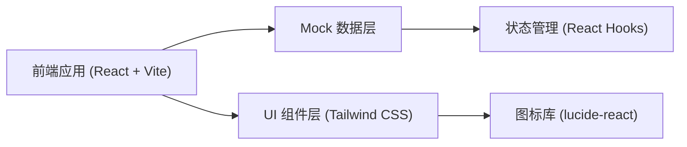

## 1. 架构设计



## 2. 技术描述
- 前端：React@18 + TypeScript + Tailwind CSS@3 + Vite@5
- 初始化工具：vite
- 状态管理：React Hooks (useState, useEffect)
- 图标：lucide-react
- 数据：前端 Mock 数据，无后端依赖

## 3. 路由定义
| Route | 页面 | 说明 |
|-------|------|------|
| / | 班结工作台 | 差异统计概览 + 班结记录列表 |
| /shift/:id | 班结差异详情 | 差异分类展示 + 数据对比 + 复核操作 |

## 4. 数据模型

### 4.1 数据类型定义

```typescript
// 差异类型
type DiscrepancyType = 'cash' | 'oil' | 'member' | 'invoice';

// 差异状态
type DiscrepancyStatus = 'pending' | 'reviewed' | 'confirmed' | 'resolved';

// 班结记录
interface ShiftRecord {
  id: string;
  shiftNo: string;
  cashier: string;
  startTime: string;
  endTime: string;
  submitTime: string;
  status: 'pending' | 'reviewing' | 'confirmed';
  discrepancies: Discrepancy[];
}

// 差异项
interface Discrepancy {
  id: string;
  type: DiscrepancyType;
  typeName: string;
  title: string;
  description: string;
  systemValue: number | string;
  actualValue: number | string;
  difference: number | string;
  unit: string;
  status: DiscrepancyStatus;
  reviewOpinion?: string;
  reviewer?: string;
  reviewTime?: string;
}

// 油品数据
interface OilData {
  tankNo: string;
  oilType: string;
  startStock: number;
  endStock: number;
  salesVolume: number;
  actualLoss: number;
  standardLoss: number;
  difference: number;
}
```

### 4.2 Mock 数据设计
- 包含 3 条班结记录，其中 1 条待复核，1 条复核中，1 条已确认
- 每条记录包含 4 类差异：现金短款、会员充值未同步、油品损耗异常、发票补开争议
- 差异金额和数量设计为真实业务场景中常见的数值
