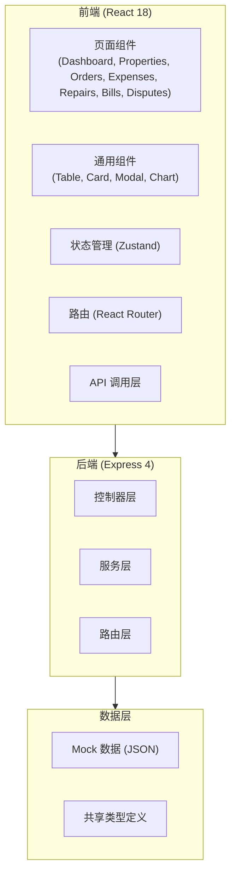
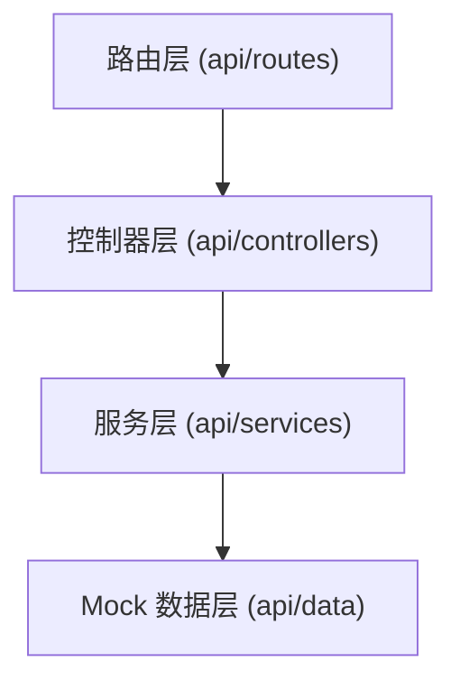
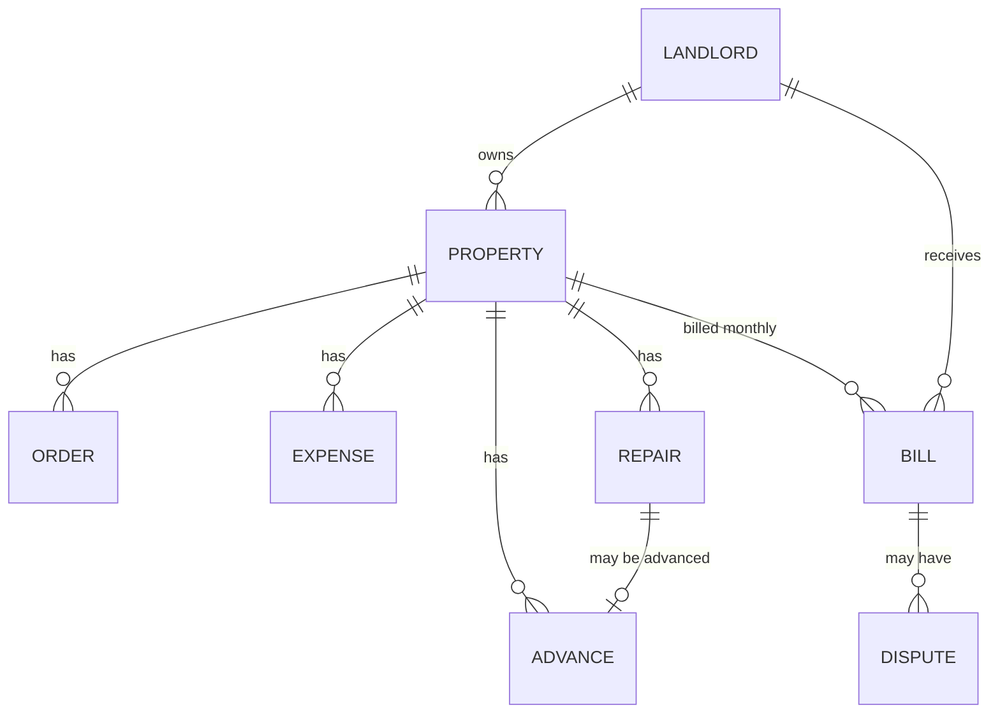

## 1. 架构设计



## 2. 技术描述

- **前端**：React@18 + TypeScript + tailwindcss@3 + vite + zustand + react-router-dom + lucide-react
- **初始化工具**：vite-init (react-express-ts 模板)
- **后端**：Express@4 + TypeScript
- **数据存储**：Mock 数据（内存 JSON 存储），前端演示使用
- **图表**：recharts（数据可视化）

## 3. 路由定义

| 路由 | 用途 |
|------|------|
| / | 仪表盘 |
| /properties | 房源列表 |
| /properties/:id | 房源详情 |
| /orders | 订单列表 |
| /orders/:id | 订单详情 |
| /expenses | 费用管理 |
| /repairs | 维修工单 |
| /bills | 账单列表 |
| /bills/:id | 账单详情 |
| /disputes | 异议管理 |
| /disputes/:id | 异议详情 |

## 4. API 定义

### TypeScript 类型定义

```typescript
// 房东
interface Landlord {
  id: string;
  name: string;
  phone: string;
  email: string;
}

// 房源
interface Property {
  id: string;
  name: string;
  address: string;
  landlordId: string;
  type: 'apartment' | 'house' | 'villa';
  bedrooms: number;
  image: string;
}

// 订单
interface Order {
  id: string;
  propertyId: string;
  platform: 'airbnb' | 'tujia' | 'xiaozhu';
  guestName: string;
  checkIn: string;
  checkOut: string;
  nights: number;
  totalAmount: number;
  platformFee: number;
  refundAmount: number;
  status: 'completed' | 'cancelled';
}

// 费用项
interface Expense {
  id: string;
  propertyId: string;
  type: 'cleaning' | 'utility' | 'supplies' | 'other';
  amount: number;
  date: string;
  description: string;
  createdBy: string;
}

// 维修工单
interface Repair {
  id: string;
  propertyId: string;
  title: string;
  description: string;
  cost: number;
  date: string;
  status: 'pending' | 'in_progress' | 'completed';
  createdBy: string;
}

// 垫付记录
interface Advance {
  id: string;
  propertyId: string;
  repairId?: string;
  amount: number;
  date: string;
  reason: string;
  createdBy: string;
}

// 月度账单
interface Bill {
  id: string;
  propertyId: string;
  landlordId: string;
  year: number;
  month: number;
  totalIncome: number;
  totalExpenses: number;
  totalRepairs: number;
  totalAdvances: number;
  platformFees: number;
  refundAmount: number;
  netAmount: number;
  status: 'draft' | 'generated' | 'sent' | 'confirmed' | 'disputed' | 'settled';
  createdAt: string;
}

// 异议
interface Dispute {
  id: string;
  billId: string;
  landlordId: string;
  type: 'income' | 'expense' | 'repair' | 'other';
  itemId?: string;
  title: string;
  description: string;
  status: 'pending' | 'reviewing' | 'resolved' | 'rejected';
  createdAt: string;
  resolvedAt?: string;
  resolution?: string;
  messages: DisputeMessage[];
}

interface DisputeMessage {
  id: string;
  sender: 'landlord' | 'operator';
  content: string;
  createdAt: string;
}
```

## 5. 服务端架构图



## 6. 数据模型

### 6.1 ER 图



### 6.2 Mock 数据场景

演示数据包含以下场景：
1. **旺季订单**：7-8 月有多笔高收入订单
2. **空置期**：部分月份订单较少
3. **维修换锁**：有一笔门锁更换的维修记录
4. **房东质疑保洁费**：有一笔保洁费用被房东提出异议
5. **平台退款扣款**：有一笔订单产生了平台退款
