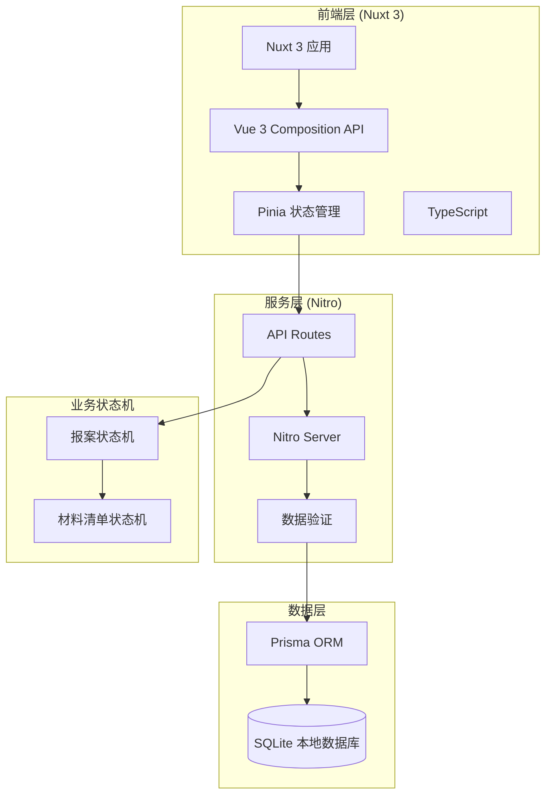

# 保险理赔中心-技术架构文档

## 1. 架构设计



## 2. 技术栈说明

| 层级 | 技术选型 | 说明 |
|------|----------|------|
| 前端框架 | Nuxt 3 | SSR/SSG 支持，文件路由 |
| UI框架 | Vue 3 + 自定义组件 | Composition API |
| 状态管理 | Pinia | TypeScript 友好 |
| 服务端 | Nitro (Nuxt内置) | API Routes |
| ORM | Prisma | SQLite 支持 |
| 数据库 | SQLite | 本地文件存储 |
| 样式 | CSS Variables + Scoped CSS | 原生CSS |
| 图标 | Lucide Icons | 轻量级SVG图标 |

## 3. 目录结构

```
├── nuxt.config.ts
├── prisma/
│   └── schema.prisma
├── server/
│   ├── api/
│   │   ├── cases/
│   │   │   ├── index.get.ts
│   │   │   ├── index.post.ts
│   │   │   ├── [id].get.ts
│   │   │   ├── [id].put.ts
│   │   │   └── [id]/
│   │   │       ├── submit.post.ts
│   │   │       ├── reject.post.ts
│   │   │       └── complete.post.ts
│   │   ├── materials/
│   │   │   ├── index.get.ts
│   │   │   ├── index.post.ts
│   │   │   └── [id]/
│   │   │       ├── upload.post.ts
│   │   │       └── verify.post.ts
│   │   └── logs/
│   │       └── [caseId].get.ts
│   └── utils/
│       └── stateMachine.ts
├── stores/
│   ├── case.ts
│   └── auth.ts
├── components/
│   ├── CaseReport/
│   │   ├── ReportForm.vue
│   │   ├── MaterialList.vue
│   │   └── OperationTimeline.vue
│   ├── Material/
│   │   ├── AttachmentUploader.vue
│   │   ├── MaterialTable.vue
│   │   └── RejectModal.vue
│   └── Common/
│       ├── StatusBadge.vue
│       └── RoleTag.vue
├── pages/
│   ├── index.vue
│   ├── cases/
│   │   ├── index.vue
│   │   └── [id].vue
│   └── materials/
│       └── [id].vue
└── types/
    └── index.ts
```

## 4. 路由定义

| 路由 | 用途 |
|------|------|
| `/` | 首页/仪表板（待办任务） |
| `/cases` | 报案列表 |
| `/cases/[id]` | 报案详情/报案受理 |
| `/materials/[id]` | 材料清单管理 |

## 5. API 定义

### 5.1 报案接口

```typescript
// GET /api/cases
// 获取报案列表
interface CasesResponse {
  cases: CaseReport[];
}

// POST /api/cases
// 创建报案
interface CreateCaseRequest {
  policyNo: string;
  policyHolder: string;
  accidentDesc: string;
}

// POST /api/cases/[id]/submit
// 提交报案
interface SubmitCaseRequest {
  operatorId: string;
  operatorRole: Role;
}

// POST /api/cases/[id]/reject
// 驳回报案
interface RejectCaseRequest {
  operatorId: string;
  reason: string; // 必填
}

// POST /api/cases/[id]/complete
// 完成报案
interface CompleteCaseRequest {
  operatorId: string;
}
```

### 5.2 材料清单接口

```typescript
// GET /api/materials?caseId=xxx
// 获取材料清单
interface MaterialsResponse {
  materials: MaterialList[];
}

// POST /api/materials
// 创建材料项
interface CreateMaterialRequest {
  caseId: string;
  materialName: string;
  materialType: string;
}

// POST /api/materials/[id]/upload
// 上传附件
interface UploadMaterialRequest {
  attachmentUrl: string;
}

// POST /api/materials/[id]/verify
// 审核材料
interface VerifyMaterialRequest {
  operatorId: string;
  status: 'confirmed' | 'rejected';
  remark?: string; // 驳回时必填
}
```

### 5.3 操作日志接口

```typescript
// GET /api/logs/[caseId]
// 获取操作日志
interface LogsResponse {
  logs: OperationLog[];
}
```

## 6. 数据模型

### 6.1 Prisma Schema

```prisma
model CaseReport {
  id           String    @id @default(uuid())
  reportNo     String    @unique
  policyNo     String
  policyHolder String
  accidentDesc String
  reporterId   String
  status       CaseStatus @default(PENDING_SUBMIT)
  createdAt    DateTime  @default(now())
  updatedAt    DateTime  @updatedAt
  materials    MaterialList[]
  logs         OperationLog[]
}

model MaterialList {
  id            String    @id @default(uuid())
  caseId        String
  case          CaseReport @relation(fields: [caseId], references: [id])
  materialName  String
  materialType  String
  attachmentUrl String?
  uploadStatus  UploadStatus @default(NOT_UPLOADED)
  verifiedBy    String?
  verifiedAt    DateTime?
  createdAt     DateTime  @default(now())
  updatedAt     DateTime  @updatedAt
}

model OperationLog {
  id            String    @id @default(uuid())
  caseId        String
  case          CaseReport @relation(fields: [caseId], references: [id])
  materialId    String?
  operatorId    String
  operatorRole  Role
  actionType    ActionType
  beforeStatus  String?
  afterStatus   String?
  remark        String?
  createdAt     DateTime  @default(now())
}

enum CaseStatus {
  PENDING_SUBMIT      // 待提交
  SUBMITTED           // 已提交
  REJECTED            // 已驳回
  COMPLETED           // 已完成
  REVIEW_FAILED       // 复核不通过
}

enum UploadStatus {
  NOT_UPLOADED
  UPLOADED
  CONFIRMED
}

enum Role {
  CLAIM_AGENT         // 理赔专员
  SURVEYOR            // 查勘员
  UNDERWRITER         // 核赔主管
}

enum ActionType {
  SUBMIT              // 提交
  VERIFY              // 审核
  REJECT              // 驳回
  SUPPLEMENT          // 补录
  CONFIRM             // 确认
}
```

## 7. 状态机定义

### 7.1 报案状态机

```
PENDING_SUBMIT → SUBMITTED (提交)
SUBMITTED → REJECTED (驳回)
REJECTED → PENDING_SUBMIT (重新提交)
SUBMITTED → COMPLETED (完成)
COMPLETED → REVIEW_FAILED (复核不通过)
REVIEW_FAILED → PENDING_SUBMIT (退回重办)
```

### 7.2 材料清单状态机

```
NOT_UPLOADED → UPLOADED (上传附件)
UPLOADED → CONFIRMED (确认)
UPLOADED → NOT_UPLOADED (驳回)
```

## 8. 角色权限矩阵

| 操作 | 理赔专员 | 查勘员 | 核赔主管 |
|------|---------|--------|----------|
| 创建报案 | ✓ | ✗ | ✗ |
| 提交报案 | ✓ | ✗ | ✗ |
| 审核材料 | ✗ | ✓ | ✗ |
| 驳回材料 | ✗ | ✓ | ✗ |
| 确认材料 | ✗ | ✓ | ✗ |
| 审批通过 | ✗ | ✗ | ✓ |
| 复核不通过 | ✗ | ✗ | ✓ |
| 查看历史 | ✓ | ✓ | ✓ |

## 9. 核心特性实现

### 9.1 交接留痕

- 每次状态变更自动记录 OperationLog
- 记录操作人 ID、角色、时间戳
- 记录变更前后的状态
- 驳回/不通过必须填写原因（remark 字段）

### 9.2 附件占位

- 材料项初始状态 attachmentUrl 为 null
- UI 显示占位符（虚线框 + 上传图标）
- 上传后实时更新 attachmentUrl
- 未上传不影响提交，但会记录未完成状态

### 9.3 异常处理

- 驳回原因表单（必填项）
- 复核不通过原因表单（必填项）
- 驳回记录永久保存
- 可追溯所有异常处理历史
