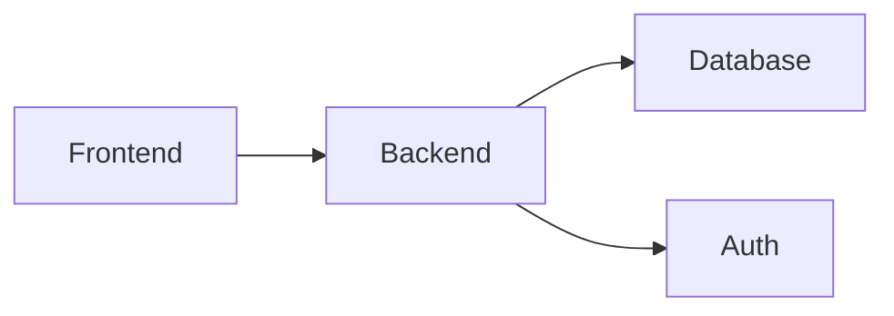

## 1. Architecture Design


## 2. Technology Description
- Frontend: React@18 + TypeScript + TailwindCSS@3 + Vite
- State Management: Zustand
- Icons: lucide-react
- Mock Data: 本地JSON数据

## 3. Route Definitions
| Route | Purpose |
|-------|---------|
| / | 工单列表首页 |
| /workorder/:id | 工单详情页（通过侧栏展示） |

## 4. API Definitions
```typescript
interface WorkOrder {
  id: string;
  title: string;
  location: string;
  description: string;
  status: 'pending' | 'processing' | 'completed' | 'overdue' | 'rejected';
  priority: 'low' | 'medium' | 'high';
  submitter: string;
  submitterRole: 'dorm_manager' | 'repairman' | 'admin';
  assignee?: string;
  assigneeRole?: 'dorm_manager' | 'repairman' | 'admin';
  createdAt: string;
  updatedAt: string;
  dueTime: string;
  responsibilityUnclear: boolean;
  history: Operation[];
  satisfaction?: Satisfaction;
}

interface Operation {
  id: string;
  operator: string;
  operatorRole: 'dorm_manager' | 'repairman' | 'admin';
  action: string;
  timestamp: string;
}

interface Satisfaction {
  score: number;
  comment: string;
  createdAt: string;
  operator: string;
}
```

## 5. Data Model
### 5.1 Data Model Definition
```mermaid
erDiagram
    WORK_ORDER {
        string id PK
        string title
        string location
        string description
        string status
        string