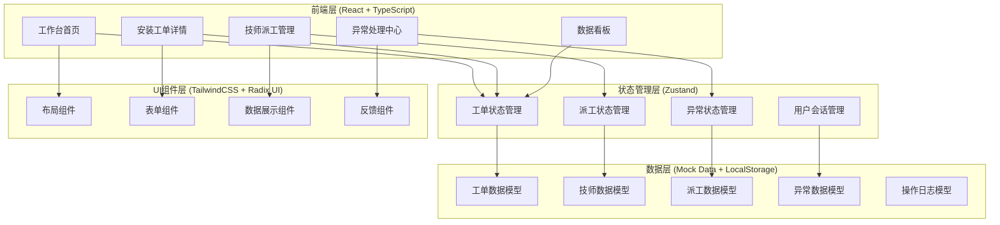

# 轮胎门店-安装工单与技师派工 技术架构文档

## 1. 架构设计



## 2. 技术选型

| 技术类别 | 技术栈 | 版本 | 说明 |
|----------|--------|------|------|
| 框架 | Next.js | 14.x | App Router，支持SSR/CSR |
| 语言 | TypeScript | 5.x | 类型安全 |
| 样式 | TailwindCSS | 3.x | 原子化CSS |
| 组件库 | Radix UI | 1.x | 无样式Headless组件 |
| 状态管理 | Zustand | 4.x | 轻量级状态管理 |
| 图标 | Lucide React | 0.300+ | 一致性图标 |
| 图表 | Recharts | 2.x | 数据可视化 |
| 日期处理 | date-fns | 3.x | 轻量日期库 |
| 表单验证 | Zod | 3.x | TypeScript优先验证 |

## 3. 路由定义

| 路由 | 页面组件 | 功能描述 |
|------|----------|----------|
| `/` | 首页重定向至 `/workbench` | 入口重定向 |
| `/workbench` | WorkbenchPage | 工作台首页 |
| `/workbench/order/[id]` | OrderDetailPage | 安装工单详情 |
| `/workbench/dispatch` | DispatchPage | 技师派工管理 |
| `/workbench/exceptions` | ExceptionsPage | 异常处理中心 |
| `/workbench/dashboard` | DashboardPage | 数据看板 |

## 4. 数据模型定义

### 4.1 工单数据模型 (WorkOrder)

```typescript
interface WorkOrder {
  id: string;                          // 工单ID
  orderNo: string;                     // 工单编号
  status: OrderStatus;                 // 工单状态
  priority: Priority;                   // 紧急程度
  source: string;                      // 来源渠道
  createdAt: Date;                     // 创建时间
  updatedAt: Date;                     // 更新时间

  // 车辆信息
  vehicle: {
    plateNo: string;                   // 车牌号
    brand: string;                      // 品牌
    model: string;                      // 车型
    year: string;                       // 年款
    vin: string;                        // VIN码
    mileage: number;                    // 行驶里程
  };

  // 轮胎信息
  tires: Array<{
    brand: string;                       // 品牌
    model: string;                       // 型号
    spec: string;                        // 规格
    pattern: string;                     // 花纹
    quantity: number;                    // 数量
    price: number;                       // 单价
  }>;

  // 安装信息
  installation: {
    technicianId: string;                // 技师ID
    startTime?: Date;                    // 开始时间
    endTime?: Date;                      // 结束时间
    position: string[];                  // 安装位置
    result?: string;                     // 安装效果
  };

  // 关联数据
  dispatchId?: string;                   // 派工单ID
  exceptions: Exception[];              // 异常记录
  logs: OperationLog[];                  // 操作日志
}

type OrderStatus = 'pending' | 'dispatched' | 'in_progress' | 'completed' | 'suspended' | 'cancelled';
type Priority = 'low' | 'normal' | 'high' | 'urgent';
```

### 4.2 派工数据模型 (Dispatch)

```typescript
interface Dispatch {
  id: string;                           // 派工ID
  dispatchNo: string;                   // 派工单号
  workOrderId: string;                  // 关联工单ID
  technicianId: string;                 // 技师ID

  dispatchType: 'auto' | 'manual';     // 派工方式
  dispatcherId?: string;               // 派工人ID(手动派工)
  dispatchedAt: Date;                   // 派工时间
  confirmedAt?: Date;                    // 技师确认时间

  status: DispatchStatus;               // 派工状态
  result?: DispatchResult;              // 执行结果

  notes?: string;                       // 备注
}

type DispatchStatus = 'pending' | 'confirmed' | 'in_progress' | 'completed' | 'cancelled';
type DispatchResult = 'success' | 'partial' | 'failed';
```

### 4.3 异常数据模型 (Exception)

```typescript
interface Exception {
  id: string;                           // 异常ID
  workOrderId: string;                  // 关联工单ID

  type: ExceptionType;                  // 异常类型
  description: string;                  // 异常描述
  severity: Severity;                   // 严重程度

  discoveredAt: Date;                   // 发现时间
  discoveredBy: string;                 // 发现人

  // 异常详情
  details: {
    expected?: string;                  // 期望结果
    actual?: string;                     // 实际结果
    evidence?: string[];                 // 证据/截图
  };

  // 分析与处理
  analysis?: {
    reason: string;                     // 原因分析
    measures: string;                    // 处理措施
    handledBy?: string;                  // 处理人
    handledAt?: Date;                   // 处理时间
    result?: string;                     // 处理结果
  };

  status: ExceptionStatus;              // 异常状态
  escalation?: {
    escalatedTo?: string;                // 升级至
    escalatedAt?: Date;                  // 升级时间
    reason?: string;                     // 升级原因
  };
}

type ExceptionType = 'wrong_model' | 'warranty_dispute' | 'inventory_issue' | 'other';
type Severity = 'low' | 'medium' | 'high' | 'critical';
type ExceptionStatus = 'open' | 'analyzing' | 'handling' | 'resolved' | 'escalated' | 'closed';
```

### 4.4 技师数据模型 (Technician)

```typescript
interface Technician {
  id: string;                            // 技师ID
  name: string;                          // 姓名
  avatar?: string;                       // 头像
  phone: string;                          // 联系电话
  role: 'technician' | 'senior_technician' | 'foreman';

  status: TechnicianStatus;              // 当前状态
  specialties: string[];                 // 擅长类型

  stats: {
    todayOrders: number;                  // 今日工单数
    weekOrders: number;                  // 本周工单数
    avgCompletionTime: number;          // 平均完成时长(分钟)
  };

  currentOrderId?: string;               // 当前工单ID
}

type TechnicianStatus = 'available' | 'busy' | 'offline' | 'break';
```

### 4.5 操作日志数据模型 (OperationLog)

```typescript
interface OperationLog {
  id: string;                            // 日志ID
  entityType: 'work_order' | 'dispatch' | 'exception';  // 实体类型
  entityId: string;                      // 实体ID

  operator: {
    id: string;                           // 操作人ID
    name: string;                         // 操作人姓名
    role: string;                         // 操作人角色
  };

  action: string;                         // 操作类型
  timestamp: Date;                        // 操作时间

  changes?: {
    field: string;                        // 变更字段
    before: any;                           // 变更前值
    after: any;                           // 变更后值
  }[];

  metadata?: Record<string, any>;         // 附加信息
}
```

## 5. Mock数据结构

```typescript
// 数据初始化策略：模拟真实门店场景，非满状态

const mockWorkOrders: WorkOrder[] = [
  {
    id: 'WO20240615001',
    status: 'pending',
    priority: 'urgent',
    // 待处理工单 - 已超时
  },
  {
    id: 'WO20240615002',
    status: 'in_progress',
    priority: 'high',
    // 进行中工单
  },
  {
    id: 'WO20240615003',
    status: 'pending',
    priority: 'normal',
    // 待派工
  },
  // ... 混合状态分布
];

const mockExceptions: Exception[] = [
  {
    type: 'wrong_model',
    status: 'open',
    severity: 'high',
    // 型号拿错 - 待审核
  },
  // ... 其他异常
];
```

## 6. 组件架构

```
src/
├── app/
│   └── workbench/
│       ├── page.tsx                    # 工作台首页
│       ├── layout.tsx                  # 工作台布局
│       ├── order/
│       │   └── [id]/
│       │       └── page.tsx            # 工单详情页
│       ├── dispatch/
│       │   └── page.tsx                # 派工管理页
│       ├── exceptions/
│       │   └── page.tsx                # 异常中心页
│       └── dashboard/
│           └── page.tsx                # 数据看板页
├── components/
│   ├── layout/
│   │   ├── Sidebar.tsx                # 侧边栏
│   │   ├── Header.tsx                 # 顶部栏
│   │   └── StatusBar.tsx              # 状态栏
│   ├── workbench/
│   │   ├── WorkOrderCard.tsx          # 工单卡片
│   │   ├── WorkOrderList.tsx          # 工单列表
│   │   ├── RiskAlert.tsx              # 风险预警
│   │   └── RecentChanges.tsx          # 最近变更
│   ├── order/
│   │   ├── OrderDetail.tsx            # 工单详情
│   │   ├── VehicleInfo.tsx            # 车辆信息
│   │   ├── TireInfo.tsx               # 轮胎信息
│   │   ├── InstallationRecord.tsx    # 安装记录
│   │   ├── ExceptionHistory.tsx       # 异常历史
│   │   └── OperationLogs.tsx          # 操作日志
│   ├── dispatch/
│   │   ├── TechnicianCard.tsx        # 技师卡片
│   │   ├── DispatchList.tsx           # 派工列表
│   │   └── WorkloadChart.tsx          # 工作量图表
│   └── exceptions/
│       ├── ExceptionCard.tsx          # 异常卡片
│       ├── ExceptionDetail.tsx        # 异常详情
│       └── ExceptionForm.tsx          # 异常表单
├── store/
│   ├── workOrderStore.ts              # 工单状态
│   ├── dispatchStore.ts                # 派工状态
│   ├── exceptionStore.ts              # 异常状态
│   └── technicianStore.ts             # 技师状态
├── data/
│   └── mockData.ts                    # Mock数据
├── types/
│   └── index.ts                       # 类型定义
└── utils/
    ├── formatters.ts                  # 格式化工具
    └── validators.ts                 # 验证工具
```

## 7. 状态管理设计

### 7.1 工单状态 (workOrderStore)

```typescript
interface WorkOrderStore {
  // 状态
  orders: WorkOrder[];
  selectedOrderId: string | null;
  filters: {
    status: OrderStatus | 'all';
    priority: Priority | 'all';
    dateRange: [Date, Date] | null;
    search: string;
  };

  // Actions
  loadOrders: () => void;
  selectOrder: (id: string) => void;
  updateOrder: (id: string, updates: Partial<WorkOrder>) => void;
  addException: (orderId: string, exception: Exception) => void;
  setFilters: (filters: Partial<WorkOrderStore['filters']>) => void;
}
```

### 7.2 派工状态 (dispatchStore)

```typescript
interface DispatchStore {
  dispatches: Dispatch[];
  technicians: Technician[];
  selectedDispatchId: string | null;

  // Actions
  loadDispatches: () => void;
  loadTechnicians: () => void;
  createDispatch: (dispatch: Omit<Dispatch, 'id'>) => void;
  confirmDispatch: (id: string) => void;
  completeDispatch: (id: string, result: DispatchResult) => void;
}
```

### 7.3 异常状态 (exceptionStore)

```typescript
interface ExceptionStore {
  exceptions: Exception[];
  selectedExceptionId: string | null;
  filterType: ExceptionType | 'all';

  // Actions
  loadExceptions: () => void;
  selectException: (id: string) => void;
  analyzeException: (id: string, analysis: Exception['analysis']) => void;
  resolveException: (id: string, result: string) => void;
  escalateException: (id: string, escalation: Exception['escalation']) => void;
}
```

## 8. 关键交互设计

### 8.1 列表-详情联动

- 左侧列表选中项高亮
- 右侧详情面板实时更新
- 列表滚动时详情保持位置
- 详情编辑后列表同步刷新

### 8.2 状态流转交互

- 状态变更需二次确认
- 变更成功后显示toast提示
- 操作日志自动记录变更
- 异常状态需填写原因

### 8.3 数据持久化

- 使用LocalStorage存储用户偏好(筛选条件、视图模式)
- Mock数据存储在内存中，刷新重置
- 支持数据导出(Excel/JSON)
