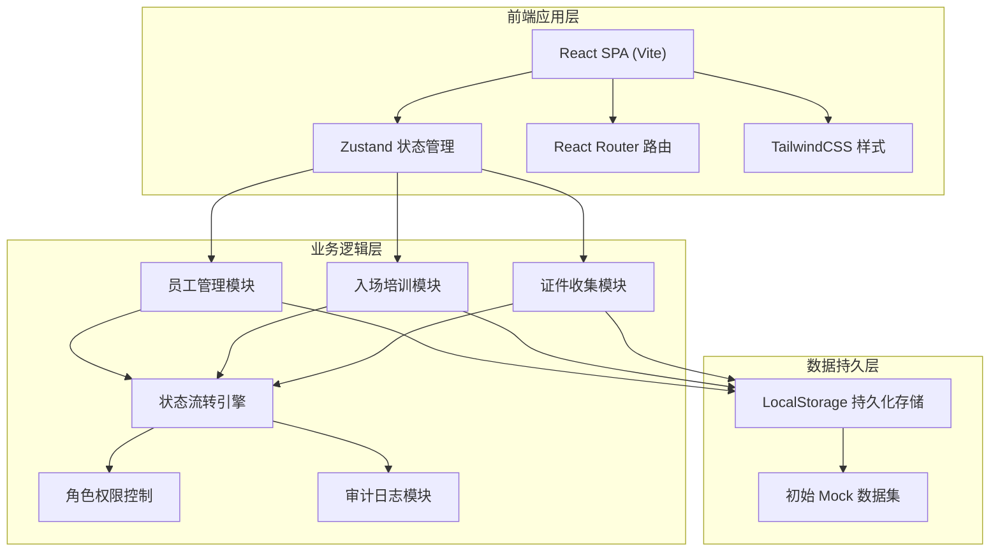
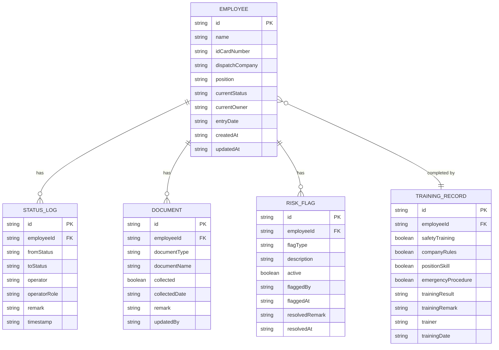

# 人力派遣公司入场培训与证件收集管理系统 - 技术架构文档

## 1. 架构设计



## 2. 技术说明

- **前端框架**：React 18 + TypeScript
- **构建工具**：Vite 5
- **样式方案**：TailwindCSS 3
- **状态管理**：Zustand 4（含 persist 中间件做 localStorage 持久化）
- **路由管理**：React Router DOM 6
- **图标库**：lucide-react
- **后端服务**：无（纯前端演示，数据存在 localStorage）
- **数据库**：LocalStorage + 初始 Mock JSON 数据
- **初始化方式**：使用 vite-init react-ts 模板

## 3. 路由定义

| 路由路径 | 页面用途 | 对应组件 |
|----------|----------|----------|
| `/` | 员工总览页（仪表盘） | `pages/Dashboard.tsx` |
| `/training` | 入场培训处理页 | `pages/TrainingPage.tsx` |
| `/training/:id` | 单员工入场培训详情处理 | `pages/TrainingDetail.tsx` |
| `/documents` | 证件收集管理页 | `pages/DocumentsPage.tsx` |
| `/documents/:id` | 单员工证件收集回看 | `pages/DocumentsDetail.tsx` |
| `/settings/reset` | 数据重置设置页 | `pages/ResetPage.tsx` |

## 4. 数据模型

### 4.1 实体关系图



### 4.2 状态枚举

```typescript
// 员工主状态
type EmployeeStatus = 
  | 'pending_training'    // 待入场培训（责任人：招聘专员）
  | 'in_training'         // 培训中（责任人：驻场主管）
  | 'training_exception'  // 培训异常（责任人：驻场主管）
  | 'pending_documents'   // 待证件收集（责任人：驻场主管）
  | 'collecting_documents'// 证件收集中（责任人：驻场主管）
  | 'completed';          // 已完成（责任人：薪酬会计复核）

// 风险类型
type RiskFlagType = 
  | 'temporary_absence'   // 临时缺岗
  | 'attendance_dispute'  // 考勤争议
  | 'salary_deduction';   // 工资扣款

// 用户角色
type UserRole = 
  | 'recruiter'           // 招聘专员
  | 'site_supervisor'     // 驻场主管
  | 'payroll_accountant'; // 薪酬会计

// 证件类型
type DocumentType = 
  | 'id_card'             // 身份证
  | 'health_cert'         // 健康证
  | 'labor_contract'      // 劳动合同
  | 'social_security'     // 社保证明
  | 'photo'               // 一寸照片
  | 'background_check';   // 背景调查证明
```

### 4.3 状态流转规则

```typescript
// 每个状态必须有明确责任人，禁止无主状态
const STATUS_OWNER_MAP: Record<EmployeeStatus, UserRole> = {
  pending_training: 'recruiter',
  in_training: 'site_supervisor',
  training_exception: 'site_supervisor',
  pending_documents: 'site_supervisor',
  collecting_documents: 'site_supervisor',
  completed: 'payroll_accountant',
};

// 合法的状态流转路径
const VALID_TRANSITIONS: Record<EmployeeStatus, EmployeeStatus[]> = {
  pending_training: ['in_training'],
  in_training: ['training_exception', 'pending_documents'],
  training_exception: ['in_training', 'pending_documents'],
  pending_documents: ['collecting_documents', 'completed'],
  collecting_documents: ['completed', 'pending_documents'],
  completed: [],
};
```

## 5. Zustand Store 结构

```typescript
interface AppState {
  // 用户状态
  currentUser: {
    role: UserRole;
    name: string;
  };
  
  // 业务数据
  employees: Employee[];
  statusLogs: StatusLog[];
  trainingRecords: TrainingRecord[];
  documents: DocumentItem[];
  riskFlags: RiskFlag[];
  
  // UI 状态
  selectedEmployeeIds: string[];  // 批量处理选中
  filters: {
    status?: EmployeeStatus;
    riskType?: RiskFlagType;
    owner?: UserRole;
    keyword?: string;
  };
  
  // Actions
  setCurrentRole: (role: UserRole) => void;
  updateEmployeeStatus: (employeeId: string, newStatus: EmployeeStatus, remark?: string) => void;
  submitTraining: (employeeId: string, training: TrainingInput, remark?: string) => void;
  batchSubmitTraining: (employeeIds: string[], remark?: string) => void;
  updateDocument: (employeeId: string, docType: DocumentType, collected: boolean, remark?: string) => void;
  addRiskFlag: (employeeId: string, flagType: RiskFlagType, description: string) => void;
  resolveRiskFlag: (flagId: string, remark: string) => void;
  toggleEmployeeSelection: (employeeId: string) => void;
  clearSelection: () => void;
  resetAllData: () => void;
}
```
