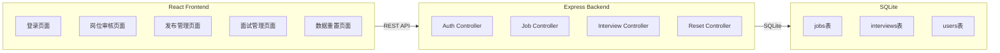
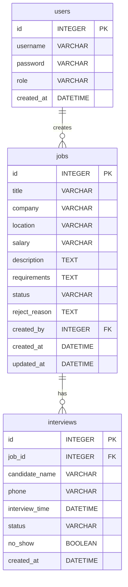

# 蓝领招聘平台-岗位审核与发布管理系统 - 技术架构文档

## 1. Architecture Design



## 2. Technology Description

- Frontend: React@18 + TypeScript + TailwindCSS@3 + Vite
- Backend: Express@4 + TypeScript + SQLite
- State Management: Zustand
- Icons: lucide-react
- Routing: react-router-dom

## 3. Route Definitions

| Route | Purpose | Access Control |
|-------|---------|----------------|
| /login | 用户登录页面 | 公开 |
| /dashboard | 首页仪表盘 | 登录用户 |
| /jobs/pending | 待审核岗位列表 | 运营 |
| /jobs/manage | 岗位发布管理 | 招聘顾问 |
| /interviews | 面试名单管理 | 招聘顾问 |
| /reset | 数据重置页面 | 运营 |

## 4. API Definitions

### 4.1 Auth API

| Endpoint | Method | Description |
|----------|--------|-------------|
| /api/auth/login | POST | 用户登录 |
| /api/auth/me | GET | 获取当前用户信息 |

**POST /api/auth/login**
- Request Body: `{ username: string, password: string, role: 'operator' | 'consultant' | 'hr' }`
- Response: `{ success: boolean, token: string, user: User }`

### 4.2 Job API

| Endpoint | Method | Description |
|----------|--------|-------------|
| /api/jobs | GET | 获取岗位列表 |
| /api/jobs | POST | 创建岗位 |
| /api/jobs/:id | GET | 获取岗位详情 |
| /api/jobs/:id | PUT | 更新岗位 |
| /api/jobs/:id/audit | POST | 审核岗位 |
| /api/jobs/:id/publish | POST | 发布岗位 |

**POST /api/jobs**
- Request Body: `{ title: string, company: string, location: string, salary: string, description: string, requirements: string }`
- Response: `{ success: boolean, job: Job }`

**POST /api/jobs/:id/audit**
- Request Body: `{ action: 'approve' | 'reject', remark?: string }`
- Response: `{ success: boolean, job: Job }`

### 4.3 Interview API

| Endpoint | Method | Description |
|----------|--------|-------------|
| /api/interviews | GET | 获取面试列表 |
| /api/interviews | POST | 创建面试记录 |
| /api/interviews/:id/status | PUT | 更新面试状态 |

### 4.4 Reset API

| Endpoint | Method | Description |
|----------|--------|-------------|
| /api/reset | POST | 重置测试数据 |

## 5. Data Model

### 5.1 ER Diagram



### 5.2 Data Definition Language

**users 表**
```sql
CREATE TABLE users (
    id INTEGER PRIMARY KEY AUTOINCREMENT,
    username VARCHAR(50) NOT NULL UNIQUE,
    password VARCHAR(255) NOT NULL,
    role VARCHAR(20) NOT NULL CHECK(role IN ('operator', 'consultant', 'hr')),
    created_at DATETIME DEFAULT CURRENT_TIMESTAMP
);

INSERT INTO users (username, password, role) VALUES
('operator', '123456', 'operator'),
('consultant', '123456', 'consultant'),
('hr', '123456', 'hr');
```

**jobs 表**
```sql
CREATE TABLE jobs (
    id INTEGER PRIMARY KEY AUTOINCREMENT,
    title VARCHAR(100) NOT NULL,
    company VARCHAR(100) NOT NULL,
    location VARCHAR(100) NOT NULL,
    salary VARCHAR(50) NOT NULL,
    description TEXT,
    requirements TEXT,
    status VARCHAR(20) NOT NULL DEFAULT 'draft' CHECK(status IN ('draft', 'pending', 'approved', 'published', 'rejected', 'expired', 'closed')),
    reject_reason TEXT,
    created_by INTEGER NOT NULL,
    created_at DATETIME DEFAULT CURRENT_TIMESTAMP,
    updated_at DATETIME DEFAULT CURRENT_TIMESTAMP,
    FOREIGN KEY (created_by) REFERENCES users(id)
);
```

**interviews 表**
```sql
CREATE TABLE interviews (
    id INTEGER PRIMARY KEY AUTOINCREMENT,
    job_id INTEGER NOT NULL,
    candidate_name VARCHAR(50) NOT NULL,
    phone VARCHAR(20) NOT NULL,
    interview_time DATETIME NOT NULL,
    status VARCHAR(20) NOT NULL DEFAULT 'scheduled' CHECK(status IN ('scheduled', 'completed', 'noshow', 'cancelled')),
    no_show BOOLEAN DEFAULT FALSE,
    created_at DATETIME DEFAULT CURRENT_TIMESTAMP,
    FOREIGN KEY (job_id) REFERENCES jobs(id)
);
```

## 6. Project Structure

```
backend/
├── src/
│   ├── controllers/
│   │   ├── authController.ts
│   │   ├── jobController.ts
│   │   ├── interviewController.ts
│   │   └── resetController.ts
│   ├── routes/
│   │   ├── authRoutes.ts
│   │   ├── jobRoutes.ts
│   │   ├── interviewRoutes.ts
│   │   └── resetRoutes.ts
│   ├── models/
│   │   ├── user.ts
│   │   ├── job.ts
│   │   └── interview.ts
│   ├── middleware/
│   │   └── authMiddleware.ts
│   ├── database/
│   │   └── db.ts
│   └── app.ts
└── package.json

frontend/
├── src/
│   ├── components/
│   │   ├── Layout.tsx
│   │   ├── Sidebar.tsx
│   │   ├── JobTable.tsx
│   │   └── InterviewList.tsx
│   ├── pages/
│   │   ├── Login.tsx
│   │   ├── Dashboard.tsx
│   │   ├── JobAudit.tsx
│   │   ├── JobManagement.tsx
│   │   ├── InterviewManagement.tsx
│   │   └── DataReset.tsx
│   ├── hooks/
│   │   └── useAuth.ts
│   ├── store/
│   │   └── authStore.ts
│   ├── utils/
│   │   └── api.ts
│   └── App.tsx
└── package.json
```

## 7. State Management

使用 Zustand 管理全局状态：

```typescript
interface AuthState {
  user: User | null;
  token: string | null;
  login: (credentials: LoginCredentials) => void;
  logout: () => void;
}

const useAuthStore = create<AuthState>((set) => ({
  user: null,
  token: null,
  login: async (credentials) => {
    // 登录逻辑
  },
  logout: () => {
    set({ user: null, token: null });
    localStorage.removeItem('token');
  },
}));
```

## 8. Security Considerations

1. **JWT Token**: 使用 JWT 进行身份验证，token 存储在 localStorage
2. **密码安全**: 后端存储加密后的密码（演示环境简化处理）
3. **权限控制**: 后端中间件验证用户角色权限
4. **SQL 注入防护**: 使用参数化查询