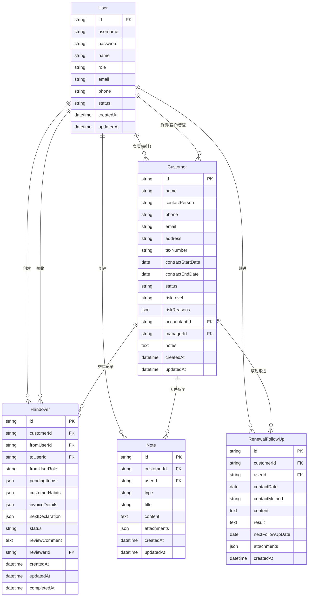

# 会计代账公司换人交接与续约风险管理系统 - 技术架构文档

## 1. 架构设计

本系统采用前后端分离架构，前端使用React构建用户界面，后端使用Express提供RESTful API服务，数据存储使用SQLite轻量级数据库。

```mermaid
graph TB
    subgraph "前端层 Frontend"
        "React应用" --> "状态管理"
        "状态管理" --> "API调用层"
    end
    
    subgraph "后端层 Backend"
        "Express服务器" --> "路由层"
        "路由层" --> "控制器层"
        "控制器层" --> "服务层"
        "服务层" --> "数据访问层"
    end
    
    subgraph "数据层 Data"
        "SQLite数据库" --> "客户数据"
        "SQLite数据库" --> "交接记录"
        "SQLite数据库" --> "用户数据"
        "SQLite数据库" --> "备注数据"
    end
    
    "API调用层" --> "Express服务器"
```

## 2. 技术栈说明

### 2.1 前端技术栈
- **框架**: React 18
- **构建工具**: Vite
- **样式方案**: Tailwind CSS 3
- **路由**: React Router v6
- **状态管理**: React Context + useReducer
- **HTTP客户端**: Axios
- **图标库**: Lucide React
- **日期处理**: date-fns
- **表单处理**: React Hook Form

### 2.2 后端技术栈
- **运行环境**: Node.js 18+
- **框架**: Express 4
- **数据库**: SQLite3
- **身份认证**: JWT (jsonwebtoken)
- **密码加密**: bcryptjs
- **数据验证**: express-validator
- **跨域处理**: cors

### 2.3 开发工具
- **代码规范**: ESLint + Prettier
- **包管理器**: npm

## 3. 路由定义

### 3.1 前端路由

| 路由路径 | 页面名称 | 功能描述 |
|---------|---------|---------|
| `/login` | 登录页 | 用户登录 |
| `/` | 仪表盘 | 数据概览、快捷入口 |
| `/customers` | 客户管理 | 客户列表、筛选、搜索 |
| `/customers/:id` | 客户详情 | 客户详细信息、交接记录 |
| `/handover` | 交接管理 | 交接清单列表、创建交接 |
| `/handover/:id` | 交接详情 | 交接清单详情、审核 |
| `/renewal` | 续约跟进 | 到期预警、风险客户 |
| `/notes` | 历史备注 | 备注搜索、时间线查看 |
| `/users` | 用户管理 | 用户列表、权限管理（管理员） |

### 3.2 后端API路由

| HTTP方法 | 路由路径 | 功能描述 |
|---------|---------|---------|
| **认证相关** |||
| POST | `/api/auth/login` | 用户登录 |
| POST | `/api/auth/logout` | 用户登出 |
| GET | `/api/auth/me` | 获取当前用户信息 |
| **客户管理** |||
| GET | `/api/customers` | 获取客户列表 |
| GET | `/api/customers/:id` | 获取客户详情 |
| POST | `/api/customers` | 创建客户 |
| PUT | `/api/customers/:id` | 更新客户信息 |
| DELETE | `/api/customers/:id` | 删除客户 |
| GET | `/api/customers/:id/handovers` | 获取客户交接记录 |
| **交接管理** |||
| GET | `/api/handovers` | 获取交接清单列表 |
| GET | `/api/handovers/:id` | 获取交接清单详情 |
| POST | `/api/handovers` | 创建交接清单 |
| PUT | `/api/handovers/:id` | 更新交接清单 |
| PUT | `/api/handovers/:id/approve` | 审核通过交接 |
| PUT | `/api/handovers/:id/reject` | 审核驳回交接 |
| **续约跟进** |||
| GET | `/api/renewals` | 获取续约跟进列表 |
| GET | `/api/renewals/alerts` | 获取到期预警列表 |
| GET | `/api/renewals/risk-customers` | 获取风险客户列表 |
| POST | `/api/renewals/:customerId/follow-ups` | 添加跟进记录 |
| PUT | `/api/renewals/:customerId/status` | 更新续约状态 |
| **历史备注** |||
| GET | `/api/notes` | 搜索历史备注 |
| GET | `/api/notes/:customerId/timeline` | 获取客户备注时间线 |
| POST | `/api/notes` | 添加备注 |
| PUT | `/api/notes/:id` | 更新备注 |
| DELETE | `/api/notes/:id` | 删除备注 |
| **用户管理** |||
| GET | `/api/users` | 获取用户列表 |
| POST | `/api/users` | 创建用户 |
| PUT | `/api/users/:id` | 更新用户信息 |
| DELETE | `/api/users/:id` | 删除用户 |
| **统计数据** |||
| GET | `/api/statistics/dashboard` | 获取仪表盘统计数据 |
| GET | `/api/statistics/handover-rate` | 获取交接完成率 |
| GET | `/api/statistics/renewal-rate` | 获取续约成功率 |

## 4. API接口定义

### 4.1 数据类型定义 (TypeScript)

```typescript
// 用户角色枚举
enum UserRole {
  ACCOUNTANT = 'accountant',      // 会计
  MANAGER = 'manager',            // 客户经理
  SUPERVISOR = 'supervisor',      // 主管
  ADMIN = 'admin'                 // 系统管理员
}

// 风险等级枚举
enum RiskLevel {
  HIGH = 'high',      // 高风险
  MEDIUM = 'medium',  // 中风险
  LOW = 'low',        // 低风险
  NONE = 'none'       // 无风险
}

// 客户状态枚举
enum CustomerStatus {
  ACTIVE = 'active',           // 正常服务
  EXPIRING = 'expiring',        // 即将到期
  EXPIRED = 'expired',          // 已到期
  SUSPENDED = 'suspended'       // 服务暂停
}

// 用户接口
interface User {
  id: string;
  username: string;
  password: string;             // 加密存储
  name: string;
  role: UserRole;
  email: string;
  phone: string;
  status: 'active' | 'inactive';
  createdAt: Date;
  updatedAt: Date;
}

// 客户接口
interface Customer {
  id: string;
  name: string;                 // 客户名称
  contactPerson: string;        // 联系人
  phone: string;                // 联系电话
  email: string;                // 邮箱
  address: string;              // 地址
  taxNumber: string;            // 税号
  contractStartDate: Date;      // 合同开始日期
  contractEndDate: Date;        // 合同结束日期
  status: CustomerStatus;
  riskLevel: RiskLevel;
  riskReasons: string[];        // 风险原因标签
  accountantId: string;         // 负责会计ID
  managerId: string;            // 负责客户经理ID
  notes: string;                // 备注
  createdAt: Date;
  updatedAt: Date;
}

// 交接清单接口
interface Handover {
  id: string;
  customerId: string;
  fromUserId: string;           // 前任负责人ID
  toUserId: string;             // 新负责人ID
  fromUserRole: 'accountant' | 'manager'; // 前任角色
  
  // 未完事项
  pendingItems: {
    pendingInvoices: string;    // 待处理发票
    pendingDeclarations: string; // 待申报税种
    pendingAccounts: string;    // 待核对账目
    otherItems: string;         // 其他待办事项
  };
  
  // 客户习惯
  customerHabits: {
    communicationPreference: 'phone' | 'wechat' | 'email'; // 沟通偏好
    bestContactTime: string;    // 最佳联系时间
    specialRequirements: string; // 特殊要求
    attentionPoints: string;    // 注意事项
  };
  
  // 发票口径
  invoiceDetails: {
    invoiceType: string;        // 发票类型
    invoiceFrequency: string;   // 开票频率
    specialRequirements: string; // 特殊开票要求
    historicalIssues: string;   // 历史问题记录
  };
  
  // 下次申报提醒
  nextDeclaration: {
    taxType: string;            // 申报税种
    deadline: Date;             // 申报截止日期
    notes: string;              // 申报注意事项
    attachments: string[];      // 相关附件
  };
  
  status: 'draft' | 'pending' | 'approved' | 'rejected';
  reviewComment: string;        // 审核意见
  reviewerId: string;           // 审核人ID
  createdAt: Date;
  updatedAt: Date;
  completedAt: Date;
}

// 续约跟进记录接口
interface RenewalFollowUp {
  id: string;
  customerId: string;
  userId: string;               // 跟进人ID
  contactDate: Date;            // 联系日期
  contactMethod: 'phone' | 'wechat' | 'email' | 'visit'; // 联系方式
  content: string;              // 沟通内容
  result: string;               // 沟通结果
  nextFollowUpDate: Date;       // 下次跟进日期
  attachments: string[];        // 附件
  createdAt: Date;
}

// 历史备注接口
interface Note {
  id: string;
  customerId: string;
  userId: string;               // 创建人ID
  type: 'general' | 'handover' | 'renewal' | 'issue'; // 备注类型
  title: string;                // 标题
  content: string;              // 内容
  attachments: string[];        // 附件
  createdAt: Date;
  updatedAt: Date;
}

// API响应接口
interface ApiResponse<T> {
  success: boolean;
  data?: T;
  message?: string;
  error?: string;
}

// 分页请求接口
interface PaginationParams {
  page: number;
  pageSize: number;
  sortBy?: string;
  sortOrder?: 'asc' | 'desc';
}

// 分页响应接口
interface PaginatedResponse<T> {
  items: T[];
  total: number;
  page: number;
  pageSize: number;
  totalPages: number;
}
```

### 4.2 请求/响应示例

**登录请求**：
```typescript
// POST /api/auth/login
// Request
{
  "username": "zhangsan",
  "password": "password123"
}

// Response
{
  "success": true,
  "data": {
    "token": "eyJhbGciOiJIUzI1NiIsInR5cCI6IkpXVCJ9...",
    "user": {
      "id": "1",
      "username": "zhangsan",
      "name": "张三",
      "role": "accountant",
      "email": "zhangsan@example.com"
    }
  }
}
```

**获取客户列表**：
```typescript
// GET /api/customers?page=1&pageSize=10&status=active&riskLevel=high
// Response
{
  "success": true,
  "data": {
    "items": [
      {
        "id": "1",
        "name": "北京科技有限公司",
        "contactPerson": "李总",
        "phone": "13800138000",
        "contractEndDate": "2024-07-15",
        "status": "expiring",
        "riskLevel": "medium",
        "riskReasons": ["临近到期"],
        "accountantId": "2",
        "managerId": "3"
      }
    ],
    "total": 50,
    "page": 1,
    "pageSize": 10,
    "totalPages": 5
  }
}
```

**创建交接清单**：
```typescript
// POST /api/handovers
// Request
{
  "customerId": "1",
  "toUserId": "5",
  "fromUserRole": "accountant",
  "pendingItems": {
    "pendingInvoices": "6月份发票未处理",
    "pendingDeclarations": "增值税申报",
    "pendingAccounts": "Q2季度报表未核对",
    "otherItems": "无"
  },
  "customerHabits": {
    "communicationPreference": "wechat",
    "bestContactTime": "下午2-4点",
    "specialRequirements": "需要提前通知开票",
    "attentionPoints": "客户对时间要求严格"
  },
  "invoiceDetails": {
    "invoiceType": "增值税专用发票",
    "invoiceFrequency": "每月一次",
    "specialRequirements": "需要提前3天通知",
    "historicalIssues": "曾出现发票金额错误"
  },
  "nextDeclaration": {
    "taxType": "增值税",
    "deadline": "2024-06-20",
    "notes": "注意核对进项税额",
    "attachments": []
  }
}

// Response
{
  "success": true,
  "data": {
    "id": "10",
    "customerId": "1",
    "status": "pending",
    "createdAt": "2024-06-13T10:00:00Z"
  },
  "message": "交接清单创建成功"
}
```

## 5. 服务器架构图

```mermaid
graph LR
    subgraph "Controller 控制器层"
        "AuthController" --> "认证处理"
        "CustomerController" --> "客户管理"
        "HandoverController" --> "交接管理"
        "RenewalController" --> "续约跟进"
        "NoteController" --> "备注管理"
        "UserController" --> "用户管理"
    end
    
    subgraph "Service 服务层"
        "AuthService" --> "业务逻辑"
        "CustomerService" --> "业务逻辑"
        "HandoverService" --> "业务逻辑"
        "RenewalService" --> "业务逻辑"
        "NoteService" --> "业务逻辑"
        "UserService" --> "业务逻辑"
    end
    
    subgraph "Repository 数据访问层"
        "UserRepository" --> "用户数据操作"
        "CustomerRepository" --> "客户数据操作"
        "HandoverRepository" --> "交接数据操作"
        "RenewalRepository" --> "续约数据操作"
        "NoteRepository" --> "备注数据操作"
    end
    
    subgraph "Database 数据库"
        "SQLite" --> "数据存储"
    end
    
    "Controller 控制器层" --> "Service 服务层"
    "Service 服务层" --> "Repository 数据访问层"
    "Repository 数据访问层" --> "Database 数据库"
```

## 6. 数据模型

### 6.1 实体关系图



### 6.2 数据库表结构 (DDL)

```sql
-- 用户表
CREATE TABLE users (
    id TEXT PRIMARY KEY,
    username TEXT UNIQUE NOT NULL,
    password TEXT NOT NULL,
    name TEXT NOT NULL,
    role TEXT NOT NULL CHECK(role IN ('accountant', 'manager', 'supervisor', 'admin')),
    email TEXT,
    phone TEXT,
    status TEXT DEFAULT 'active' CHECK(status IN ('active', 'inactive')),
    created_at DATETIME DEFAULT CURRENT_TIMESTAMP,
    updated_at DATETIME DEFAULT CURRENT_TIMESTAMP
);

-- 客户表
CREATE TABLE customers (
    id TEXT PRIMARY KEY,
    name TEXT NOT NULL,
    contact_person TEXT,
    phone TEXT,
    email TEXT,
    address TEXT,
    tax_number TEXT,
    contract_start_date DATE,
    contract_end_date DATE,
    status TEXT DEFAULT 'active' CHECK(status IN ('active', 'expiring', 'expired', 'suspended')),
    risk_level TEXT DEFAULT 'none' CHECK(risk_level IN ('high', 'medium', 'low', 'none')),
    risk_reasons TEXT DEFAULT '[]',
    accountant_id TEXT,
    manager_id TEXT,
    notes TEXT,
    created_at DATETIME DEFAULT CURRENT_TIMESTAMP,
    updated_at DATETIME DEFAULT CURRENT_TIMESTAMP,
    FOREIGN KEY (accountant_id) REFERENCES users(id),
    FOREIGN KEY (manager_id) REFERENCES users(id)
);

-- 交接清单表
CREATE TABLE handovers (
    id TEXT PRIMARY KEY,
    customer_id TEXT NOT NULL,
    from_user_id TEXT NOT NULL,
    to_user_id TEXT NOT NULL,
    from_user_role TEXT NOT NULL CHECK(from_user_role IN ('accountant', 'manager')),
    pending_items TEXT NOT NULL DEFAULT '{}',
    customer_habits TEXT NOT NULL DEFAULT '{}',
    invoice_details TEXT NOT NULL DEFAULT '{}',
    next_declaration TEXT NOT NULL DEFAULT '{}',
    status TEXT DEFAULT 'draft' CHECK(status IN ('draft', 'pending', 'approved', 'rejected')),
    review_comment TEXT,
    reviewer_id TEXT,
    created_at DATETIME DEFAULT CURRENT_TIMESTAMP,
    updated_at DATETIME DEFAULT CURRENT_TIMESTAMP,
    completed_at DATETIME,
    FOREIGN KEY (customer_id) REFERENCES customers(id),
    FOREIGN KEY (from_user_id) REFERENCES users(id),
    FOREIGN KEY (to_user_id) REFERENCES users(id),
    FOREIGN KEY (reviewer_id) REFERENCES users(id)
);

-- 续约跟进记录表
CREATE TABLE renewal_follow_ups (
    id TEXT PRIMARY KEY,
    customer_id TEXT NOT NULL,
    user_id TEXT NOT NULL,
    contact_date DATE NOT NULL,
    contact_method TEXT NOT NULL CHECK(contact_method IN ('phone', 'wechat', 'email', 'visit')),
    content TEXT NOT NULL,
    result TEXT,
    next_follow_up_date DATE,
    attachments TEXT DEFAULT '[]',
    created_at DATETIME DEFAULT CURRENT_TIMESTAMP,
    FOREIGN KEY (customer_id) REFERENCES customers(id),
    FOREIGN KEY (user_id) REFERENCES users(id)
);

-- 历史备注表
CREATE TABLE notes (
    id TEXT PRIMARY KEY,
    customer_id TEXT NOT NULL,
    user_id TEXT NOT NULL,
    type TEXT NOT NULL CHECK(type IN ('general', 'handover', 'renewal', 'issue')),
    title TEXT NOT NULL,
    content TEXT NOT NULL,
    attachments TEXT DEFAULT '[]',
    created_at DATETIME DEFAULT CURRENT_TIMESTAMP,
    updated_at DATETIME DEFAULT CURRENT_TIMESTAMP,
    FOREIGN KEY (customer_id) REFERENCES customers(id),
    FOREIGN KEY (user_id) REFERENCES users(id)
);

-- 索引
CREATE INDEX idx_customers_status ON customers(status);
CREATE INDEX idx_customers_risk_level ON customers(risk_level);
CREATE INDEX idx_customers_contract_end ON customers(contract_end_date);
CREATE INDEX idx_customers_accountant ON customers(accountant_id);
CREATE INDEX idx_customers_manager ON customers(manager_id);

CREATE INDEX idx_handovers_customer ON handovers(customer_id);
CREATE INDEX idx_handovers_status ON handovers(status);
CREATE INDEX idx_handovers_from_user ON handovers(from_user_id);
CREATE INDEX idx_handovers_to_user ON handovers(to_user_id);

CREATE INDEX idx_renewals_customer ON renewal_follow_ups(customer_id);
CREATE INDEX idx_renewals_date ON renewal_follow_ups(contact_date);

CREATE INDEX idx_notes_customer ON notes(customer_id);
CREATE INDEX idx_notes_type ON notes(type);
CREATE INDEX idx_notes_created ON notes(created_at);

-- 初始数据
INSERT INTO users (id, username, password, name, role, email, phone, status) VALUES
('1', 'admin', '$2a$10$XOPbrlUPQdwdJUpSrIF6X.LbE14qsMmKGhM1A8W9iqaG3vv1BD7WC', '系统管理员', 'admin', 'admin@example.com', '13800000000', 'active'),
('2', 'zhangsan', '$2a$10$XOPbrlUPQdwdJUpSrIF6X.LbE14qsMmKGhM1A8W9iqaG3vv1BD7WC', '张会计', 'accountant', 'zhangsan@example.com', '13800000001', 'active'),
('3', 'lisi', '$2a$10$XOPbrlUPQdwdJUpSrIF6X.LbE14qsMmKGhM1A8W9iqaG3vv1BD7WC', '李经理', 'manager', 'lisi@example.com', '13800000002', 'active'),
('4', 'wangwu', '$2a$10$XOPbrlUPQdwdJUpSrIF6X.LbE14qsMmKGhM1A8W9iqaG3vv1BD7WC', '王主管', 'supervisor', 'wangwu@example.com', '13800000003', 'active'),
('5', 'wangji', '$2a$10$XOPbrlUPQdwdJUpSrIF6X.LbE14qsMmKGhM1A8W9iqaG3vv1BD7WC', '王会计', 'accountant', 'wangji@example.com', '13800000004', 'active');

-- 密码都是 'password123'
```

## 7. 项目目录结构

```
accounting-handover-system/
├── client/                      # 前端项目
│   ├── src/
│   │   ├── components/          # 公共组件
│   │   │   ├── Layout/         # 布局组件
│   │   │   ├── common/         # 通用组件
│   │   │   └── forms/          # 表单组件
│   │   ├── pages/              # 页面组件
│   │   │   ├── Login/          # 登录页
│   │   │   ├── Dashboard/      # 仪表盘
│   │   │   ├── Customers/      # 客户管理
│   │   │   ├── Handover/       # 交接管理
│   │   │   ├── Renewal/        # 续约跟进
│   │   │   ├── Notes/          # 历史备注
│   │   │   └── Users/          # 用户管理
│   │   ├── services/           # API服务
│   │   ├── hooks/              # 自定义Hooks
│   │   ├── utils/              # 工具函数
│   │   ├── context/            # Context
│   │   ├── types/              # TypeScript类型
│   │   ├── App.tsx             # 根组件
│   │   └── main.tsx            # 入口文件
│   ├── public/                 # 静态资源
│   ├── index.html              # HTML模板
│   ├── package.json            # 依赖配置
│   ├── vite.config.ts          # Vite配置
│   └── tailwind.config.js      # Tailwind配置
│
├── server/                      # 后端项目
│   ├── src/
│   │   ├── controllers/        # 控制器
│   │   ├── services/           # 服务层
│   │   ├── repositories/       # 数据访问层
│   │   ├── routes/             # 路由
│   │   ├── middleware/         # 中间件
│   │   ├── models/             # 数据模型
│   │   ├── utils/              # 工具函数
│   │   ├── types/              # TypeScript类型
│   │   ├── database/           # 数据库
│   │   │   ├── schema.sql      # 数据库结构
│   │   │   └── seed.sql        # 初始数据
│   │   └── app.ts              # 应用入口
│   ├── package.json            # 依赖配置
│   └── tsconfig.json           # TypeScript配置
│
├── .trae/                       # Trae配置
│   └── documents/              # 文档
│       ├── prd.md              # 产品需求文档
│       └── architecture.md     # 技术架构文档
│
└── README.md                    # 项目说明
```

## 8. 开发规范

### 8.1 代码规范
- 使用ESLint进行代码检查
- 使用Prettier进行代码格式化
- 使用TypeScript进行类型检查
- 遵循Airbnb JavaScript风格指南

### 8.2 Git提交规范
- feat: 新功能
- fix: 修复bug
- docs: 文档更新
- style: 代码格式调整
- refactor: 重构
- test: 测试相关
- chore: 构建/工具相关

### 8.3 API设计规范
- 使用RESTful风格
- 统一返回格式 `{ success, data, message, error }`
- 使用HTTP状态码表示请求结果
- 使用JWT进行身份认证
- 所有API需要验证用户权限

### 8.4 数据库设计规范
- 使用TEXT类型存储UUID
- 使用JSON类型存储复杂数据结构
- 所有表包含created_at和updated_at字段
- 使用外键约束保证数据完整性
- 合理使用索引提升查询性能