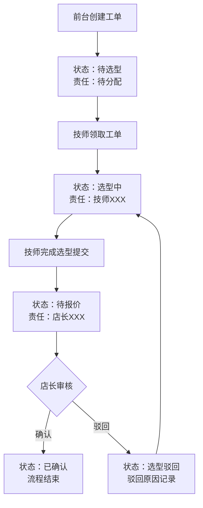

## 1. 产品概述
轮胎门店业务管理系统，解决轮胎选型与报价确认流程中责任不清、状态不明的问题，面向前台、技师、店长三类角色，实现全流程可追溯、责任可界定的业务闭环。

## 2. 核心功能

### 2.1 用户角色
| 角色 | 登录方式 | 核心权限 |
|------|----------|----------|
| 前台 | 账号登录 | 创建工单、录入客户信息、提交轮胎选型申请、查看报价确认结果 |
| 技师 | 账号登录 | 执行轮胎选型、填写选型依据、上传检测记录、查看报价状态 |
| 店长 | 账号登录 | 审核报价、确认报价、查看全量工单、回溯操作记录、处理异常 |

### 2.2 功能模块
1. **登录/角色切换页**：角色身份选择与登录入口
2. **工作台首页**：待办事项、异常工单、已完成任务概览
3. **工单列表页**：全量工单筛选与状态追踪
4. **工单详情页**：轮胎选型、报价确认、状态流转、责任标记
5. **轮胎选型处理页**：技师录入轮胎规格、品牌推荐、价格明细
6. **报价确认页**：店长审核报价、责任标识、确认/驳回操作

### 2.3 页面详情
| 页面名称 | 模块名称 | 功能描述 |
|-----------|-------------|---------------------|
| 登录页 | 角色选择卡片 | 三种角色独立入口，视觉区分 |
| 工作台 | 待办卡片 | 展示当前角色待处理工单数量及快捷入口 |
| 工作台 | 异常告警 | 高亮展示超时、被驳回、责任待确认的工单 |
| 工作台 | 已完成 | 近7天已完成工单列表 |
| 工单详情 | 状态时间线 | 选型中→待报价→已确认/已驳回的完整流转记录 |
| 工单详情 | 责任标识区 | 明确标注选型责任(技师)、报价责任(店长)、不可跨角色操作 |
| 轮胎选型 | 规格录入 | 轮胎尺寸、载重指数、速度级别、品牌、数量 |
| 轮胎选型 | 依据上传 | 旧台账、现场记录、沟通截图作为背景材料附件 |
| 报价确认 | 报价明细 | 单价、工时费、优惠、合计金额展示 |
| 报价确认 | 确认操作 | 店长确认/驳回，驳回需填写原因 |

## 3. 核心流程

客户到店 → 前台创建工单并录入客户/车辆信息 → 技师接收待办进行轮胎选型（可查看旧台账/现场记录/沟通截图背景）→ 系统标注"选型责任：技师XXX" → 提交后流转至"待报价"状态 → 店长接收待办进行报价审核 → 系统标注"报价责任：店长XXX" → 确认/驳回 → 完成/回退至选型环节

## 4. 用户界面设计
### 4.1 设计风格
- 主色：深赭红 #8B2500（工业/专业感），辅色：暗金色 #B8860B（品质感），中性色：炭灰 #2C2C2C
- 按钮风格：硬朗直角矩形，2px 描边，按下有内阴影效果
- 字体：标题使用 "Bebas Neue" 工业感字体，正文使用 "JetBrains Mono" 等宽字体强化表格和数字
- 布局：卡片式分区，顶部导航+左侧角色栏+主内容区，大量使用表格和时间线
- 图标风格：线性图标 lucide-react，统一 stroke 宽度

### 4.2 页面设计概述
| 页面名称 | 模块名称 | UI元素 |
|-----------|-------------|-------------|
| 登录页 | 角色卡片 | 三色区分卡片、图标徽章、悬浮浮起效果 |
| 工作台 | 统计概览 | 大数字展示、状态色标签、横向排布卡片 |
| 工作台 | 工单列表 | 斑马纹表格、状态徽章、快捷操作按钮 |
| 工单详情 | 状态时间线 | 垂直时间线、节点图标、责任标签高亮 |
| 工单详情 | 责任标识 | 红色边框警示框、责任人签名区、不可编辑状态 |
| 选型/报价页 | 表单区 | 分组折叠面板、输入框描边风格、表格明细 |

### 4.3 响应式
桌面端优先设计，最小支持 1280px 宽度；平板适配通过隐藏次要侧边栏实现。
