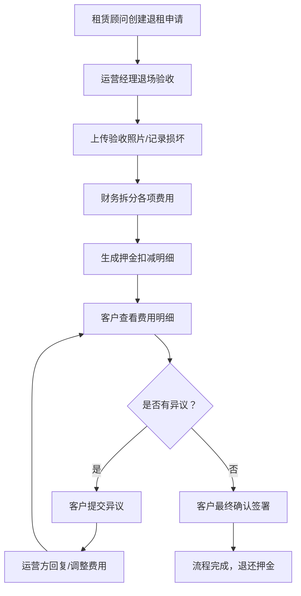

## 1. 产品概述
写字楼退租清算与押金明细系统，解决租赁退租过程中押金扣减争议大、流程不透明的问题。通过标准化的退场验收、费用拆分和客户确认流程，让每一笔扣款都有据可依。

- 目标用户：写字楼租赁顾问、运营经理、财务人员、企业客户
- 核心价值：退租全流程可追溯、每笔扣款有依据、客户异议可在线处理

## 2. 核心功能

### 2.1 用户角色

| 角色 | 核心权限 |
|------|----------|
| 租赁顾问 | 创建退租申请、录入租户信息、查看流程进度 |
| 运营经理 | 退场验收、上传照片、记录房屋状况和钥匙交接 |
| 财务 | 费用拆分（租金、水电、维修、违约金）、生成押金明细 |
| 企业客户 | 查看费用明细、提交异议、最终确认 |

### 2.2 功能模块
1. **工作台**：退租申请列表、状态统计、待办提醒
2. **退租申请页**：录入租户信息、合同信息、退租原因和预计退场日期
3. **退场验收页**：房屋验收项、照片上传占位、钥匙交接记录、验收备注
4. **费用明细页**：租金结算、水电费用、维修费用、违约金、押金明细和扣减依据
5. **客户确认页**：费用展示、异议提交、异议回复、最终确认签署

### 2.3 页面详情

| 页面名称 | 模块名称 | 功能描述 |
|----------|----------|----------|
| 工作台 | 数据概览 | 展示进行中退租数、待验收、待确认、异议处理中等统计卡片 |
| 工作台 | 申请列表 | 退租申请表格，支持按状态筛选，点击进入详情 |
| 工作台 | 快速操作 | 新建退租申请快捷入口 |
| 退租申请页 | 租户信息 | 公司名称、联系人、联系电话、租赁楼层/房号 |
| 退租申请页 | 合同信息 | 合同编号、租赁面积、押金金额、合同起止日期 |
| 退租申请页 | 退租信息 | 退租原因、预计退场日期、申请备注 |
| 退场验收页 | 验收清单 | 墙面、地面、天花、门窗、空调、消防、家具等逐项验收（正常/损坏/缺失） |
| 退场验收页 | 照片占位 | 每个验收项支持上传照片占位，展示缩略图网格 |
| 退场验收页 | 钥匙交接 | 钥匙类型、数量、交接人、交接时间 |
| 退场验收页 | 验收结论 | 验收备注、验收人签字、验收日期 |
| 费用明细页 | 费用概览 | 押金总额、应扣费用合计、应退还金额汇总卡片 |
| 费用明细页 | 租金结算 | 占用天数、日租金、计算依据（合同条款引用） |
| 费用明细页 | 水电费用 | 水电表读数、单价、用量、计算期间 |
| 费用明细页 | 维修费用 | 维修项、损坏描述、维修报价单、扣减依据 |
| 费用明细页 | 违约金 | 违约条款、违约天数、违约金计算公式 |
| 费用明细页 | 押金明细 | 每笔扣减项目、金额、扣减依据说明、关联附件 |
| 客户确认页 | 费用明细展示 | 以时间线或卡片形式展示全部费用及依据 |
| 客户确认页 | 异议提交 | 选择异议项、填写异议理由、上传证明材料 |
| 客户确认页 | 异议回复 | 运营方回复内容、处理结果、调整后的费用 |
| 客户确认页 | 最终确认 | 电子签名、确认日期、生成确认单PDF |

## 3. 核心流程

租赁顾问创建退租申请 → 运营经理进行退场验收（拍照、记录） → 财务拆分各项费用并生成押金明细 → 客户查看明细 → 如有异议提交并协商处理 → 无异议/异议解决后客户最终确认

## 4. 界面设计

### 4.1 设计风格
- 主色调：深蓝灰 #1e3a5f（专业商务），辅助色：琥珀金 #d4a853（品质感），强调色：珊瑚橙 #ff6b4a（提醒/行动）
- 按钮风格：直角微圆角（4px），渐变填充，按压有轻微下沉动效
- 字体：Noto Serif SC（标题/金额数字）、Noto Sans SC（正文），搭配等宽字体 JetBrains Mono 展示金额
- 布局风格：左右分栏导航，内容区采用卡片式分组，重要金额数字突出放大
- 图标风格：线性图标（Lucide），关键状态点用实心小圆点装饰

### 4.2 页面设计概览

| 页面名称 | 模块名称 | UI 元素 |
|----------|----------|---------|
| 工作台 | 数据概览 | 4个统计卡片，深蓝底配金色数字，悬停有微浮起效果 |
| 工作台 | 申请列表 | 斑马纹表格，状态标签用不同颜色圆点，行悬停高亮 |
| 退租申请页 | 表单区域 | 双列表单布局，左侧信息分组，右侧合同摘要，底部固定操作栏 |
| 退场验收页 | 验收清单 | 分组折叠面板，每项含状态标签、照片上传占位区、备注输入 |
| 退场验收页 | 照片占位 | 3列网格占位，灰色虚线框+相机图标，点击可替换 |
| 费用明细页 | 费用概览 | 三栏金额卡片，押金（蓝）、扣减（橙红）、退还（绿），大字号数字 |
| 费用明细页 | 扣减明细 | 每一项扣减带"依据"折叠面板，引用合同条款+计算过程 |
| 客户确认页 | 时间线流程 | 左侧垂直时间线展示各阶段，右侧对应阶段内容 |
| 客户确认页 | 异议区 | 聊天气泡样式展示客户异议和运营回复 |

### 4.3 响应式
桌面端优先（1440px+），平板端（768-1024px）侧边栏折叠为图标，移动端（<768px）卡片纵向堆叠，表格横向滚动。

### 4.4 动效设计
- 页面进入：左侧导航先滑入，内容区卡片依次向上淡入（stagger 80ms）
- 状态切换：金额数字滚动变化动画
- 卡片交互：悬停时轻微上浮 + 阴影加深
- 折叠面板：平滑高度过渡 + 箭头旋转
