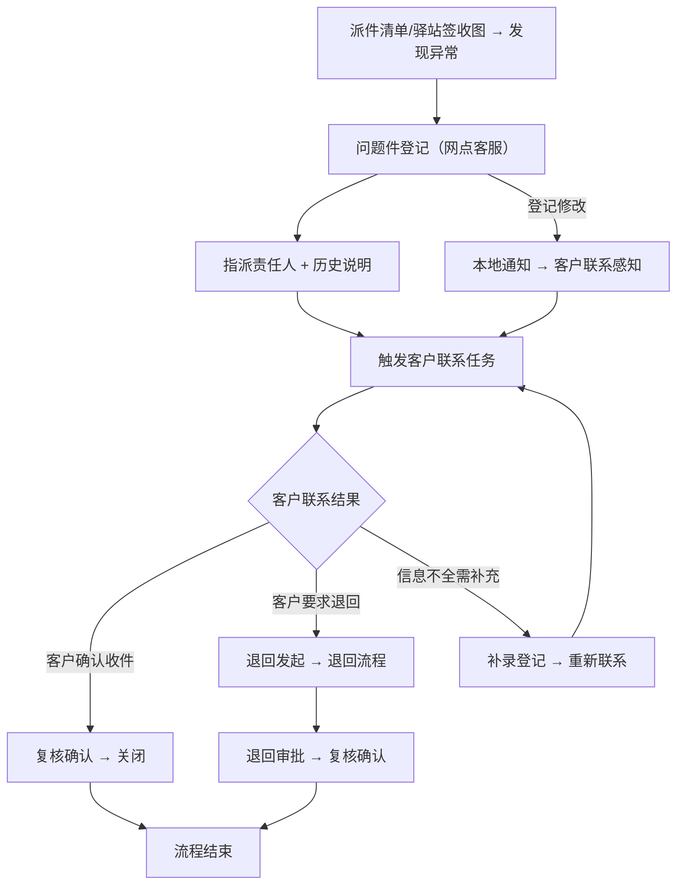

## 1. 产品概述

快递网点问题件登记与客户联系工作台——面向快递网点客服、派件员、驿站负责人的业务工作台，解决问题件从登记、客户联系、退回到复核全流程中责任不清、信息断裂、处理节奏不同步的痛点。核心价值：将问题件登记和客户联系之间的责任链显性化，保证每一环节的改动都能被下游感知，支撑连续高效处理。

## 2. 核心功能

### 2.1 用户角色

| 角色 | 进入方式 | 核心权限 |
|------|----------|----------|
| 网点客服 | 工号登录 | 问题件登记、客户联系、补录、退回发起、复核提交 |
| 派件员 | 工号登录 | 查看派件清单、确认问题件状态、上传驿站签收图 |
| 驿站负责人 | 工号登录 | 查看驿站签收图、确认签收、问题件反馈 |

### 2.2 功能模块

1. **业务工作台主页**：问题件登记列表、客户联系看板、状态标签筛选、异常提醒、操作入口
2. **问题件登记详情**：问题件信息登记/编辑、责任人指派、处理节奏标注、历史说明
3. **客户联系面板**：联系记录、联系回看、问题件关联、责任人与历史传递
4. **派件清单视图**：派件列表、问题件关联标记、驿站签收图预览
5. **退回/补录/复核流程**：退回发起与审批、补录登记、复核确认

### 2.3 页面详情

| 页面名称 | 模块名称 | 功能描述 |
|----------|----------|----------|
| 业务工作台主页 | 问题件登记列表 | 展示待处理/处理中/已完成的问题件，支持状态标签筛选和批量操作 |
| 业务工作台主页 | 客户联系看板 | 展示待联系/已联系/联系异常的客户联系任务，与问题件联动 |
| 业务工作台主页 | 异常提醒区 | 实时展示超时未联系、登记变更、退回预警等异常信息 |
| 业务工作台主页 | 状态标签筛选器 | 按问题类型、处理阶段、责任人等多维度筛选 |
| 问题件登记详情 | 登记表单 | 填写运单号、问题类型、问题描述、责任人、处理建议 |
| 问题件登记详情 | 责任链面板 | 显示当前责任人、历史责任人变更、变更说明 |
| 问题件登记详情 | 处理节奏时间线 | 按时间展示登记→联系→退回→复核各节点 |
| 客户联系面板 | 联系记录表单 | 记录联系方式、联系结果、客户反馈、承诺处理方案 |
| 客户联系面板 | 联系回看 | 回溯历史联系记录，关联问题件变更 |
| 客户联系面板 | 问题件感知区 | 展示关联问题件的最新状态和变更通知 |
| 派件清单视图 | 派件列表 | 展示当日派件清单，标记异常件 |
| 派件清单视图 | 签收图预览 | 展示驿站签收图片，关联问题件 |
| 退回/补录/复核流程 | 退回发起 | 选择退回原因、填写退回说明、指定退回接收人 |
| 退回/补录/复核流程 | 补录登记 | 补录遗漏的问题件信息和客户联系记录 |
| 退回/补录/复核流程 | 复核确认 | 复核问题件处理结果、客户联系结果，确认关闭 |

## 3. 核心流程

**主流程描述：** 问题件从派件清单或驿站签收图中发现异常后，由网点客服登记问题件并指派责任人。责任人（客服/派件员/驿站负责人）处理后，系统自动触发客户联系任务。客户联系完成后，根据结果进入退回、补录或复核环节。若问题件登记被修改，客户联系侧通过本地通知机制感知变更。整个流程保证责任人和历史说明在各环节间不丢失。

**责任链传递规则：**
1. 问题件登记时必须指定责任人，变更责任人时必须填写变更说明
2. 从问题件登记切到客户联系时，责任人和历史说明自动带入
3. 问题件登记被修改后，通过本地通知记录触发客户联系侧的感知刷新
4. 退回、补录、复核操作均需记录操作人和操作说明

## 4. 用户界面设计

### 4.1 设计风格

- **主色调**：深蓝灰(#1e293b) + 琥珀色强调(#f59e0b) + 状态色（红/绿/蓝/橙）
- **按钮风格**：圆角微阴影，主要操作用琥珀色填充，次要操作用线框
- **字体**：正文使用 Noto Sans SC，标题使用 DM Sans，数据使用 JetBrains Mono
- **布局风格**：左侧导航 + 顶部操作栏 + 中部双栏（问题件列表/客户联系看板）+ 右侧详情抽屉
- **图标风格**：Lucide 线性图标，统一 18px

### 4.2 页面设计概览

| 页面名称 | 模块名称 | UI要素 |
|----------|----------|--------|
| 业务工作台主页 | 问题件登记列表 | 卡片列表、状态色标签、批量操作栏、筛选标签组、分页 |
| 业务工作台主页 | 客户联系看板 | 看板列（待联系/已联系/异常）、拖拽排序、关联问题件标识 |
| 业务工作台主页 | 异常提醒区 | 顶部通知条、闪烁提醒图标、时间倒序、点击跳转 |
| 业务工作台主页 | 状态标签筛选器 | 标签组、多选下拉、清空按钮 |
| 问题件登记详情 | 登记表单 | 分组表单、必填标记、责任人下拉、问题类型选择 |
| 问题件登记详情 | 责任链面板 | 时间线组件、头像+姓名+角色、变更说明气泡 |
| 问题件登记详情 | 处理节奏时间线 | 竖向时间线、节点状态色、时间戳、操作按钮 |
| 客户联系面板 | 联系记录表单 | 联系方式选择、结果标签、反馈文本框 |
| 客户联系面板 | 联系回看 | 折叠面板、历史记录列表、问题件变更高亮 |
| 客户联系面板 | 问题件感知区 | 通知卡片、变更对比、刷新按钮 |
| 退回/补录/复核流程 | 退回发起 | 模态对话框、原因选择、说明文本、确认/取消 |
| 退回/补录/复核流程 | 补录登记 | 侧边抽屉、快速补录表单 |
| 退回/补录/复核流程 | 复核确认 | 复核摘要卡片、确认按钮、退回修改按钮 |

### 4.3 响应式

桌面优先设计，最小宽度 1280px。平板端隐藏右侧详情抽屉改为全屏弹窗。移动端暂不适配。

### 4.4 3D场景

不适用。
